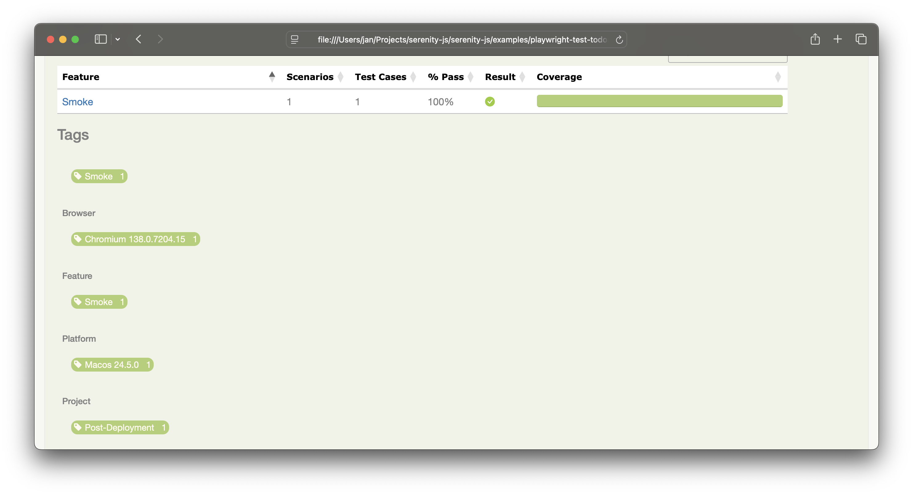

The latest release, Serenity/JS 3.32, brings powerful enhancements to your test automation workflow.
This version focuses on further improving the integration between [**Playwright Test**](/handbook/test-runners/playwright-test/) and [**Serenity BDD**](/handbook/reporting/serenity-bdd-reporter/),
delivering rich, actionable test reports that go beyond pass/fail results.

**Key updates in this release**:

🎭 Improved APIs and support for using actors in `beforeAll` and `afterAll` hooks.

✅ Improved reporting, including support for retried tests, repeated tests, and project tags.

⚙ Configuration updates to better separate test-scope and worker-scope fixtures.

Let’s take a closer look at what’s new!

{/* truncate */}

:::tip New to Serenity/JS?
New to Serenity/JS or test automation? Start with ["Your first web scenario"](/handbook/tutorials/your-first-web-scenario/),
praised by our community as "the best guide to take your automation skills to the next level."

For the deep dive, check out the [Serenity/JS integration guide for Playwright Test](/handbook/test-runners/playwright-test/).
:::

### Worker-scope actors

Serenity/JS 3.32 introduces support for [Playwright Test worker-scope fixtures](https://playwright.dev/docs/test-fixtures#worker-scoped-fixtures),
allowing you to use actors in `beforeAll` and `afterAll` hooks.

To use actors in a `beforeAll` or `afterAll` hook, use the  [`actorCalled`](https://serenity-js.org/api/playwright-test/interface/SerenityFixtures/#actorCalled) fixture:

```ts title="github.spec.ts"
import { afterAll, beforeAll, describe, it } from '@serenity-js/playwright-test'

describe('GitHub', () => {

    beforeAll(async ({ actorCalled }) => {
        await actorCalled('Stagehand').attemptsTo(
        );
    });

    afterAll(async ({ actorCalled }) => {
        await actorCalled('Stagehand').attemptsTo(
        );
    });
});
```
Worker-scope actors are particularly useful when you need to perform setup or teardown tasks that are common to all tests in a worker, such as starting a server, checking the status of an external service, or preparing a database.

:::tip Worker-scope actors
Worker-scope actors are actors initialised using the `actorCalled` fixture in a `beforeAll` hook. Worker-scope actors are shared across all tests in that worker.
:::

In the example below, we use a worker-scope actor called `Stagehand` to ensure that the system is ready to test before running any tests in the `GitHub` suite.

```ts title="github.spec.ts"
import { Ensure, equals } from '@serenity-js/assertions'
import { beforeAll, describe, it } from '@serenity-js/playwright-test'
import { CallAnApi, GetRequest, LastResponse, Send } from '@serenity-js/rest'

describe('GitHub', () => {

    beforeAll('Ensure system is ready to test', async ({ actorCalled }) => {
        await actorCalled('Stagehand')
            .whoCan(CallAnApi.at('https://www.githubstatus.com/api/v2/'))
            .attemptsTo(
                Send.a(GetRequest.to('status.json')),
                Ensure.that(
                    LastResponse.status(),
                    equals(200)
                ),
                Ensure.that(
                    LastResponse.body().status.description,
                    equals('All Systems Operational')
                ),
            );
    });
});
```

Worker-scope actors have the same behaviour as other worker-scope fixtures in Playwright Test:
- They are created once and only once per [Playwright Test worker](https://playwright.dev/docs/test-parallel) and shared across all tests in that worker.
- Each worker-scope actor automatically receives the `BrowseTheWebWithPlaywright` ability configured with an **isolated** and **independent browser context**.
  This isolation allows worker-scope actors not to clash with each other, or with the test-scope actors.
  What it also means is that you can use both worker-scope and test-scope actors in the same test without conflicts.
- Worker-scope actors don't automatically receive the `CallAnApi` ability, so you need to explicitly grant it to the actor if you want to use it.

A complete example of using both worker-scope and test-scope actors could look like this:

```ts title="github.spec.ts"
import { Ensure, equals } from '@serenity-js/assertions'
import { beforeAll, describe, it } from '@serenity-js/playwright-test'
import { CallAnApi, GetRequest, LastResponse, Send } from '@serenity-js/rest'
import { Navigate, Page } from '@serenity-js/web'

describe('GitHub', () => {

    beforeAll('Ensure system is ready to test', async ({ actorCalled }) => {
        await actorCalled('Stagehand')

            // Grant the actor any extra abilities
            .whoCan(CallAnApi.at('https://www.githubstatus.com/api/v2/'))

            // Perform setup or initial checks
            .attemptsTo(
                Send.a(GetRequest.to('status.json')),
                Ensure.that(
                    LastResponse.status(),
                    equals(200)
                ),
                Ensure.that(
                    LastResponse.body().status.description,
                    equals('All Systems Operational')
                ),
            );
    });

    afterAll('Clean up', async ({ actorCalled }) => {

        // Reuse the worker-scope actor to perform any necessary cleanup
        await actorCalled('Stagehand').attemptsTo(
            // ...
        );
    });

    describe('Project readme', () => {

        it('is available for a GitHub namespace ', async ({ actor, actorCalled }) => {

            // You can use worker-scope actors in your tests, too!
            // Simply refer to the already-initialised actor by their name:
            await actorCalled('Stagehand').attemptsTo(
                // ...
            );

            await actor.attemptsTo(
                Navigate.to('https://github.com/serenity-js'),
                Ensure.that(Page.current().title(), equals('Serenity/JS'))
            )
        });
    });
});
```


#### BrowseTheWebWithPlaywright API clean-up

This release also introduces some important changes to the `BrowseTheWebWithPlaywright` ability API, designed to improve clarity and usability.

Prior to Serenity/JS 3.32, the `BrowseTheWebWithPlaywright.usingPage(page, contextOptions)` type signature incorrectly
indicated that the method accepted the full `BrowserContextOptions` object.

However, since the Playwright `page` object you'd pass to the method has already been configured with a `BrowserContext` upon creation,
most of the `BrowserContextOptions` (such as `baseURL`) were silently ignored.

To avoid confusion, Serenity/JS 3.32 introduces the following API adjustments:
- `BrowseTheWebWithPlaywright.usingPage(page, extraContextOptions)` type signature is updated to indicate
   that the method accepts only a limited set of browser context options, described by the new type - `ExtraBrowserContextOptions`
- `BrowseTheWebWithPlaywright.using(browser, contextOptions, extraContextOptions)` type signature
   is extended to introduce the third parameter and separate Playwright's `BrowserContextOptions` from the additional `ExtraBrowserContextOptions`

:::info Action required
If you're overriding the default `BrowseTheWebWithPlaywright` ability
and pass custom configuration options, make sure to use the new `ExtraBrowserContextOptions` type.
:::

### Configuration changes

To clearly separate test-scope and worker-scope fixtures and configuration, Serenity/JS 3.32
introduces new [`SerenityFixtures`](/api/playwright-test/interface/SerenityFixtures/) and [`SerenityWorkerFixtures`](/api/playwright-test/interface/SerenityWorkerFixtures/) types.

Those new fixture types **replace** the old `SerenityOptions` type you might have used in your Playwright Test configuration.

:::info Action required
If you are using the `SerenityOptions` type in your Playwright Test configuration, you should update your configuration to use the new [`SerenityFixtures`](/api/playwright-test/interface/SerenityFixtures/) and [`SerenityWorkerFixtures`](/api/playwright-test/interface/SerenityWorkerFixtures/) types instead.
:::

After updating to Serenity/JS 3.32, update your `playwright.config.ts` file to use the new [`SerenityFixtures`](/api/playwright-test/interface/SerenityFixtures/)
and [`SerenityWorkerFixtures`](/api/playwright-test/interface/SerenityWorkerFixtures/) types instead of the no longer available `SerenityOptions`.

```diff title="playwright.config.ts"
import { defineConfig } from '@playwright/test'
import type {
-  SerenityOptions,
+  SerenityFixtures,
+  SerenityWorkerFixtures,
} from '@serenity-js/playwright-test'

- export default defineConfig<SerenityOptions>({
+ export default defineConfig<SerenityFixtures, SerenityWorkerFixtures>({

    // ...
})
```

### Reporting

Serenity/JS 3.32 introduces several important improvements to Serenity BDD reporting for Playwright Test,
making it easier to identify and understand test results and their context.


#### Project tags

You might be familiar with Playwright Test's ability to group tests into ["projects"](https://playwright.dev/docs/test-projects).
Playwright projects can be used to run tests with different configurations, such as browsers, devices, or environments,
or to split tests into logical groups, like smoke tests, accessibility tests, or performance tests.

Serenity/JS 3.32 introduces improved support for Playwright Test projects, allowing you to quickly identify which project a test belongs to, and filter scenarios by project tags in the Serenity BDD HTML report.

To use project tags, simply add a `name` property to your Playwright Test project configuration in `playwright.config.ts`.
In the example below, we define a project called `Post-deployment`, which runs the `smoke.spec.ts` test file in a desktop Chrome browser.

```ts title="playwright.config.ts"
import { devices, defineConfig } from '@playwright/test'
import {
    SerenityFixtures,
    SerenityWorkerFixtures,
} from '@serenity-js/playwright-test'

export default defineConfig<SerenityFixtures, SerenityWorkerFixtures>({

    projects: [
        {
            name: 'Post-deployment',
            testMatch: [
                'smoke.spec.ts',
            ],
            use: {
                ...devices['Desktop Chrome'],
            },
        },
        // ... other projects
    ],
})
```

Every scenario included in a Playwright Test project is now **automatically tagged with the project name**,
allowing you to easily filter scenarios in the Serenity BDD HTML report.



Additionally, **project name is now also **included in the scenario name**, making it easier to identify which project a scenario belongs to when viewing the test results.


#### Retried tests

Serenity/JS 3.32 introduces **support for reporting [retries of flaky tests](https://playwright.dev/docs/test-retries#retries)** in Playwright Test.


Each retry is now aggregated under the same scenario in the Serenity BDD HTML report, making it easier to track flaky tests and their retries.


:::tip Don't ignore flaky tests
Flaky tests are typically a sign of an underlying issue in your application or insufficient or incorrect [synchronisation in your test code](/handbook/design/waiting-and-synchronisation/).

To avoid having flaky tests go unnoticed, make sure to enable the [`failOnFlakyTests`](https://playwright.dev/docs/api/class-testconfig#test-config-fail-on-flaky-tests) option in your Playwright Test
configuration and fix the flaky tests as soon as possible.
:::

If your codebase contains flaky tests, use a combination of Playwright Test [projects](https://playwright.dev/docs/test-projects)
and [tags](https://playwright.dev/docs/test-annotations#tag-tests)
to isolate them from the rest of your test suite. The complete configuration example below shows how to do that.

```ts title="playwright.config.ts"
import { defineConfig, devices } from '@playwright/test'
import {
    SerenityFixtures,
    SerenityWorkerFixtures,
} from '@serenity-js/playwright-test'

export default defineConfig<SerenityFixtures, SerenityWorkerFixtures>({
    // ...

    failOnFlakyTests: true,

    projects: [
        {
            name: 'Flaky tests',
            grep: /@flaky/,
            retries: 2,
            use: {
                ...devices['Desktop Chrome'],
            },
        },
        // ... other projects
    ],
});
```

#### Repeated tests

Serenity/JS 3.32 introduces **support for reporting repeated tests**.

Playwright Test's [`repeatEach`](https://playwright.dev/docs/api/class-testconfig#test-config-repeat-each)
feature is useful when debugging flaky tests by running them repeatedly despite their result.

```ts title="playwright.config.ts"

import { defineConfig, devices } from '@playwright/test'
import {
    SerenityFixtures,
    SerenityWorkerFixtures,
} from '@serenity-js/playwright-test'

export default defineConfig<SerenityFixtures, SerenityWorkerFixtures>({

    projects: [
        {
            name: 'Repeated test suite',
            testMatch: 'demo.spec.ts',
            repeatEach: 10,
            use: {
                ...devices['Desktop Chrome'],
            },
        },
    ],
});
```

To make it easier for you to identify the failure pattern, Serenity/JS appends the repetition number to test name in the report.


#### Cleaner Playwright Test reports

To help avoid noise in Playwright Test HTML reports and support capturing events that occurred in `beforeAll` and `afterAll` hooks,
Serenity/JS no longer passes its internal event streams via Playwright attachments.

Instead, event streams are now saved to disk under the Playwright Test [`${outputDir}/serenity`](https://playwright.dev/docs/api/class-testconfig#test-config-output-dir).


## Next steps

🎁 [Update your Serenity/JS project to 3.32](/releases/updating-serenity-js/)

📖 [Learn about Serenity/JS with Playwright Test](/handbook/test-runners/playwright-test/)

💬 Let us know what you think in the [comments below](/blog/better-api-documentation/#giscus-comments) 👇

⭐ [Star Serenity/JS on GitHub ](https://github.com/serenity-js/serenity-js) and follow us for updates on new features, tutorials, and demos!

[](https://www.linkedin.com/company/serenity-js)
[](https://www.youtube.com/@serenity-js)
[](https://matrix.to/#/#serenity-js:gitter.im)
[](https://github.com/serenity-js/serenity-js)

## Support Serenity/JS

💛 Like what we're building? Become a [GitHub Sponsor](https://github.com/sponsors/serenity-js) and help grow Serenity/JS!

[](https://github.com/sponsors/serenity-js)
