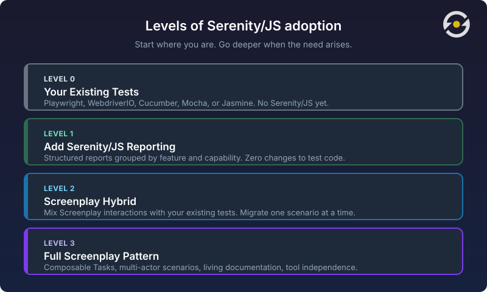

# Code Was Never the Hard Part

Jan Graefe recently published [an open letter](https://www.pilot-period.org/serenity-js-open-letter/) in response to the updated [Getting Started guides](/getting-started/) on serenity-js.org. His letter touches on something that's been central to the [Screenplay Pattern](/handbook/design/screenplay-pattern/) since 2007 — and that I've been working on since [joining the effort in 2013](/handbook/design/screenplay-pattern/#history-of-the-screenplay-pattern): the idea that test automation should express intent, not implementation.

I'd like to respond publicly because the ideas Graefe raises deserve a wider conversation.

{/* truncate */}

## The silver bullet cycle

Our industry has a pattern of chasing tools. Selenium, then Cypress, then Playwright. No-code, low-code, AI. Each new arrival promises to solve the test automation problem once and for all.

None of them do — because the hard part was never the code.

The hard part is understanding the purpose the system needs to serve, the audience it needs to support, and the goals it needs to help them accomplish. These are difficult things to get right. They require engineers to have a deep understanding of the business domain and their customers. Chasing the next tool is much easier than facing that challenge.

Graefe captures this well:

> [Serenity/JS's] value is that it encourages teams to think about behaviour, intent, and outcomes. It helps automation express what users are trying to achieve rather than simply documenting which buttons were clicked.

When you define a Task called `ScheduleAppointment.with(doctor).at(time)`, you're making a design decision. You're naming a business capability and separating it from the mechanics of filling in forms. That separation is what makes the test meaningful six months later when the UI has changed but the business process hasn't.

This isn't a new idea. It's what the Screenplay Pattern has been about since Antony Marcano first demonstrated the ["Roles, Goals, Tasks, Actions"](/handbook/design/screenplay-pattern/#history-of-the-screenplay-pattern) model almost twenty years ago. What's changed is that the industry may finally be ready to hear it.

## Why now?

The Screenplay Pattern always required a lot from the people adopting it. Understanding the business domain. Being open to collaboration across roles. Familiarity with Domain-Driven Design (DDD). Having enough software engineering experience to put all of it into practice. That was a lot to ask — and for many teams, it was too much at once.

AI changed the equation. Not because it made the design thinking easier — it didn't. But it made the code generation part trivial. When producing test code is no longer the bottleneck, people are freed up to think about design and architecture. They still need the skills, and they still need a north star to aim for. But the gap between "I understand what good looks like" and "I can actually build it" is finally closing.

## Strategy without architecture is a daydream

Graefe writes:

> But the best tools amplify a good strategy rather than compensate for the lack of one.

I'd go further: strategy and architecture are co-dependent. You can't have a strategy without something to express it in. A test strategy that lives only in a wiki page or a presentation deck isn't a strategy — it's an aspiration.

The Screenplay Pattern isn't a tool you pick after deciding your strategy. It *is* the expression of a strategy. When the framework requires you to name a Task before you can use it, that's not ceremony — it's forcing you to articulate what you're doing in business language before you automate it. When it separates Abilities from Interactions, it's encoding the principle that your test logic shouldn't be coupled to a specific interface driver.

The architecture makes certain strategies natural and others inconvenient. That's by design.

## Progressive adoption

Graefe notes how the updated site "meets people where they are." This reflects something I've observed over the past two decades working with teams.

Nobody commits to a new way of working because a website or a blog post told them to. They commit when they've hit a real problem, recognised what's holding them back, and experienced firsthand how a better approach helps them move past it. The adoption model exists to let teams prove the value of each layer to themselves:

- Start with reporting — you see what your tests cover without changing them.
- Add Screenplay interactions — failures become comprehensible because every step has a name.
- Adopt full Screenplay — composable Tasks, [multi-actor scenarios](/handbook/test-runners/playwright-test/multi-actor-scenarios/) and [blended testing](/handbook/web-testing/blended-testing/) become natural.

Each level makes the value of the next one obvious.

## Code still matters

Graefe writes that "the value of testing has never been in writing code." This is a popular sentiment, and I understand the spirit — the value lies in the thinking, the risk analysis, the understanding of what matters.

But I'd push back, gently. The value of testing has *always* been partly in the code — specifically in how well that code expresses intent. Poorly written test code doesn't just fail to communicate risk; it actively obscures it. When a test fails and the report shows `locator('[data-test="confirm-appointment"]') timed out`, you know *something* broke but not *what* the user was trying to accomplish.

Behaviour-Driven Development, Domain-Driven Design, and the Screenplay Pattern have never said "code doesn't matter." They've said: code should express business meaning. The code *is* the thinking, made executable.

## Architecture as guardrail

An AI can generate hundreds of flat Playwright scripts in minutes. Debugging, maintaining, and explaining those scripts to a stakeholder six months later is a different problem entirely.

The Screenplay Pattern doesn't just encourage better thinking — it *constrains* the output. When an AI generates into a Screenplay-based codebase, the framework's structure forces it to produce named [Tasks, explicit Interactions, and declared Abilities](/handbook/design/screenplay-pattern/#the-five-elements-of-the-screenplay-pattern). The architecture acts as a guardrail: what comes out is maintainable and intention-revealing, not just syntactically valid.

Structure is what makes the difference between test code that works today and a test system that scales.

## The fundamentals always mattered

BDD, DDD, intent over implementation — these ideas have been around for decades. They've always mattered. The industry just wasn't ready to pay the cost of learning them, because the immediate pain of bad test architecture was always one tool migration away from being someone else's problem.

That's changing. AI made the code cheap. Architecture and design thinking are what's left. The fundamentals were never optional — they just seemed optional when there was always a new tool to chase.

This is what the Serenity/JS community has been working towards. Not a better way to click buttons, but a better way to express what our systems are supposed to do and verify that they do it.

Thank you, Jan Graefe. Letters like yours are what keep an open-source project honest.
