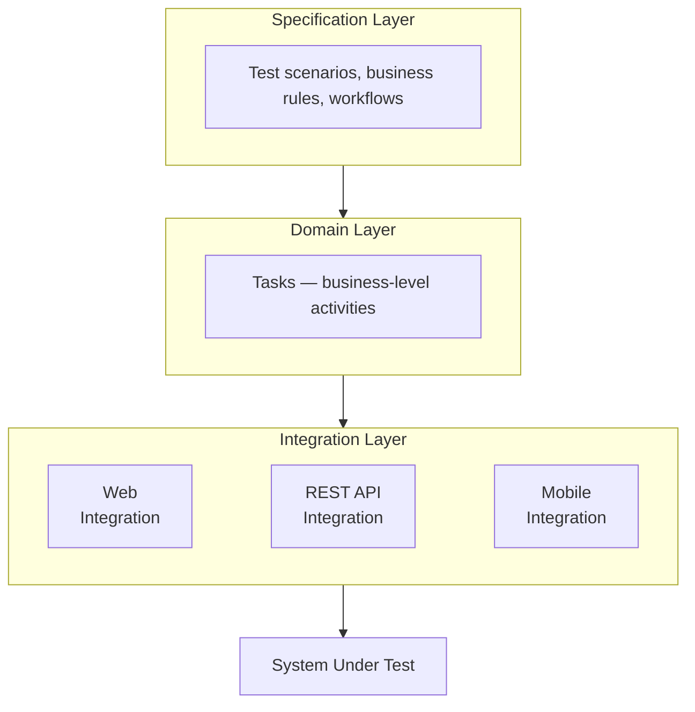

import Tabs from '@theme/Tabs';
import TabItem from '@theme/TabItem';

# Why Serenity/JS

Serenity/JS helps your team evolve from writing test scripts to designing a **test automation system** — with the architecture, reporting, and reusability that implies. It's a layer on top of Playwright, WebdriverIO, or Cucumber that adds structure as your test suite grows.

This page shows the **same scenario** at three levels of architecture so you can see what each one gives you and decide where to start.

:::info Works with multiple tools
The examples use [Playwright Test](/getting-started/playwright/), but Serenity/JS provides the same benefits with [WebdriverIO](/getting-started/webdriverio/). The Screenplay Pattern code is **identical** regardless of which tool drives the browser — that's the point of the architecture.
:::

---

## The problem with flat test scripts

Most test suites start simple: a few specs, each one a sequence of clicks and assertions. This works fine at first. But as the suite grows, problems emerge:

- **Selectors duplicated everywhere** — a UI change means updating dozens of files.
- **No reuse** — login logic is copy-pasted into every test that needs an authenticated user.
- **Reports show only pass/fail** — when a test fails, you read through low-level clicks to figure out what it was even trying to do.
- **Locked to one tool** — every line of test code is coupled to a specific browser driver API.

The solution is the same one that works for production software: **separate concerns into layers.**

---

## Layered test architecture

As described in [BDD in Action, Second Edition](https://www.manning.com/books/bdd-in-action-second-edition), a well-structured test automation system has three layers:



- **Specification layer** — *what* the system should do. Test scenarios expressed in business language.
- **Domain layer** — *how* actors accomplish goals. Composable Tasks using business vocabulary, independent of any tool.
- **Integration layer** — *where* the system is touched. Low-level interactions with web UIs, APIs, or mobile apps through tool-specific drivers.

Each layer depends only on the layer below it. When something changes, only the affected layer needs updating:

| What changes | What you update | What stays the same |
|---|---|---|
| UI redesign | Integration layer (selectors) | Domain + Specification |
| New business rule | Specification + Domain | Integration |
| Switch Playwright → WebdriverIO | Integration config | Domain + Specification |
| Add API testing | Integration layer | Domain + Specification |

**How Serenity/JS implements this:**

| Layer | Serenity/JS concept | Example |
|---|---|---|
| Specification | Test scenarios (`describe`, `it`) | `it('should let a user checkout', ...)` |
| Domain | [Tasks](/api/core/class/Task/) | `Checkout.completeWith(...)` |
| Integration | [Interactions](/api/core/class/Interaction/) + [Lean Page Objects](/handbook/web-testing/page-objects-pattern/) | `Click.on(...)`, `PageElement.located(...)` |

→ Learn more: [Screenplay Pattern](/handbook/design/screenplay-pattern/) | [BDD in Action, Second Edition](https://www.manning.com/books/bdd-in-action-second-edition)

---

## The same scenario, three ways

:::info The scenario
A user logs in to [Swag Labs](https://www.saucedemo.com/), adds a "Sauce Labs Backpack" to their cart, completes checkout, and verifies the order confirmation.
:::

### Level 1: Vanilla Playwright

No Serenity/JS. All logic in one flat script.

```typescript title="tests/checkout.spec.ts"
import { test, expect } from '@playwright/test';

test('should complete checkout successfully', async ({ page }) => {
    await page.goto('https://www.saucedemo.com/');
    await page.locator('[data-test="username"]').fill('standard_user');
    await page.locator('[data-test="password"]').fill('secret_sauce');
    await page.locator('[data-test="login-button"]').click();

    await page.locator('[data-test="add-to-cart-sauce-labs-backpack"]').click();

    await page.locator('[data-test="shopping-cart-link"]').click();
    await page.locator('[data-test="checkout"]').click();

    await page.locator('[data-test="firstName"]').fill('Alice');
    await page.locator('[data-test="lastName"]').fill('Smith');
    await page.locator('[data-test="postalCode"]').fill('90210');
    await page.locator('[data-test="continue"]').click();

    await page.locator('[data-test="finish"]').click();
    await expect(page.locator('[data-test="complete-header"]'))
        .toHaveText('Thank you for your order!');
});
```

**What you get:** A working test. Quick to write for a handful of scenarios.

**What's missing:** No reuse, no structured reporting, no abstraction. Every test that needs login will duplicate those selectors.

---

### Level 2: Add Serenity/JS reporting

Change one import. Your test code stays identical, but your test results are now organised by business capability and system feature — based on your directory structure — instead of a flat list of pass/fail results.

```typescript title="tests/checkout.spec.ts"
import { test, expect } from '@serenity-js/playwright-test';  // ← only change

test('should complete checkout successfully', async ({ page }) => {
    await page.goto('https://www.saucedemo.com/');
    await page.locator('[data-test="username"]').fill('standard_user');
    await page.locator('[data-test="password"]').fill('secret_sauce');
    await page.locator('[data-test="login-button"]').click();

    await page.locator('[data-test="add-to-cart-sauce-labs-backpack"]').click();

    await page.locator('[data-test="shopping-cart-link"]').click();
    await page.locator('[data-test="checkout"]').click();

    await page.locator('[data-test="firstName"]').fill('Alice');
    await page.locator('[data-test="lastName"]').fill('Smith');
    await page.locator('[data-test="postalCode"]').fill('90210');
    await page.locator('[data-test="continue"]').click();

    await page.locator('[data-test="finish"]').click();
    await expect(page.locator('[data-test="complete-header"]'))
        .toHaveText('Thank you for your order!');
});
```

**What you gain:**
- Test results organised per feature and capability (based on your test directory structure) instead of a flat list
- [Serenity BDD living documentation](/handbook/reporting/serenity-bdd-reporter/) that stakeholders can navigate by business area
- **Zero changes to your test logic**

**What requires Screenplay (Level 3):** In-depth activity breakdown showing each interaction with timing, and automated screenshots captured at each step.

→ [Set this up in 5 minutes](/getting-started/playwright/#step-1-install)

---

### Level 3: Full Screenplay Pattern

Tests describe *what the user does* in business language. Implementation details live in separate, reusable classes.

<Tabs>
<TabItem value="spec" label="swag-labs.spec.ts" default>

```typescript title="tests/swag-labs.spec.ts"
import { describe, it } from '@serenity-js/playwright-test';
import { Ensure, equals } from '@serenity-js/assertions';
import { Navigate } from '@serenity-js/web';

import { Authenticate } from '../screenplay/Authenticate';
import { Inventory } from '../screenplay/Inventory';
import { Checkout } from '../screenplay/Checkout';

describe('Swag Labs', () => {

    it('should let a standard user complete checkout', async ({ actor }) => {
        await actor.attemptsTo(
            Navigate.to('https://www.saucedemo.com/'),
            Authenticate.withCredentials('standard_user', 'secret_sauce'),
            Inventory.productCalled('Sauce Labs Backpack').addToCart(),
            Checkout.completeWith({
                firstName: 'Alice',
                lastName: 'Smith',
                postalCode: '90210',
            }),
            Ensure.that(Checkout.confirmationHeading(), equals('Thank you for your order!')),
        );
    });
});
```

</TabItem>
<TabItem value="authenticate" label="Authenticate.ts">

```typescript title="screenplay/Authenticate.ts"
import { Masked, Task } from '@serenity-js/core';
import { Click, Enter, PageElement, By } from '@serenity-js/web';

export class Authenticate {
    private static usernameField =
        PageElement.located(By.css('[data-test="username"]')).describedAs('username field');

    private static passwordField =
        PageElement.located(By.css('[data-test="password"]')).describedAs('password field');

    private static loginButton =
        PageElement.located(By.css('[data-test="login-button"]')).describedAs('login button');

    static withCredentials = (username: string, password: string) =>
        Task.where(`#actor logs in as ${ username }`,
            Enter.theValue(username).into(Authenticate.usernameField),
            Enter.theValue(Masked.valueOf(password)).into(Authenticate.passwordField),
            Click.on(Authenticate.loginButton),
        );
}
```

</TabItem>
<TabItem value="inventory" label="Inventory.ts">

```typescript title="screenplay/Inventory.ts"
import { Task } from '@serenity-js/core';
import { Click, Text, PageElement, By } from '@serenity-js/web';

export class ProductCard {
    constructor(private name: string) {}

    private card = PageElement.located(By.css(
        `[data-test="inventory-item"]:has([data-test="inventory-item-name"]:text("${ this.name }"))`
    )).describedAs(`product card for "${ this.name }"`);

    private inventoryItemPrice =
        PageElement.located(By.css('[data-test="inventory-item-price"]'))
            .of(this.card).describedAs(`price of "${ this.name }"`);

    private addToCartButton =
        PageElement.located(By.css('[data-test^="add-to-cart"]'))
            .of(this.card).describedAs(`"Add to cart" button for "${ this.name }"`);

    price = () =>
        Text.of(this.inventoryItemPrice);

    addToCart = () =>
        Task.where(`#actor adds "${ this.name }" to the cart`,
            Click.on(this.addToCartButton),
        );
}

export class Inventory {
    static productCalled = (name: string) => new ProductCard(name);
}
```

</TabItem>
<TabItem value="checkout" label="Checkout.ts">

```typescript title="screenplay/Checkout.ts"
import { Task } from '@serenity-js/core';
import { Click, Enter, Text, PageElement, By } from '@serenity-js/web';

export class Cart {
    private static cartLink =
        PageElement.located(By.css('[data-test="shopping-cart-link"]')).describedAs('shopping cart link');

    private static checkoutButton =
        PageElement.located(By.css('[data-test="checkout"]')).describedAs('checkout button');

    static open = () =>
        Task.where('#actor opens the shopping cart',
            Click.on(Cart.cartLink),
        );

    static checkout = () =>
        Task.where('#actor proceeds to checkout',
            Cart.open(),
            Click.on(Cart.checkoutButton),
        );
}

export class Checkout {
    private static firstNameField =
        PageElement.located(By.css('[data-test="firstName"]')).describedAs('first name');

    private static lastNameField =
        PageElement.located(By.css('[data-test="lastName"]')).describedAs('last name');

    private static postalCodeField =
        PageElement.located(By.css('[data-test="postalCode"]')).describedAs('postal code');

    private static continueButton =
        PageElement.located(By.css('[data-test="continue"]')).describedAs('continue button');

    private static finishButton =
        PageElement.located(By.css('[data-test="finish"]')).describedAs('finish button');

    private static confirmationHeader =
        PageElement.located(By.css('[data-test="complete-header"]')).describedAs('confirmation heading');

    static completeWith = (info: { firstName: string; lastName: string; postalCode: string }) =>
        Task.where(`#actor completes checkout`,
            Cart.checkout(),
            Enter.theValue(info.firstName).into(Checkout.firstNameField),
            Enter.theValue(info.lastName).into(Checkout.lastNameField),
            Enter.theValue(info.postalCode).into(Checkout.postalCodeField),
            Click.on(Checkout.continueButton),
            Click.on(Checkout.finishButton),
        );

    static confirmationHeading = () =>
        Text.of(Checkout.confirmationHeader);
}
```

</TabItem>
</Tabs>

**What you gain:**
- **Readable tests** — the scenario reads like a user story, not a browser script
- **Reusable building blocks** — `Authenticate.withCredentials()` works in every test; change a selector once, fix it everywhere
- **Rich reports** — hierarchical activity breakdown: "completes checkout" → "proceeds to checkout" → "clicks on checkout button"
- **Masked credentials** — sensitive values appear as `[MASKED]` in reports
- **Multi-actor support** — buyer + seller, admin + user scenarios become trivial
- **Blended testing** — use APIs for fast test data setup, UI only where it matters
- **Tool independence** — swap Playwright for WebdriverIO without touching test logic

:::tip Tasks are portable
The Task code imports from `@serenity-js/web` and `@serenity-js/core` — not from Playwright or WebdriverIO. Switch tools (or use both) without rewriting your Domain layer. Only the [Ability](/api/core/class/Ability/) configuration changes.
:::

→ [Try the Screenplay Pattern](/getting-started/playwright/#step-5-optional-write-your-first-screenplay-test) | [Full Playwright tutorial](/getting-started/playwright/) | [WebdriverIO tutorial](/getting-started/webdriverio/)

---

## How to start

**Start with reporting** — add Serenity/JS in reporting-only mode (Level 2). One import change, zero risk, five minutes. Your existing tests immediately produce detailed activity reports that show what went wrong and where.

**Use Screenplay for new tests** — when you write your next scenario, use the actor model and composable Tasks. Old tests stay untouched; new tests get better structure from day one.

**Migrate what matters** — identify the legacy scenarios that break often or are hard to understand, and convert them to Screenplay. Better reports, easier maintenance, less time debugging. For lower-value scenarios, either convert them gradually or delete them when your Screenplay tests already cover the same ground more effectively.

**Speed up slow suites with blended testing** — use API interactions for test data setup while testing through the UI only where it demonstrates value. The same Task can have a fast API-based implementation for preconditions and a thorough UI-based one for the scenario you're actually verifying.

You're in control of how many scenarios follow the improved structure — Serenity/JS supports both architectures side by side in the same project. There's no big-bang rewrite.

---

## Ready to try Serenity/JS?

- **[For Playwright users](/getting-started/playwright/)** — add Serenity/JS to your project in 5 minutes
- **[For WebdriverIO users](/getting-started/webdriverio/)** — integrate with your existing setup
- **[15-minute tutorial](/handbook/tutorials/your-first-web-scenario/)** — build your first Screenplay test
- **[Project Templates](/getting-started/project-templates/)** — pre-configured starter projects
