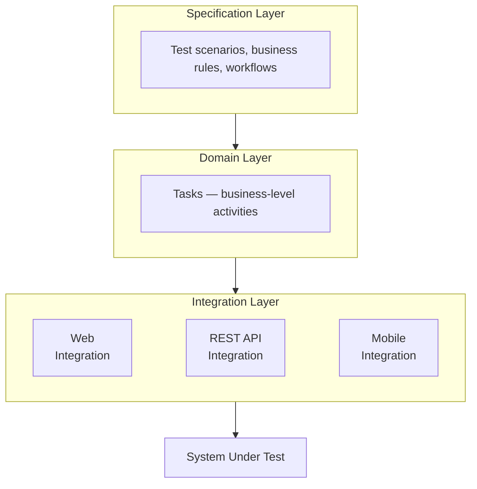

import Tabs from '@theme/Tabs';
import TabItem from '@theme/TabItem';

# Why Serenity/JS

Serenity/JS helps your team evolve from writing test scripts to designing a **test automation system** — with the architecture, reporting, and reusability to scale your automation and adapt it as requirements change. The framework works as a layer on top of Playwright, WebdriverIO, or Cucumber, adding structure while reducing complexity and maintenance costs.

To show you what that looks like in practice, this guide walks through the **same scenario** at four levels of Serenity/JS adoption — from a flat test script to structured, reusable code with rich reporting.

:::tip Works with multiple tools
The examples below use [Playwright Test](/getting-started/playwright/), but everything shown here applies equally to [WebdriverIO](/getting-started/webdriverio/), [Cucumber](/getting-started/cucumber/), and other [supported test runners](/handbook/test-runners/). Screenplay Pattern code is **identical** regardless of what test runner or browser driver you use — that's the point of the architecture.
:::

---

## The problem with flat test scripts

Most test suites start simple: a few specs, each one a sequence of clicks and assertions. That works — until the suite grows and the cracks show:

- **Selectors duplicated everywhere** — a single UI change means updating dozens of files
- **No reuse** — login logic is copy-pasted into every test that needs an authenticated user
- **Reports show only pass/fail** — when something breaks, you're forced to read raw selectors to figure out what the test was trying to do
- **Locked to one tool** — every line of code is coupled to a specific browser driver API

The fix is the same one that works for production software: **separation of concerns** — keep *what* you're testing apart from *how* you're testing it.

---

## Layered test architecture

As described in [BDD in Action, Second Edition](https://www.manning.com/books/bdd-in-action-second-edition), a well-structured test automation system has three layers:

- **Specification layer** — *what* the system should do. Test scenarios expressed in business language.
- **Domain layer** — *how* actors accomplish goals. Composable Tasks that use business vocabulary, independent of any integration tool.
- **Integration layer** — *where* the system is interacted with. Low-level interactions with web UIs, APIs, or mobile apps through tool-specific drivers.

<figure>



<figcaption>A layered test architecture separates business logic from integration details, making each layer independently maintainable.</figcaption>
</figure>

Each layer depends only on the layer below it, so when something in the system under test changes, only the affected layer needs updating. For example, a UI redesign means new selectors in the Integration layer — but your Domain Tasks and Specification scenarios stay untouched:

| What changes | What you update | What stays the same |
|---|---|---|
| UI redesign | Integration layer (selectors) | Domain + Specification |
| New business rule | Specification + Domain | Integration |
| Switch Playwright → WebdriverIO | Integration config | Domain + Specification |
| Add API testing | Integration layer | Domain + Specification |

In Serenity/JS, these layers map directly to framework concepts you'll use every day:

| Layer | Serenity/JS concept | Example |
|---|---|---|
| Specification | Test scenarios (`describe`, `it`) | `it('should let a user complete checkout', ...)` |
| Domain | [Actors](/api/core/class/Actor/) + [Tasks](/api/core/class/Task/) | `actor.attemptsTo(Checkout.completeWith(...))` |
| Integration | [Abilities](/api/core/class/Ability/) + [Interactions](/api/core/class/Interaction/) + [Questions](/api/core/class/Question/) | `Click.on(...)`, `Text.of(...)`, `PageElement.located(...)` |

→ Learn more: [Screenplay Pattern](/handbook/design/screenplay-pattern/) | [Serenity/JS Architecture](/handbook/architecture/) | [BDD in Action, Second Edition](https://www.manning.com/books/bdd-in-action-second-edition)

---

## Levels of adoption

The following scenario is implemented at four levels of Serenity/JS adoption — from vanilla Playwright and no Serenity/JS, through to the full Serenity/JS Screenplay Pattern implementation. Each level builds on the previous one, and you can stop wherever it makes sense for your project.

**The scenario:** A "standard user" logs in to [Swag Labs](https://www.saucedemo.com/), adds a "Sauce Labs Backpack" to their cart, completes checkout, and verifies the order confirmation.

:::tip About Swag Labs
[Swag Labs](https://www.saucedemo.com/) is a demo e-commerce website created by [Sauce Labs](https://saucelabs.com/) specifically for practicing test automation.
It's a fictive online store where you can browse products, add items to a cart, and complete checkout flows.
:::

### Level 0: Vanilla Playwright

This is the starting point most teams are familiar with — no Serenity/JS, all logic in one flat script.

```typescript title="tests/checkout.spec.ts"
import { test, expect } from '@playwright/test';

test('should complete checkout successfully', async ({ page }) => {
    await page.goto('https://www.saucedemo.com/');
    await page.locator('[data-test="username"]').fill('standard_user');
    await page.locator('[data-test="password"]').fill('secret_sauce');
    await page.locator('[data-test="login-button"]').click();

    await page.locator('[data-test="add-to-cart-sauce-labs-backpack"]').click();

    await page.locator('[data-test="shopping-cart-link"]').click();
    await page.locator('[data-test="checkout"]').click();

    await page.locator('[data-test="firstName"]').fill('Alice');
    await page.locator('[data-test="lastName"]').fill('Smith');
    await page.locator('[data-test="postalCode"]').fill('90210');
    await page.locator('[data-test="continue"]').click();

    await page.locator('[data-test="finish"]').click();
    await expect(page.locator('[data-test="complete-header"]'))
        .toHaveText('Thank you for your order!');
});
```

**What you get:** A working test. Quick to write when you have a handful of scenarios.

**What breaks down at scale:**
- **Selector duplication** — when `[data-test="login-button"]` becomes `[data-test="sign-in"]`, you grep the codebase and update every file that references it. With 200 tests and 30 that need login, that's 30 edits for one rename.
- **Opaque failures** — reports show "failed at locator `[data-test="login-button"]`". To understand *what* the test was verifying, you have to mentally parse the whole script.
- **No reuse** — login, "add to cart", checkout — each sequence is copy-pasted into every test that needs it.

---

### Level 1: Add Serenity/JS reporting

The smallest possible improvement: add Serenity/JS reporters to your `playwright.config.ts`. Your test code stays completely unchanged, but the reports now organise results by capability and feature — [derived from your file naming conventions and directory structure](/handbook/reporting/serenity-bdd-reporter/#serenity-bdd-best-practices) — rather than showing a flat list of pass/fail.

```diff title="playwright.config.ts"
  import { defineConfig, devices } from '@playwright/test';

  export default defineConfig({
      testDir: './tests',
-     reporter: 'html',
+     reporter: [
+         [ 'html' ],   // Keep the default Playwright HTML reporter for low-level debugging
+         [ '@serenity-js/playwright-test', {
+             crew: [
+                 '@serenity-js/console-reporter',
+                 [ '@serenity-js/serenity-bdd', {
+                     specDirectory: './tests'
+                 } ],
+                 [ '@serenity-js/core:ArtifactArchiver', {
+                     outputDirectory: './reports/serenity'
+                 } ],
+             ]
+         }]
+     ],
      // ... rest of your config stays the same
  });
```

Next, update your `package.json` scripts to generate the Serenity BDD HTML report after test execution:

```diff title="package.json"
 {
   "scripts": {
+    "clean": "rimraf target",
+    "test": "failsafe clean test:execute [...] test:report",
+    "test:execute": "npx playwright test",
+    "test:report": "serenity-bdd run --features='./tests' --source='./reports/serenity' --destination='./reports/serenity'"
   }
 }
```

→ Learn more: [Using npm-failsafe](https://www.npmjs.com/package/npm-failsafe) | [Configuring the test runner](/handbook/reporting/serenity-bdd-reporter/#configuring-the-test-runner)

**What you gain:**
- Test results grouped by feature and capability rather than a flat list
- [Serenity BDD living documentation](/handbook/reporting/serenity-bdd-reporter/) that stakeholders can explore by feature and capability
- **Zero changes to your test code** — only the config and scripts are updated

**What still breaks down at scale:**
- **Selectors still duplicated** — a UI refactor still means a multi-file find-and-replace
- **No code reuse** — login logic is still copy-pasted into every test that needs an authenticated user
- **Diagnosis gap** — reports tell you *which* test failed, but the test code itself still can't tell you *why* at a glance

<Figure
    caption='Example Serenity BDD report generated by Serenity/JS'
    img={require('@site/static/images/reporting/serenity-bdd-reporter.png')}
    externalLink={'https://serenity-js.github.io/serenity-js-cucumber-playwright-template/'}
/>

→ [Set this up in 5 minutes](/getting-started/playwright/#step-1-install)

---

### Level 2: Screenplay + Playwright hybrid

Here you start using Serenity/JS fixtures alongside your existing Playwright code. Swap the import to `@serenity-js/playwright-test` to access the `actor` fixture, then introduce Screenplay interactions where they add clarity — existing tests stay as they are.

```typescript title="tests/checkout.spec.ts"
import { test, expect } from '@serenity-js/playwright-test';  // ← swap the import
import { Navigate } from '@serenity-js/web';

test('should complete checkout successfully', async ({ actor, page }) => {
    // Screenplay interaction — shows as a named step in reports
    await actor.attemptsTo(
        Navigate.to('https://www.saucedemo.com/'),
    );

    // Vanilla Playwright — still works, just won't appear as named steps
    await page.locator('[data-test="username"]').fill('standard_user');
    await page.locator('[data-test="password"]').fill('secret_sauce');
    await page.locator('[data-test="login-button"]').click();

    await page.locator('[data-test="add-to-cart-sauce-labs-backpack"]').click();
    await page.locator('[data-test="shopping-cart-link"]').click();
    await page.locator('[data-test="checkout"]').click();

    await page.locator('[data-test="firstName"]').fill('Alice');
    await page.locator('[data-test="lastName"]').fill('Smith');
    await page.locator('[data-test="postalCode"]').fill('90210');
    await page.locator('[data-test="continue"]').click();
    await page.locator('[data-test="finish"]').click();

    await expect(page.locator('[data-test="complete-header"]'))
        .toHaveText('Thank you for your order!');
});
```

**What you gain over Level 1:**
- Screenplay interactions appear as named steps in reports — with timing and screenshots
- Access to `actor`, `actorCalled`, and other [Serenity/JS fixtures](/api/playwright-test/interface/SerenityFixtures/)
- Incremental adoption — convert interactions one at a time without rewriting entire tests

**What still breaks down at scale:**
- **Sequences still inlined** — two tests that both need "add item to cart" each spell out the same clicks and selectors
- **No single source of truth** — selectors live in test files rather than in a shared location, so a rename still fans out
- **Limited composability** — named steps improve reports, but cross-test reuse requires the next step: factoring common workflows into composable Tasks

---

### Level 3: Full Screenplay Pattern

At this level, tests describe *what the user does* in business language. Selectors, page interactions, and API calls live in separate, reusable classes that any test can compose. Compare the spec file below with the flat script from Level 0:

<Tabs>
<TabItem value="spec" label="swag-labs.spec.ts" default>

```typescript title="tests/swag-labs.spec.ts"
import { describe, it } from '@serenity-js/playwright-test';
import { Ensure, equals } from '@serenity-js/assertions';
import { Navigate } from '@serenity-js/web';

import { Authenticate } from '../screenplay/Authenticate';
import { Inventory } from '../screenplay/Inventory';
import { Checkout } from '../screenplay/Checkout';

describe('Swag Labs', () => {

    it('should let a standard user complete checkout', async ({ actor }) => {
        await actor.attemptsTo(
            Navigate.to('https://www.saucedemo.com/'),
            Authenticate.withCredentials('standard_user', 'secret_sauce'),
            Inventory.productCalled('Sauce Labs Backpack').addToCart(),
            Checkout.completeWith({
                firstName: 'Alice',
                lastName: 'Smith',
                postalCode: '90210',
            }),
            Ensure.that(Checkout.confirmationHeading(), equals('Thank you for your order!')),
        );
    });
});
```

</TabItem>
<TabItem value="authenticate" label="Authenticate.ts">

```typescript title="screenplay/Authenticate.ts"
import { Masked, Task } from '@serenity-js/core';
import { Click, Enter, PageElement, By } from '@serenity-js/web';

export class Authenticate {
    private static usernameField =
        PageElement.located(By.css('[data-test="username"]')).describedAs('username field');

    private static passwordField =
        PageElement.located(By.css('[data-test="password"]')).describedAs('password field');

    private static loginButton =
        PageElement.located(By.css('[data-test="login-button"]')).describedAs('login button');

    static withCredentials = (username: string, password: string) =>
        Task.where(`#actor logs in as ${ username }`,
            Enter.theValue(username).into(Authenticate.usernameField),
            Enter.theValue(Masked.valueOf(password)).into(Authenticate.passwordField),
            Click.on(Authenticate.loginButton),
        );
}
```

</TabItem>
<TabItem value="inventory" label="Inventory.ts">

```typescript title="screenplay/Inventory.ts"
import { Task } from '@serenity-js/core';
import { Click, Text, PageElement, By } from '@serenity-js/web';

export class ProductCard {
    constructor(private name: string) {}

    private card = PageElement.located(By.css(
        `[data-test="inventory-item"]:has([data-test="inventory-item-name"]:text("${ this.name }"))`
    )).describedAs(`product card for "${ this.name }"`);

    private inventoryItemPrice =
        PageElement.located(By.css('[data-test="inventory-item-price"]'))
            .of(this.card).describedAs(`price of "${ this.name }"`);

    private addToCartButton =
        PageElement.located(By.css('[data-test^="add-to-cart"]'))
            .of(this.card).describedAs(`"Add to cart" button for "${ this.name }"`);

    price = () =>
        Text.of(this.inventoryItemPrice);

    addToCart = () =>
        Task.where(`#actor adds "${ this.name }" to the cart`,
            Click.on(this.addToCartButton),
        );
}

export class Inventory {
    static productCalled = (name: string) => new ProductCard(name);
}
```

</TabItem>
<TabItem value="checkout" label="Checkout.ts">

```typescript title="screenplay/Checkout.ts"
import { Task } from '@serenity-js/core';
import { Click, Enter, Text, PageElement, By } from '@serenity-js/web';

export class Cart {
    private static cartLink =
        PageElement.located(By.css('[data-test="shopping-cart-link"]')).describedAs('shopping cart link');

    private static checkoutButton =
        PageElement.located(By.css('[data-test="checkout"]')).describedAs('checkout button');

    static open = () =>
        Task.where('#actor opens the shopping cart',
            Click.on(Cart.cartLink),
        );

    static checkout = () =>
        Task.where('#actor proceeds to checkout',
            Cart.open(),
            Click.on(Cart.checkoutButton),
        );
}

export class Checkout {
    private static firstNameField =
        PageElement.located(By.css('[data-test="firstName"]')).describedAs('first name');

    private static lastNameField =
        PageElement.located(By.css('[data-test="lastName"]')).describedAs('last name');

    private static postalCodeField =
        PageElement.located(By.css('[data-test="postalCode"]')).describedAs('postal code');

    private static continueButton =
        PageElement.located(By.css('[data-test="continue"]')).describedAs('continue button');

    private static finishButton =
        PageElement.located(By.css('[data-test="finish"]')).describedAs('finish button');

    private static confirmationHeader =
        PageElement.located(By.css('[data-test="complete-header"]')).describedAs('confirmation heading');

    static completeWith = (info: { firstName: string; lastName: string; postalCode: string }) =>
        Task.where(`#actor completes checkout`,
            Cart.checkout(),
            Enter.theValue(info.firstName).into(Checkout.firstNameField),
            Enter.theValue(info.lastName).into(Checkout.lastNameField),
            Enter.theValue(info.postalCode).into(Checkout.postalCodeField),
            Click.on(Checkout.continueButton),
            Click.on(Checkout.finishButton),
        );

    static confirmationHeading = () =>
        Text.of(Checkout.confirmationHeader);
}
```

</TabItem>
</Tabs>

**What you gain over Levels 1–2:**
- **Readable tests** — the scenario reads like a user story, not a browser script
- **Reusable building blocks** — `Authenticate.withCredentials()` works in every test; change a selector once, fix it everywhere
- **Rich activity breakdown** — reports show "completes checkout" → "proceeds to checkout" → "clicks on checkout button", with timing at each step
- **Masked credentials** — sensitive values appear as `[MASKED]` in reports (see the `Authenticate.ts` tab above)
- **Multi-actor support** — buyer + seller, admin + user scenarios become [trivial to implement](/handbook/test-runners/playwright-test/multi-actor-scenarios/)
- **[Blended testing](/handbook/web-testing/blended-testing/)** — use APIs for fast test data setup, UI only where it matters
- **Tool independence** — swap Playwright for WebdriverIO, or use both in the same project, without touching test logic

:::tip Tasks are portable
The Task code imports from [`@serenity-js/web`](/api/web/) and [`@serenity-js/core`](/api/core/) — not from Playwright or WebdriverIO. Switch tools (or use both) without rewriting your Domain layer. Only the [Ability](/api/core/class/Ability/) configuration changes.
:::

→ [Try the Screenplay Pattern](/getting-started/playwright/#step-5-optional-write-your-first-screenplay-test) | [Full Playwright tutorial](/getting-started/playwright/) | [WebdriverIO tutorial](/getting-started/webdriverio/)

---

## How to start

The most common adoption path:

**Level 1 — reporting.** Add Serenity/JS reporters to your config. No test code changes, immediate value from structured reports.

**Level 2 — hybrid.** Swap the import and start using `actor` alongside `page`. Convert interactions one at a time where they add clarity.

**Level 3 — new tests.** Write new scenarios with composable Tasks from the start. Migrate existing tests when they become painful to maintain.

**Beyond Level 3 — [blended testing](/handbook/web-testing/blended-testing/).** Use API interactions for test data setup while testing through the UI only where it demonstrates value. The same Task can have a fast API-based implementation for preconditions and a thorough UI-based one for the scenario you're verifying.

All levels coexist in the same project — you're in control of how far and how fast you go. There's no big-bang rewrite.

---

## Ready to try Serenity/JS?

- **[For Playwright users](/getting-started/playwright/)** — add Serenity/JS to your project in 5 minutes
- **[For WebdriverIO users](/getting-started/webdriverio/)** — integrate with your existing setup
- **[For Cucumber users](/getting-started/cucumber/)** — add reporting and Screenplay to your Gherkin scenarios
- **[15-minute tutorial](/handbook/tutorials/your-first-web-scenario/)** — build your first Screenplay test
- **[Project Templates](/getting-started/project-templates/)** — pre-configured starter projects
