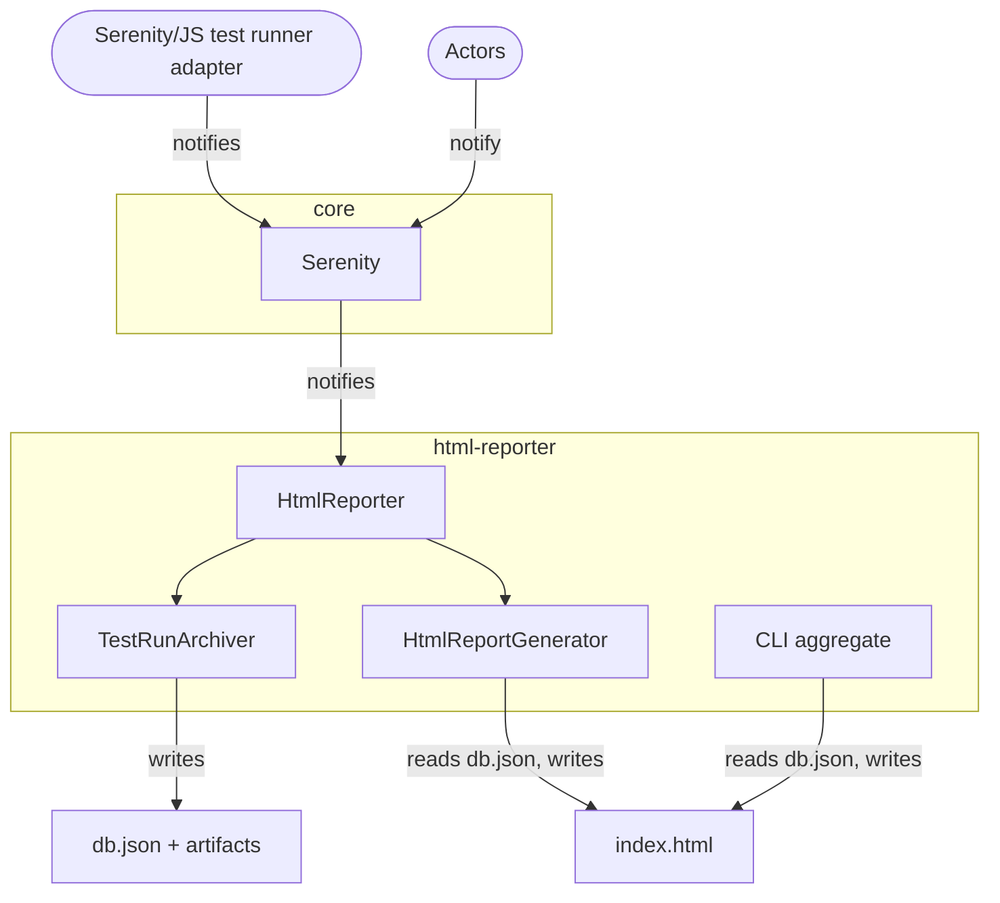

# HTML Reporter

The [`@serenity-js/html-reporter`](/api/html-reporter) module produces a **self-contained HTML report** from your Serenity/JS test suite — open `index.html` directly from the filesystem with no server, no Java, and no external dependencies.

<Figure
    caption='Dashboard view of the Serenity/JS HTML Report'
    img={require('@site/static/images/reporting/html-reporter-dashboard.png')}
/>

## Key features

- **Trend history across CI runs** — the report preserves execution data across builds, showing pass rate and duration trends over time. Spot regressions the moment they appear, not after they've been hiding for days.
- **Flaky test detection** — automatically classifies tests as flaky, degraded, inconsistent, or recovered based on outcome patterns across recent runs.
- **Single self-contained HTML file** — all JavaScript, CSS, and chart logic embedded inline. Test data is loaded from a companion `data.js` file. Open directly from the filesystem, deploy to any static host. No server required.
- **Activity trees with evidence** — every Task, Interaction, and assertion shown with timing, screenshots, HTTP exchanges, and video.
- **Error clustering** — groups failures by normalised root cause so you see 1 bug with 12 affected tests, not 12 unrelated failures.
- **Living documentation** — `README.md` files render alongside test results in the Capabilities view, turning your test directory into navigable documentation.
- **Deep linking** — every view state (filters, search, sort, selected scenario) is encoded in the URL hash. Share a link to take someone directly to a specific failure.
- **Dark and light themes** — respects `prefers-color-scheme` with a manual toggle; preference persisted in `localStorage`.
- **Incomplete run detection** — detects crashed CI runners and surfaces them with ⚠️ indicators, preventing "false green" results.
- **No Java required** — pure Node.js. No JRE download, no `.jar` files, no classpath issues.

:::tip Works with and without the Screenplay Pattern
Trend analysis, flaky test detection, error clustering, and the dashboard KPIs work for **all** Serenity/JS test suites — including those that haven't adopted the Screenplay Pattern yet. Activity trees, screenshots, and REST exchange panels are available for scenarios that use [Screenplay Pattern interactions](/handbook/design/screenplay-pattern/).
:::

### Progressive adoption

You don't need to rewrite your test suite to benefit from the HTML Reporter. Serenity/JS is designed for [incremental adoption](https://serenity-js.org/blog/code-was-never-the-hard-part/):

1. **Start with reporting** — add the [test runner adapter](/handbook/test-runners/) and the HTML Reporter. Your existing tests gain trend tracking, flaky test detection, and a dashboard immediately.
2. **Introduce Screenplay for critical workflows** — when you write new tests or refactor high-value scenarios, use [Tasks and Interactions](/handbook/design/screenplay-pattern/). The report shows richer activity trees and evidence for those tests automatically.
3. **Expand gradually** — adopt Screenplay at your own pace. Tests with and without it coexist in the same report, the same suite, and the same CI pipeline.

## Overview

`@serenity-js/html-reporter` is a [stage crew member](/api/core/interface/StageCrewMember/) that:
- Collects test execution data, screenshots, and HTTP exchanges during your test run
- Produces a static HTML report with interactive dashboard, scenario details, and trend history
- Supports multi-run CI workflows where each job archives data independently, and a final step aggregates everything into one report

The report includes seven views:

| View | Purpose |
|------|---------|
| **Dashboard** | KPI cards (pass rate, consistency, confidence), trend chart, consistency highlights |
| **Test Scenarios** | Searchable, filterable list of all scenarios with outcome, duration, and tags |
| **Capabilities** | Requirements hierarchy tree with health indicators and README rendering |
| **Errors** | Error clustering — groups failures by root cause |
| **Consistency** | Identifies flaky, degraded, and recovered tests across recent runs |
| **Timeline** | Execution timeline showing parallelism and timing |
| **Tags** | Browse scenarios by tag (feature, issue, module, custom) |

:::tip Live example
See the [Serenity/JS HTML Report](https://serenity-js.github.io/serenity-js/) generated from the framework's own integration test suite.
:::

## Installation

Install the module along with `@serenity-js/core` as development dependencies:

```sh npm2yarn
npm install --save-dev @serenity-js/core @serenity-js/web @serenity-js/html-reporter
```

:::tip Screenshots
`@serenity-js/web` is optional but recommended — it enables [`Photographer`](/handbook/reporting/photographer/) to capture screenshots that the HTML Reporter embeds in the report.
:::

## Configuration

The HTML Reporter follows the same [crew member configuration pattern](/handbook/reporting/) as all other Serenity/JS reporters.
You add it to the `crew` array in your test runner configuration.

### Playwright Test

```ts title="playwright.config.ts"
import { defineConfig } from '@playwright/test';
import type { SerenityFixtures, SerenityWorkerFixtures } from '@serenity-js/playwright-test';

export default defineConfig<SerenityFixtures, SerenityWorkerFixtures>({
    testDir: './spec',

    reporter: [
        ['line'],
        ['@serenity-js/playwright-test', {
            crew: [
                ['@serenity-js/html-reporter', {
                    outputDirectory: './reports/serenity-js',
                    specDirectory: './spec',   // same as testDir
                }],
            ]
        }]
    ],
});
```

Learn more about using [Serenity/JS with Playwright Test](/handbook/test-runners/playwright-test/).

### WebdriverIO

```ts title="wdio.conf.ts"
import type { WebdriverIOConfig } from '@serenity-js/webdriverio';

export const config: WebdriverIOConfig = {
    framework: '@serenity-js/webdriverio',

    serenity: {
        runner: 'mocha',
        crew: [
            ['@serenity-js/html-reporter', {
                outputDirectory: './reports/serenity-js',
                specDirectory: './test/specs',   // root of your specs directory
            }],
        ]
    },

    specs: ['./test/specs/**/*.spec.ts'],
};
```

Learn more about using [Serenity/JS with WebdriverIO](/handbook/test-runners/webdriverio/).

### Cucumber

```ts title="features/support/serenity.config.ts"
import { configure } from '@serenity-js/core';

configure({
    crew: [
        ['@serenity-js/html-reporter', {
            outputDirectory: './reports/serenity-js',
            specDirectory: './features',   // root of your .feature files
        }],
    ],
});
```

Call this in a [`BeforeAll`](https://github.com/cucumber/cucumber-js/blob/main/docs/support_files/hooks.md#beforeall--afterall) hook.
Learn more about using [Serenity/JS with Cucumber](/handbook/test-runners/cucumber/).

### Mocha

```ts title="spec/support/serenity.config.ts"
import { configure } from '@serenity-js/core';

configure({
    crew: [
        ['@serenity-js/html-reporter', {
            outputDirectory: './reports/serenity-js',
            specDirectory: './spec',   // root of your .spec.ts files
        }],
    ],
});
```

Require this file via your [`.mocharc.yml`](https://mochajs.org/#configuring-mocha-nodejs) configuration.
Learn more about using [Serenity/JS with Mocha](/handbook/test-runners/mocha/).

### Jasmine

```ts title="spec/helpers/serenity.config.ts"
import { configure } from '@serenity-js/core';

configure({
    crew: [
        ['@serenity-js/html-reporter', {
            outputDirectory: './reports/serenity-js',
            specDirectory: './spec',   // root of your spec files
        }],
    ],
});
```

Configure Jasmine to load this file via the [`helpers`](https://jasmine.github.io/setup/nodejs.html) option in `spec/support/jasmine.json`.
Learn more about using [Serenity/JS with Jasmine](/handbook/test-runners/jasmine/).

### Configuration options

All options are optional. See the [`HtmlReporterConfig` API reference](/api/html-reporter/interface/HtmlReporterConfig/) for full details.

| Option | Type | Default | Description |
|--------|------|---------|-------------|
| `outputDirectory` | `string` | `'./reports/serenity-js'` | Directory for the generated report and test run data |
| `specDirectory` | `string` | auto-detected | Root directory for the requirements hierarchy (enables the Capabilities view) |
| `title` | `string` | project name | Custom title displayed in the report header |
| `maxHistory` | `number` | unlimited | Maximum test runs to retain; older runs are pruned during aggregation |
| `consistencyWindow` | `number` | `5` | Number of recent runs used to classify flaky, degraded, and recovered tests |
| `projectName` | `string` | from `package.json` | Custom project name displayed in the report |
| `testRunId` | `string` | auto-detected | Identifier for the test run directory; auto-detects from CI environment variables (`GITHUB_RUN_NUMBER`, `CI_PIPELINE_IID`, `BUILD_NUMBER`, `CIRCLE_BUILD_NUM`) |
| `moduleId` | `string` | auto-detected | Identifier for the CI job shard; defaults to working directory name when a CI build number is detected |
| `ci` | `object` | auto-detected | Override CI/CD context (`provider`, `buildNumber`, `branch`, `commit`, `commitMessage`, `commitAuthor`, `jobUrl`, `repositoryUrl`) |

:::note `consistencyWindow` is capped by `maxHistory`
If you set `consistencyWindow: 10` but `maxHistory: 5`, the reporter uses the 5 available runs for consistency analysis. Ensure `maxHistory` is at least as large as your desired `consistencyWindow`.
:::

:::note About `specDirectory`
When `specDirectory` is configured, the report's **Capabilities view** organises your scenarios into a tree that mirrors your directory structure.
Directories become capabilities, and `README.md` files within them render as living documentation.
If omitted, the Capabilities view is disabled.
:::

## Viewing the report

After your tests complete, the report is available in your configured `outputDirectory` (default: `./reports/serenity-js`).

**Open directly:** Double-click `reports/serenity-js/index.html` in your file manager — it works from `file://` URLs with no server needed.

**Serve locally:** Use the built-in server to view the report and share it with others on your network:

```sh
npx @serenity-js/html-reporter serve --open
```

The `serve` command defaults to `./reports/serenity-js`. Use `--dir` to specify a different location.

**Add to `.gitignore`:** The report output should not be committed to source control:

```gitignore
reports/serenity-js
```

## The requirements hierarchy

The HTML Reporter uses your test directory structure to build a **requirements hierarchy** — a tree of capabilities that maps directly to your filesystem layout. This powers the Capabilities view, giving stakeholders a navigable overview of what your system does and how well each area is tested.

### How it works

When you set `specDirectory`, the reporter treats each subdirectory as a **capability** (a business function or feature area). Test files within a directory are grouped under that capability, and the tree reflects your nesting:

```
spec/
├── authentication/
│   ├── google-sign-in.spec.ts
│   ├── microsoft-sign-in.spec.ts
│   └── README.md              ← rendered as living documentation
├── shopping-cart/
│   ├── item-management.spec.ts
│   ├── save-for-later.spec.ts
│   └── README.md
└── checkout/
    ├── payment.spec.ts
    ├── shipping.spec.ts
    └── README.md
```

In the Capabilities view, this produces a tree:
- **authentication** (3 scenarios, 100% passing)
  - google-sign-in
  - microsoft-sign-in
- **shopping-cart** (2 scenarios, 95% passing)
  - item-management
  - save-for-later
- **checkout** (2 scenarios, 100% passing)
  - payment
  - shipping

Each node shows its pass rate, confidence score, and health indicator.

### Adding README files

Place a `README.md` file in any directory to describe that capability. The HTML Reporter renders it inline in the Capabilities view when a user selects that node in the tree.

Use README files to document:
- **What** the capability does (business context)
- **Why** it exists (user need or business rule)
- **Links** to external documentation, design specs, or architecture diagrams
- **Known limitations** or planned improvements

```markdown
<!-- spec/authentication/README.md -->
# Authentication

Single sign-on integrations for corporate and social identity providers.

## Supported providers
- Google Workspace (OAuth 2.0)
- Microsoft Entra ID (SAML)
- Custom SAML/OIDC via company configuration

## Architecture
See the [authentication design doc](https://wiki.example.com/auth-design) for sequence diagrams.
```

README files support standard Markdown including headings, lists, code blocks, tables, and links. Relative links between README files are resolved within the report — linking to `../shopping-cart/README.md` navigates to that capability in the tree.

### Auto-detection

When `specDirectory` is not explicitly configured, Serenity/JS looks for conventional directories such as `features`, `specs`, `spec`, `tests`, `test`, or `src` in your project root. If found, the reporter uses it automatically. Set `specDirectory` explicitly when your spec files live in a non-standard location.

### Comparison with Serenity BDD

The requirements hierarchy in the HTML Reporter works the same way as in the [Serenity BDD Reporter](/handbook/reporting/serenity-bdd-reporter/#the-requirements-hierarchy) — your directory structure defines the tree, and `README.md` files provide documentation. The key differences:

| | HTML Reporter | Serenity BDD Reporter |
|---|---|---|
| **README rendering** | Inline in the Capabilities view | Rendered in the living documentation |
| **Health indicators** | Pass rate + confidence score per node | Pass/fail count per node |
| **Tree navigation** | Single-page interactive tree with expand/collapse | Multi-page navigation |
| **Configuration** | `specDirectory` option | `specDirectory` option + `--features` CLI flag |

## Report views

### Dashboard

The Dashboard provides a 30-second answer to "Can we ship this?" — showing confidence score, pass rate, consistency, completeness, trend chart, and a summary of recently changed tests.

<Figure
    caption='Dashboard with KPI cards and trend chart'
    img={require('@site/static/images/reporting/html-reporter-dashboard.png')}
/>

### Test Scenarios

A searchable, filterable list of all test scenarios. Click any scenario to see its full execution details: activity tree, screenshots, REST exchanges, and error diagnostics.

<Figure
    caption='Test Scenarios view with search and outcome filters'
    img={require('@site/static/images/reporting/html-reporter-scenarios.png')}
/>

### Scenario detail

Each scenario shows its activity tree (auto-expanded to the first failure), a photo strip with lightbox, REST query panels, and execution history across recent runs.

<Figure
    caption='Scenario detail showing activity tree and execution history'
    img={require('@site/static/images/reporting/html-reporter-scenario-detail.png')}
/>

### Capabilities

When `specDirectory` is configured, the Capabilities view renders your test directory structure as a requirements tree. Each node shows its health (pass rate), and `README.md` files render inline as living documentation.

<Figure
    caption='Capabilities view with requirements hierarchy and README rendering'
    img={require('@site/static/images/reporting/html-reporter-capabilities.png')}
/>

### Errors

Groups failures by root cause using error fingerprinting. Normalises away machine-specific paths and timestamps so the same underlying bug clusters into one entry regardless of which CI runner hit it.

<Figure
    caption='Errors view clustering failures by root cause'
    img={require('@site/static/images/reporting/html-reporter-errors.png')}
/>

### Consistency

Identifies tests whose behaviour has changed across recent runs:

| Classification | Meaning |
|----------------|---------|
| **Flaky** | Passes only via retry — the build goes green, but the test needed multiple attempts |
| **Inconsistent** | Final outcome differs across runs — masks a deeper problem |
| **Degraded** | Was passing, now consistently failing |
| **Recovered** | Was failing, now passes cleanly (no retry needed) |

<Figure
    caption='Consistency view identifying flaky and degraded tests'
    img={require('@site/static/images/reporting/html-reporter-consistency.png')}
/>

## CI integration

For provider-specific setup instructions, see:
- [GitHub Actions](/handbook/integration/github-actions/)
- [GitLab CI](/handbook/integration/gitlab-ci/)
- [Jenkins](/handbook/integration/jenkins-ci/)

### Single-job setup

For simple CI pipelines with a single test job, the default configuration is all you need.
The `HtmlReporter` crew member both archives the data and generates the report when the test run finishes:

```yaml title=".github/workflows/test.yml"
- name: Run tests
  run: npx playwright test

- name: Upload report
  if: always()
  uses: actions/upload-artifact@v4
  with:
    name: html-report
    path: reports/serenity-js/index.html
```

### Multi-job setup with TestRunArchiver

For parallel CI pipelines (e.g., sharded Playwright, multi-browser WebdriverIO), use `TestRunArchiver` in each job to archive data only, then aggregate in a final step.

**Step 1:** In each parallel job, use `TestRunArchiver` instead of the full `HtmlReporter`:

```ts title="playwright.config.ts"
reporter: [
    ['@serenity-js/playwright-test', {
        crew: [
            ['@serenity-js/html-reporter:TestRunArchiver', {
                outputDirectory: './reports/serenity-js',
                specDirectory: './spec',
            }],
        ]
    }]
],
```

Each job produces a `db.json` file in `reports/serenity-js/test-runs/<runId>/<moduleId>/`.

**Step 2:** In a final aggregation job, combine all archived data into one report:

```yaml title=".github/workflows/test.yml"
aggregate-report:
  needs: [test-chrome, test-firefox, test-webkit]
  if: always()
  steps:
    - uses: actions/download-artifact@v4
      with:
        pattern: test-run-data-*
        path: reports/

    - name: Aggregate report
      run: |
        npx @serenity-js/html-reporter aggregate \
          --input "reports/*/test-runs/*" \
          --output ./reports/serenity-js \
          --title "My Project" \
          --spec-dir ./spec \
          --max-history 20

    - name: Deploy to GitHub Pages
      uses: peaceiris/actions-gh-pages@v4
      with:
        publish_dir: ./reports/serenity-js
```

### CLI reference

#### `aggregate`

Aggregates test run data from multiple sources into a single HTML report.

```bash
npx @serenity-js/html-reporter aggregate \
  --input "reports/*/test-runs/*" \
  --output ./reports/serenity-js \
  --title "My Project" \
  --spec-dir ./spec \
  --max-history 20 \
  --consistency-window 5
```

| Option | Required | Default | Description |
|--------|:--------:|---------|-------------|
| `--input` | ✓ | — | Glob pattern(s) for directories containing `db.json` files (comma-separated for multiple) |
| `--output` | | `./reports/serenity-js` | Output directory for the generated report |
| `--title` | | — | Report title displayed in the header |
| `--spec-dir` | | — | Root directory for the requirements hierarchy |
| `--max-history` | | unlimited | Maximum test runs to keep |
| `--consistency-window` | | `5` | Number of recent runs for flaky test detection |

The `--input` option automatically resolves `db.json` files within matched directories. If your pattern doesn't already end with `db.json` or `db-*`, the CLI appends `/**/db.json` and `/**/db-*.json` to locate all test run data. This means `--input "reports/*/test-runs/*"` and `--input "reports/*/test-runs/**/db.json"` produce the same result — the shorter form is recommended.

Multiple input sources can be combined with commas: `--input "ci-data/*/test-runs/*,local/test-runs/*"`.

#### `serve`

Serves the generated report on a local HTTP server.

```bash
npx @serenity-js/html-reporter serve --dir ./reports/serenity-js --open
```

| Option | Default | Description |
|--------|---------|-------------|
| `--dir` | `./reports/serenity-js` | Directory containing the generated report |
| `--port` | `8080` | Port to listen on |
| `--host` | `0.0.0.0` | Host to bind to (accessible from other devices on the network) |
| `--open` | — | Open the report in the default browser |

## Choosing a reporter

Serenity/JS offers two HTML reporting options. Unless your project already has a dependency on Java, the HTML Reporter is typically the better choice — it's simpler to set up, requires no external tooling, and provides trend analysis that Serenity BDD doesn't offer.

| | HTML Reporter | [Serenity BDD Reporter](/handbook/reporting/serenity-bdd-reporter/) |
|---|---|---|
| **Output** | Single self-contained HTML file | Multi-page HTML site |
| **Dependencies** | Node.js only | Requires Java (JRE) |
| **Living documentation** | README rendering in Capabilities view | Narrative-driven living documentation with requirements coverage |
| **Trend history** | Built-in trend charts across runs | — |
| **CI aggregation** | Native CLI (`aggregate` command) | Serenity BDD CLI (`serenity-bdd run`) |
| **Offline viewing** | Works from `file://` URLs | Works from `file://` URLs |
| **Best for** | Teams wanting lightweight, zero-dependency reporting with CI trend tracking | Teams already using Serenity BDD, or mixed JavaScript and Java codebases |

:::tip Use both reporters
You can use both reporters simultaneously — they collect data independently and don't conflict. See [Migrating from Serenity BDD Reporter](#running-both-reporters-together) for a configuration example.
:::

## Integration architecture

The HTML Reporter listens to [domain events](/handbook/reporting/domain-events) emitted by actors and test runner adapters, just like any other crew member.



The `HtmlReporter` composes two internal crew members:
- **`TestRunArchiver`** — collects scene data, screenshots, and artifacts into `db.json` files during test execution
- **`HtmlReportGenerator`** — aggregates `db.json` files and produces the final `index.html` when the test run finishes

For CI pipelines, you can use `TestRunArchiver` alone in parallel jobs, then run the CLI `aggregate` command in a final step to produce the report.

## Migrating from Serenity BDD Reporter

If you're currently using [`@serenity-js/serenity-bdd`](/handbook/reporting/serenity-bdd-reporter/), you can migrate to the HTML Reporter in stages — run both side by side first, then switch fully when you're comfortable.

:::info Before you start
Make sure all your `@serenity-js/*` packages are on the [latest version](/releases/).
The HTML Reporter requires the same version as the rest of your Serenity/JS modules.
See [Updating Serenity/JS](/releases/updating-serenity-js/) for step-by-step instructions.
:::

### Running both reporters together

Both reporters coexist in the same `crew` array. They write to different directories and don't conflict:

```ts
crew: [
    // New HTML Reporter — generates report automatically
    ['@serenity-js/html-reporter', {
        outputDirectory: './reports/html',
        title: 'My Project',
    }],

    // Existing Serenity BDD Reporter
    '@serenity-js/serenity-bdd',
    ['@serenity-js/core:ArtifactArchiver', { outputDirectory: './reports/serenity-bdd' }],
]
```

Try this approach first to compare reports side by side before fully migrating.

### Replacing Serenity BDD entirely

**Step 1: Install the HTML Reporter**

```sh npm2yarn
npm install --save-dev @serenity-js/html-reporter
```

**Step 2: Remove Serenity BDD packages**

```sh npm2yarn
npm uninstall @serenity-js/serenity-bdd rimraf npm-failsafe
```

Keep `rimraf` if you use it elsewhere. Only remove `npm-failsafe` if the `serenity-bdd run` step was its sole purpose.

**Step 3: Update crew configuration**

Remove `@serenity-js/serenity-bdd` and `@serenity-js/core:ArtifactArchiver` from the crew array. Replace with `@serenity-js/html-reporter`:

```diff
 crew: [
-    '@serenity-js/serenity-bdd',
-    ['@serenity-js/core:ArtifactArchiver', { outputDirectory: 'target/site/serenity' }],
+    ['@serenity-js/html-reporter', {
+        outputDirectory: './reports/serenity-js',
+        title: 'My Project',
+    }],
 ]
```

:::note Keep Photographer
If you use [`Photographer`](/handbook/reporting/photographer/) for screenshots, keep it — it captures the images that the HTML Reporter embeds in the report. What you can remove is `ArtifactArchiver`, since the HTML Reporter handles artifact storage internally.
:::

**Step 4: Simplify package.json scripts**

The HTML Reporter generates the report automatically when the test run finishes. There is no separate generation step:

```diff
 {
   "scripts": {
-    "clean": "rimraf target",
-    "test": "failsafe clean test:execute test:report",
-    "test:execute": "npx playwright test",
-    "test:report": "serenity-bdd run --features='./tests' --source='./target/site/serenity' --destination='./target/site/serenity'"
+    "test": "npx playwright test"
   }
 }
```

No `clean` step, no `failsafe` wrapper, no `test:report` step. The report appears in your configured `outputDirectory` as soon as the tests complete.

**Step 5: Update .gitignore**

Replace the old output path with the new one:

```diff
- target/site/serenity
+ reports/serenity-js
```

**Step 6: View the report**

See [Viewing the report](#viewing-the-report) — open `index.html` directly or use `npx @serenity-js/html-reporter serve --open`.

### What about screenshots?

| Setup | Who captures? | Who stores? |
|---|---|---|
| Serenity BDD | `Photographer` | `ArtifactArchiver` (separate crew member) |
| HTML Reporter | `Photographer` | `HtmlReporter` (built-in) |

Remove `ArtifactArchiver` when switching — the HTML Reporter handles artifact storage internally. Keep `Photographer` in the test-level `crew` if you want screenshots.

### Do I still need Java?

No. The HTML Reporter is pure Node.js — no JRE, no JAR downloads, no `serenity-bdd update`.

### What replaces `serenity-bdd run`?

Nothing — the report generates automatically at the end of the test run. For multi-job CI aggregation, use the [`aggregate` CLI command](#aggregate) instead.

## FAQ

### What if my report gets too large?

The main levers for controlling report size:
- **Reduce `maxHistory`** — fewer retained runs means less data in `test-runs/`. Start with 10–20 and adjust based on your deployment target's size limits.
- **Use `TakePhotosOfFailures`** — capturing screenshots only on failure (rather than `TakePhotosOfInteractions`) significantly reduces artifact size.
- **Disable video recording** — video files are the largest artifacts. Only enable them when actively debugging.

### What about screenshots and videos growing over time?

`maxHistory` prunes old runs automatically — when a run is pruned, its screenshots and videos are removed too. Within retained runs, the main levers are screenshot strategy and video settings.

If your deployment target has strict size limits (e.g., GitHub Pages' 1GB soft limit), reduce `maxHistory` or deploy to external static hosting (S3, Azure Blob Storage, Netlify, Cloudflare Pages) instead.

### What happens if a CI job crashes mid-run?

The HTML Reporter uses a two-phase write pattern: it writes a placeholder `db.json` when the test run starts, then overwrites it with full data when the run finishes. If the process crashes between these two steps, the placeholder persists and the report surfaces it with a ⚠️ indicator — preventing "false green" results. Data from other modules is not affected.

### Can I use Git LFS for report data?

No. GitHub Pages and GitLab Pages serve files directly from the repository — they can't resolve LFS pointers. If you use LFS, the deployed report would contain pointer files instead of actual data. Keep report artifacts in regular Git storage, or deploy to external hosting.

:::tip Have a question that's not answered here?
Ask in the comments below — we'll answer and may add it to this guide.
:::

## Learn more

- [`@serenity-js/html-reporter` API documentation](/api/html-reporter)
- [Serenity/JS Reporting overview](/handbook/reporting/)
- [Domain Events](/handbook/reporting/domain-events) — understand the event model that powers all Serenity/JS reporters
- [Photographer](/handbook/reporting/photographer/) — automatically capture screenshots to include in the report
- [Serenity/JS example projects](https://github.com/serenity-js/serenity-js/tree/main/examples) — all configured with `@serenity-js/html-reporter`
