# Playwright Test

[Playwright Test](https://playwright.dev/docs/intro) is a test runner specifically designed to accommodate the needs
of browser-based end-to-end and component test automation using the [Playwright](https://playwright.dev/) web automation library.
Playwright supports all modern rendering engines, including Chromium, WebKit, and Firefox.
It also enables test execution on Windows, Linux, and macOS, whether locally or in CI environments, in both headless and headed modes,
with native mobile emulation for Google Chrome on Android and Mobile Safari.

[Serenity/JS](https://serenity-js.org) revolutionises automated testing by enabling teams to write **expressive**, **maintainable tests** that align
with **their unique domain**. Seamlessly integrating with Playwright and Playwright Test,
Serenity/JS also offers **advanced reporting** that provides clear insights into test results,
aiding both technical teams and business stakeholders in assessing system quality.


**Benefits of integrating Playwright Test with Serenity/JS:**

- [Enhanced Reporting](/handbook/reporting/) – Use Serenity/JS to augment [Playwright Test reports](#reporting) and generate living documentation with [Serenity BDD](/handbook/reporting/serenity-bdd-reporter/).
- [Reusable Code](/handbook/design/screenplay-pattern/) – Leverage the [Screenplay Pattern](/handbook/design/screenplay-pattern/) to write maintainable test code, facilitate collaboration, and implement multi-actor, multi-interface test scenarios.
- [Integration Libraries](/api/) – Interact seamlessly with [REST APIs](/api/rest/), [local Node.js servers](/api/local-server/), and verify [complex workflows](/api/assertions/) using prebuilt integration libraries.


**In this guide, you will learn how to:**

- Install Playwright Test and its dependencies.
- Add Serenity/JS integration and reporting modules to new or existing Playwright Test projects.
- Configure test reports and generate living documentation.
- Implement Playwright Test scenarios using Serenity/JS Screenplay Pattern APIs and the [Serenity/JS Playwright module](/api/playwright).

<Figure
    caption='Native Playwright Test HTML report, Playwright UI View, and Playwright Trace Viewer augmented with information from Serenity/JS Screenplay Pattern APIs and screenshots automatically captured by the Serenity/JS Photographer'
    img={require('@site/static/images/test-runners/playwright-test/serenity-js-playwright-test-reports-hero.png')}
/>

## Quick start 🚀

To start testing immediately, consider using:
- [**Serenity/JS Project Templates for Playwright Test**](/handbook/project-templates/#playwright) - Pre-configured with essential dependencies.
- [**Serenity/JS GitPods**](/handbook/project-templates/#serenityjs-gitpods) - Ready-to-use cloud-based development environments.
- [**Serenity/JS reference implementations**](https://github.com/serenity-js/serenity-js/tree/main/examples) on GitHub.

To see Serenity/JS reporting in action, explore the live reports generated by the [Serenity/JS Playwright Test Template](https://github.com/serenity-js/serenity-js-playwright-test-template):
- [Live Serenity BDD report](https://serenity-js.github.io/serenity-js-playwright-test-template/serenity/)
- [Live Playwright Test report](https://serenity-js.github.io/serenity-js-playwright-test-template/playwright/)

## Installation

To use Serenity/JS with Playwright Test, follow the [Serenity/JS installation guide](/handbook/installation/)
to set up your development environment and core runtime dependencies.
Then, create a new Playwright Test project or add Serenity/JS integration and reporting modules to an existing project.

### Initialising a Playwright Test project

If you already have a Playwright Test project, skip this step and proceed to [installing Serenity/JS](#installing-serenityjs).

To create a new Playwright Test project, follow the Playwright Test [installation instructions](https://playwright.dev/docs/intro#installing-playwright)
and run the following command:

```sh npm2yarn
npm init playwright@latest
```

Expected output (example):

```
Getting started with writing end-to-end tests with Playwright:
Initialising project in '.'
✔ Do you want to use TypeScript or JavaScript? · TypeScript
✔ Where to put your end-to-end tests? · tests
✔ Add a GitHub Actions workflow? (y/N) · false
✔ Install Playwright browsers (can be done manually via 'npx playwright install')? (Y/n) · true
```

:::tip TypeScript or JavaScript?
Using TypeScript improves code completion support in [JetBrains IDEs](/handbook/integration/jetbrains-idea) and
[Visual Studio Code](/handbook/integration/visual-studio-code), reducing common coding errors.
:::

### Installing Serenity/JS

To add Serenity/JS to a Playwright Test project, install the following modules:

```sh npm2yarn
npm install --save-dev @serenity-js/core @serenity-js/console-reporter @serenity-js/playwright @serenity-js/playwright-test @serenity-js/rest @serenity-js/web @serenity-js/serenity-bdd
```

This command installs:
- [`@serenity-js/core`](/api/core)
- [`@serenity-js/console-reporter`](/api/console-reporter)
- [`@serenity-js/playwright`](/api/playwright)
- [`@serenity-js/playwright-test`](/api/playwright-test)
- [`@serenity-js/rest`](/api/rest)
- [`@serenity-js/web`](/api/web)
- [`@serenity-js/serenity-bdd`](/api/serenity-bdd)

To ensure that your version of Playwright Test is compatible with the latest version of Serenity/JS, check the [Serenity/JS releases and compatibility page](/releases/).

## Configuration

Playwright Test uses the [`playwright.config.ts` file](https://playwright.dev/docs/test-configuration) to configure test scenarios, workers, and reporters.
Since Playwright [runs tests in parallel](https://playwright.dev/docs/test-parallel) across multiple Node.js processes,
reporters must be configured separately from test scenarios in the configuration file.

This section provides a step-by-step guide to the complete configuration setup.

### Integrating Serenity/JS reporting

To integrate [Serenity/JS reporting](/handbook/reporting/), modify the `playwright.config.ts` file as follows:

```typescript title="playwright.config.ts"
import { defineConfig, devices } from '@playwright/test'
import type { SerenityOptions } from '@serenity-js/playwright-test'

export default defineConfig<SerenityOptions>({
    reporter: [
        // Serenity/JS reporting services
        [ '@serenity-js/playwright-test', {
            crew: [
                '@serenity-js/console-reporter',
                [ '@serenity-js/serenity-bdd', {
                  specDirectory: './spec'
                } ],
                [ '@serenity-js/core:ArtifactArchiver', {
                  outputDirectory: './target/site/serenity'
                } ],
            ]
        }],

        // Any other native Playwright Test reporters
        [ 'html', { open: 'never' } ],
    ],

    // Other Playwright Test configuration options
});
```

This configuration enables the [`@serenity-js/playwright-test`](/api/playwright-test/) test runner adapter, which in turn configures the ["stage crew"](/handbook/architecture/#serenityjs-reporting-services) of Serenity/JS reporting services:
- [Console reporter](/handbook/reporting/console-reporter/) - Displays test results in the terminal.
- [Serenity BDD reporter](/handbook/reporting/serenity-bdd-reporter/) - Produces `json` reports to be ingested by the Serenity BDD CLI and produce the living documentation.
- [Artifact Archiver](/handbook/reporting/artifact-archiver/) - Stores the `json` reports and screenshots captured by the Photographer to disk.

Note that the above configuration assumes the following directory structure of your project:
- `./spec` - stores your test scenarios and is the top-most directory of your [requirements hierarchy](/handbook/reporting/serenity-bdd-reporter/#the-requirements-hierarchy).
- `./target/site/serenity` - stores any test report artifacts, like the `.json` files and screenshots.

If you'd like to use different locations for your tests or the test reports, adjust the `specDirectory` and `outputDirectory` settings accordingly.

### Enabling automatic screenshots

Serenity/JS offers automatic screenshot capture for test scenarios using the [Screenplay Pattern](/handbook/design/screenplay-pattern/).
This is handled by the [Photographer service](/handbook/reporting/photographer/), which takes screenshots based on interactions and assertion failures performed by the Serenity/JS actors.

To enable automatic screenshot capture, add the `@serenity-js/web:Photographer` service to the [`crew`](/api/playwright-test/interface/SerenityOptions/#crew) array
in the appropriate `use` section of your [`playwright.config.ts`](https://playwright.dev/docs/test-configuration) configuration file.

There are three available scopes for configuring the Photographer:
- [`testConfig.use`](https://playwright.dev/docs/api/class-testconfig#test-config-use) - Global scope for all test scenarios.
- [`testProject.use`](https://playwright.dev/docs/api/class-testproject#test-project-use) - [Project](https://playwright.dev/docs/test-projects)-specific scope that overrides global settings.
- [`test.use`](/api/playwright-test/function/it/#use) - Test file scope, which overrides both global and project configurations.

For example, to take screenshots only **on assertion failures by default**, but capture **every interaction** in the `audit-trail` test suite, configure your project as follows:

```ts title="playwright.config.ts"
import { defineConfig, devices } from '@playwright/test'
import type { SerenityOptions } from '@serenity-js/playwright-test'

export default defineConfig<SerenityOptions>({
    reporter: [
        // ...
    ],

    // Global configuration for all test scenarios
    use: {
        crew: [
            // Automatically take screenshots upon an assertion failure
            ['@serenity-js/web:Photographer', { strategy: 'TakePhotosOfFailures' }]
        ],
        defaultActorName: 'Alice',
    },

    projects: [
        // Per-project configuration, overrides the global defaults.
        {
            name: 'audit-trail',
            testMatch: [
                '**/audit-trail/**/*.spec.ts',
            ],
            use: {
                ...devices['Desktop Chrome'],
                crew: [
                    // Automatically take screenshots of every actor interaction
                    ['@serenity-js/web:Photographer', { strategy: 'TakePhotosOfInteractions' }]
                ],
            },
        },
        // Other projects
    }

    // Other Playwright Test configuration options
});
```

You also have the option to configure the Photographer for individual **test files**. To do that, add the [`test.use`](/api/playwright-test/function/it/#use)
outside of any `describe` blocks.

```ts title="spec/checkout.spec.ts"
import { describe, it, test } from '@serenity-js/playwright-test'

test.use({
  crew: [
    [ '@serenity-js/web:Photographer', { strategy: 'TakePhotosOfInteractions' } ]
  ]
})

describe('Checkout', () => {

    // test scenarios
})
```

Learn more about:
- [Serenity/JS configuration options](/api/playwright-test/interface/SerenityOptions)
- [Playwright Test configuration options](https://playwright.dev/docs/test-configuration)

## Writing tests

Serenity/JS is designed to integrate seamlessly with your existing Playwright Test codebase, even if you are not using the [Screenplay Pattern](/handbook/design/screenplay-pattern/) yet.
Additionally, the framework enables you to **mix Screenplay and non-Screenplay scenarios** within the same codebase, helping your team gradually adopt the pattern where appropriate.

In this section, you will learn how to write test scenarios using Playwright Test and Serenity/JS APIs and how to leverage actors to structure your test interactions.

### Defining a test scenario

A typical Playwright Test scenario is defined using the `test` function imported from the `@playwright/test` module:

```ts
import { test, expect } from '@playwright/test'

test('todo list lets a guest user record a new todo', async ({ page }) => {

    await page.goto('https://todo-app.serenity-js.org/#/');

    await page.locator('.new-todo').fill('Read a book');
    await page.locator('.new-todo').press('Enter');

    await expect(page.locator('.view label')).toHaveText([ 'Read a book' ]);
});
```

To use Serenity/JS Screenplay Pattern APIs and benefit from in-depth reporting capabilities,
you need to **import Serenity/JS `test` function** instead of the default one:

```diff
- import { test, expect } from '@playwright/test'
+ import { test, expect } from '@serenity-js/playwright-test'

test('todo list lets a guest user record a new todo', async ({ page }) => {

    // ...
});
```

:::tip Migrating existing Playwright Test code base
When migrating an existing test codebase, a great first step is to use the "find and replace" feature of your IDE to replace any `@playwright/test` imports
in your test scenarios with `@serenity-js/playwright-test`.
:::

### Grouping test scenarios

Apart from the default `test` function, the `@serenity-js/playwright-test` module
offers the more concise BDD-style syntax:
- [`describe`](/api/playwright-test/function/describe/) - Alias for [`test.describe`](/api/playwright-test/function/test/#describe).
- [`it`](/api/playwright-test/function/it/) - Alias for [`test`](/api/playwright-test/function/test/).

To make the most of [Serenity BDD reporting capabilities](/handbook/reporting/serenity-bdd-reporter/),
you should use a **single outermost `describe` block** to describe the **component** or **feature** being exercised by the scenarios in the test file.
You can then use as many nested `describe` blocks as necessary to group related scenarios within the test file.

```ts title="./spec/todo_app.spec.ts"
import { describe, it, expect } from '@serenity-js/playwright-test'

// Feature or component name (matching the file name, see below)
describe('Todo App', () => {

    // One or more nested `describe` blocks grouping multiple scenarios by context
    describe('Guest user', () => {

        // Expected behaviour
        it('should start with an empty todo list', async ({ page }) => {
            // ...
        })

        it('should be able to record a new todo', async ({ page }) => {)
            // ...
        })
    })

    describe('Registered user', () => {

        it('should start with the last todo list they used', async ({ page }) => {
            // ...
        })

        // ...
    })
})
```

:::tip Serenity BDD File naming conventions
To ensure [Serenity BDD](/handbook/reporting/serenity-bdd-reporter) correctly associates test results with test files
and generates [feature coverage reports](https://serenity-bdd.github.io/docs/reporting/the_serenity_reports), you **must**:
- Use **one and only one** outermost `describe` block per test file.
- Ensure the outermost `describe` block name **matches the test file name**, e.g. `'Todo App'` and `todo_app.spec.ts`.

Learn more about [Serenity BDD best practices](/handbook/reporting/serenity-bdd-reporter/#serenity-bdd-best-practices).
:::

### Using the Screenplay Pattern APIs

The [Screenplay Pattern](/handbook/design/screenplay-pattern/) is an innovative, user-centred approach to writing high-quality automated acceptance tests.
It promotes effective use of layers of abstraction, helps your test scenarios reflect the business vernacular of your domain,
and encourages good testing and software engineering practices within your team.

Serenity/JS provides Playwright Test [fixtures](/api/playwright-test/interface/SerenityFixtures/) that automatically inject one or multiple [actors](/api/core/class/Actor)
into your scenarios. Each actor is [automatically equipped](#modifying-default-abilities) with a set of [abilities](/api/core/class/Ability/) that enable them to interact with the system under test using the Serenity/JS Screenplay Pattern APIs.
You can also create custom abilities and write your own implementations of Screenplay Pattern APIs to extend your actors’ capabilities.

To use the Screenplay Pattern APIs, import the relevant [interactions](/api/core/class/Interaction/) and [questions](/api/core/class/Question/) from the appropriate modules,
and instruct your actors to perform them using the [`actor.attemptsTo`](/api/core/class/Actor/#attemptsTo) method.

The most commonly used Screenplay Pattern APIs come from the following modules:
- [`@serenity-js/web`](/api/web) - Provides web interactions portable across different web automation libraries, such as Playwright or [WebdriverIO](/handbook/test-runners/webdriverio/), as well as the [Page Element Query Language](/handbook/web-testing/page-element-query-language/) APIs.
- [`@serenity-js/assertions`](/api/assertions) - Provides universal assertions that work across different test runners and automation libraries.
- [`@serenity-js/rest`](/api/rest) - Provides RESTful API interactions for sending requests and inspecting responses.
- [`@serenity-js/playwright`](/api/playwright) - Provides Playwright-specific interactions.
- [`@serenity-js/core`](/api/core) - Provides interface-agnostic interactions, such as [waiting and synchronisation](/handbook/design/waiting-and-synchronisation/), [control flow](/handbook/design/control-flow/), or [logging](/handbook/design/logging/).

### Writing single-actor scenarios

If your test scenario requires a single actor, inject the default instance using the [`actor`](/api/playwright-test/interface/SerenityFixtures/#actor) fixture:

```ts title="./spec/todo_app.spec.ts"
import { describe, it, expect } from '@serenity-js/playwright-test'
import { Navigate, Text, PageElements, By } from '@serenity-js/web'
import { Ensure, equals } from '@serenity-js/assertions'

import { TodoApp } from './screenplay/TodoApp'

describe('Todo App', () => {

    describe('Guest user', () => {

        it('should start with an empty todo list', async ({ page, actor }) => {

            const recordedItems = () =>
                Text.ofAll(PageElements.located(By.css('.todo-list li')))
                    .describedAs('displayed items');

            await actor.attemptsTo(
                Navigate.to('https://todo-app.serenity-js.org/#/'),
                Ensure.that(TodoApp.recordedItems().count(), equals(0)),
            )
        })
    })
})
```

:::tip Default actor and page
The default `actor` fixture is linked with the default `page` fixture, allowing you to use the actor model in your existing Playwright Test scenarios, even alongside the regular Playwright Test APIs.
:::

### Reusing interactions with tasks

One of the key benefits of using the Screenplay Pattern is that it allows you to use [tasks](/api/core/class/Task/) to **encapsulate** and **reuse** sequences of interactions across multiple test scenarios.
You can introduce tasks in-line in your test scenarios as you develop them, extract them into separate files, or organise them into classes to make your test scenarios more readable and maintainable.

:::tip Task composition
Tasks can be composed of other tasks, allowing you to build complex sequences of interactions from smaller, reusable building blocks.
:::

In the example below, we've extracted the interactions with the To-do App into a separate `TodoApp` class, but you can organise them in any way that makes sense for your project. Check out the ["Design" chapter](/handbook/design/) of this Handbook for inspiration.

```ts title="./spec/todo_app.spec.ts"
import { describe, it, beforeEach } from '@serenity-js/playwright-test'
import { Navigate } from '@serenity-js/web'
import { Ensure, equals } from '@serenity-js/assertions'

import { TodoApp } from './screenplay/TodoApp'

describe('Todo App', () => {

    describe('Guest user', () => {

        beforeEach(async ({ actor }) => {
            await actor.attemptsTo(}
                Navigate.to('https://todo-app.serenity-js.org/#/'),
            )
        })

        it('should start with an empty todo list', async ({ actor }) => {

            await actor.attemptsTo(
                Ensure.that(TodoApp.recordedItems().count(), equals(0)),
            )
        })

        it('should be able to record a new todo', async ({ actor }) => {

            await actor.attemptsTo(
                TodoApp.recordItem('Read a book')
                Ensure.that(TodoApp.recordedItems(), equals([
                    'Read a book'
                ])),
            )
        })
    })
})
```

We've implemented the `TodoApp` class using `private` static methods to hide the implementation details of [page elements and selectors](/handbook/web-testing/page-element-query-language/) used to identify interactive elements and `public` static methods to expose the tasks to the test scenarios.

```ts title="./spec/screenplay/TodoApp.ts"
import { PageElement, PageElements, By, Enter, Key, Press, Text } from '@serenity-js/web'
import { Task } from '@serenity-js/core'

class TodoApp {
    private static newTodoInput = () =>
        PageElement.located(By.css('.new-todo'))
            .describedAs('"What needs to be done?" input box');

    private static items = () =>
        PageElements.located(By.css('.todo-list li'))
            .describedAs('displayed items');

    static const recordItem = (name: string) =>
        Task.where(`#actor records an item called ${ name }`,
            Enter.theValue(name).into(this.newTodoInput()),
            Press.the(Key.Enter).in(this.newTodoInput()),
        )

    static const recordedItems = () =>
        Text.ofAll(this.items())
            .describedAs('displayed items');
}
```

To try this example out, check out the [Serenity/JS Playwright Test Template](https://github.com/serenity-js/serenity-js-playwright-test-template/blob/main/spec/recording_items.spec.ts) on GitHub.

### Changing the default actor name

You can change the name of the default `actor` by setting the [`defaultActorName`](/api/playwright-test/interface/SerenityOptions/#defaultActorName) configuration option in your [`playwright.config.ts`](https://playwright.dev/docs/test-configuration) file:

```ts title="playwright.config.ts"
import { defineConfig, devices } from '@playwright/test'
import type { SerenityOptions } from '@serenity-js/playwright-test'

export default defineConfig<SerenityOptions>({
    // Global configuration for all test scenarios
    use: {
        defaultActorName: 'Alice',
    },

    projects: [
        // Per-project configuration, overrides the global defaults.
        {
            name: 'chromium',
            use: {
                ...devices['Desktop Chrome'],
                defaultActorName: 'Alice',
            },
        },
    }
    // ...
});
```

You can also set it directly in your test file via [`test.use`](/api/playwright-test/function/test/#use):

```ts title="./spec/todo_app.spec.ts"
import { describe, it, beforeEach, test } from '@serenity-js/playwright-test'
import { Navigate } from '@serenity-js/web'
import { Ensure, equals } from '@serenity-js/assertions'

import { TodoApp } from './screenplay/TodoApp'

describe('Todo App', () => {

    describe('Guest user', () => {

        test.use({
            defaultActorName: 'Guest',
        });

        beforeEach(async ({ actor }) => {
            await actor.attemptsTo(}
                Navigate.to('https://todo-app.serenity-js.org/#/'),
            )
        })

        it('should start with an empty todo list', async ({ actor }) => {

            await actor.attemptsTo(
                Ensure.that(TodoApp.recordedItems().count(), equals(0)),
            )
        })
    })
})
```

### Writing multi-actor scenarios

The Screenplay Pattern is particularly useful when modelling interactions between multiple actors, each with their own responsibilities, and playing their role in the workflow.
Examples include a buyer and a seller in an e-commerce scenario, a customer and a support agent in a customer service scenario, or a doctor and a patient in a healthcare scenario.

To inject multiple actors into your test scenario, use the [`actorCalled`](/api/playwright-test/interface/SerenityFixtures/#actor) fixture:

```ts title="./spec/todo_app.spec.ts"
import { describe, it, beforeEach } from '@serenity-js/playwright-test'
import { Navigate } from '@serenity-js/web'
import { Ensure, equals } from '@serenity-js/assertions'

import { TodoApp } from './screenplay/TodoApp'

describe('Todo App', () => {

    describe('Guest user', () => {

        it('shares the list with other guests using the same browser', async ({ actorCalled }) => {

            await actorCalled('Alice').attemptsTo(
                Navigate.to('https://todo-app.serenity-js.org/#/'),
                TodoApp.recordItem('Read a book')
                Ensure.that(TodoApp.recordedItems(), equals([
                    'Read a book'
                ])),
            )

            // By default, Alice and Bob use the same browser session
            // so Bob sees the same list as Alice

            await actorCalled('Bob').attemptsTo(
                Ensure.that(TodoApp.recordedItems(), equals([
                    'Read a book'
                ])),
            )
        })
    })
})
```

:::tip Multi-browser test scenarios
By default, all actors share the same browser session. To make them use **independent browsers**, see the [Using multiple browsers](#using-multiple-browsers) section.
:::

## Modifying default abilities

Each actor comes with a set of abilities that enable them to interact with the system under test. By default, these abilities include:
- [`BrowseTheWebWithPlaywright`](/api/playwright/class/BrowseTheWebWithPlaywright/) - Allows interaction with the browser using the default [`page`](https://playwright.dev/docs/test-fixtures#built-in-fixtures) fixture.
- [`TakeNotes.usingAnEmptyNotepad()`](/api/core/class/TakeNotes/) - Facilitates storing and retrieving information during the test run.
- [`CallAnApi`](/api/rest/class/CallAnApi/) - Enables interaction with RESTful APIs using an Axios HTTP client configured
  with [`baseURL`](https://playwright.dev/docs/api/class-testoptions#test-options-base-url),
  [`extraHTTPHeaders`](https://playwright.dev/docs/api/class-testoptions#test-options-extra-http-headers),
  and proxy configuration derived from the [`proxy`](https://playwright.dev/docs/api/class-testoptions#test-options-proxy) fixture.

:::tip Overriding abilities
An actor can only have **one instance of each ability** type at a time.
Therefore, providing a new instance of the same type via the [`actor.whoCan`](/api/core/class/Actor/#whoCan) method overrides any existing ability of that type
:::

### Overriding abilities inline

You can override the default abilities inline or add [custom abilities](/api/core/class/Ability/) within a test scenario using the [`actor.whoCan`](/api/core/class/Actor/#whoCan) method:

```ts title="./spec/todo_app.spec.ts"
import { describe, it, beforeEach } from '@serenity-js/playwright-test'
import { TakeNotes, Notepad } from '@serenity-js/core'

describe('Todo App', () => {

    describe('actor', () => {

        it('can share notes with another actor', async ({ actorCalled, browser }) => {

            const sharedNotepad = Notepad.empty()

            await actorCalled('Alice')
                .whoCan(TakeNotes.using(sharedNotepad))
                .attemptsTo(
                    // ...
                )

            await actorCalled('Bob')
                .whoCan(TakeNotes.using(sharedNotepad))
                .attemptsTo(
                    // ...
                )
        })
    })
})
```

### Overriding abilities via `test.use`

To avoid adding or overriding abilities inline, you can do so globally by overriding the [`actorCalled`](/api/playwright-test/interface/SerenityFixtures/#actorCalled) fixture
via [`test.use`](/api/playwright-test/function/test/#use):

```ts title="./spec/todo_app.spec.ts"
import { describe, it, beforeEach, test } from '@serenity-js/playwright-test'
import { TakeNotes, Notepad } from '@serenity-js/core'

describe('Todo App', () => {

    test.use({
        actorCalled: async ({ actorCalled }, use) => {
            await use(actorName => actorCalled(actorName).whoCan(
                // ...add or override the abilities
            ));
        },
    });

    // ...
})
```

### Overriding abilities via `useFixtures`

You can override the [`actorCalled`](/api/playwright-test/interface/SerenityFixtures/#actorCalled) fixture globally using the [`useFixtures`](/api/playwright-test/function/useFixtures/) function.
This function returns a test API, including functions such as `describe`, `it`, `beforeEach`, or `test`, which you can use instead of the default ones to define test scenarios.

```ts title="./spec/test-api.ts"
import { useFixtures } from '@serenity-js/playwright-test'
import { TakeNotes, Notepad } from '@serenity-js/core'

export interface MyNotes {
    testListId: string;
}

export const { describe, it, beforeEach, test } = useFixtures<{ notepad: Notepad<MyNotes> }>({
  notepad: Notepad.with<MyNotes>({
     testListId: process.env.TEST_LIST_ID,
  }),

  actorCalled: async ({ actorCalled, notepad }, use) => {
      await use(actorName => actorCalled(actorName).whoCan(
          TakeNotes.using(notepad),
      ));
  },
})
```

```ts title="./spec/todo_app.spec.ts"
import { describe, it, beforeEach, test, type MyNotes } from './test-api.ts'
import { Navigate } from '@serenity-js/web'
import { notes, q } from '@serenity-js/core'

describe('Todo App', () => {

    it('uses shared notes', async ({ actor }) => {
        await actor.attemptsTo(
            Navigate.to(q`/lists/${ notes<MyNotes>().testListId }`),
            // ...
        )
    });

    // ...
})
```

### Using multiple browsers

By default, scenarios with [multiple actors](#writing-multi-actor-scenarios) reuse the same underlying `page` instance to align with Playwright Test defaults.
While this is useful for simulating multiple users interacting within the same browser session, it may not be appropriate for scenarios where different actors represent distinct users or roles.
For instance, a doctor and a patient using a healthcare system would not share the same browser session or user interface.


To address this, use the [`actor.whoCan`](/api/core/class/Actor/#whoCan) method to override the default ability to [`BrowseTheWebWithPlaywright`](/api/playwright/class/BrowseTheWebWithPlaywright).
This allows actors who require a separate browser to have their own instance.

In this modified implementation below, `Alice` uses the default browser instance, associated with the `page` fixture,
while `Bob` uses a separate browser instance launched using the [`browser`](https://playwright.dev/docs/test-fixtures#built-in-fixtures) fixture.

```ts title="./spec/todo_app.spec.ts"
import { describe, it, beforeEach } from '@serenity-js/playwright-test'
import { BrowseTheWebWithPlaywright } from '@serenity-js/playwright'
import { Navigate } from '@serenity-js/web'
import { Ensure, equals } from '@serenity-js/assertions'

import { TodoApp } from './screenplay/TodoApp'

describe('Todo App', () => {

    describe('Guest user', () => {


        it('does not share lists across browsers', async ({ actorCalled, browser }) => {

            await actorCalled('Alice').attemptsTo(
                Navigate.to('https://todo-app.serenity-js.org/#/'),
                TodoApp.recordItem('Read a book')
                Ensure.that(TodoApp.recordedItems(), equals([
                    'Read a book'
                ])),
            )

            await actorCalled('Bob')
                .whoCan(BrowseTheWebWithPlaywright.using(browser))
                .attemptsTo(
                    Navigate.to('https://todo-app.serenity-js.org/#/'),
                    Ensure.that(TodoApp.recordedItems(), equals([ ])),
                )
        })
    })
})
```

If your scenario requires more actors using separate browser instances, you can override the default ability to [`BrowseTheWeb`](/api/web/class/BrowseTheWeb) for each actor in the same way.

### Sharing notes between actors

[By default](#modifying-default-abilities), each actor receives an ability to [`TakeNotes`](/api/core/class/TakeNotes/) using their own [notepad](/api/core/class/Notepad/).
To share notes between actors, you can introduce a `notepad` fixture and override the default [`actorCalled`](/api/playwright-test/interface/SerenityFixtures/#actorCalled) function to make the actors reuse the same notepad.

Overriding the [`actorCalled`](/api/playwright-test/interface/SerenityFixtures/#actorCalled) function allows you to customise the abilities of the actors created via the `actorCalled` fixture,
as well as the default actor injected via the [`actor`](/api/playwright-test/interface/SerenityFixtures/#actor) fixture.

```ts title="./spec/test-api.ts"
import { useFixtures } from '@serenity-js/playwright-test';
import { Notepad, notes, TakeNotes } from '@serenity-js/core';

export interface SharedNotes {
    items: string[];
}

export interface TestScopeFixtures {
    notepad: Notepad<SharedNotes>
}

export const { describe, it, beforeEach, afterEach, test }  = useFixtures<TestScopeFixtures>({

    // Shared notepad instantiated before each test
    notepad: async ({ }, use) => {

        // Create an empty notepad to share between actors
        const notepad = Notepad.empty<SharedNotes>()

        // Alternatively, pre-populate the notepad with some data
        // const notepad = Notepad.with<SharedNotes>({
        //     items: ['strawberries', 'bananas'],
        // })

        await use(notepad)
    },

    // Override the actorCalled fixture to use the shared notepad
    actorCalled: async ({ actorCalled, notepad }, use) => {
        await use(actorName => actorCalled(actorName).whoCan(

            // The new TakeNotes ability overrides the default one
            TakeNotes.using(notepad),

            // ...add or override other abilities
        ));
    },
})
```

```ts title="./spec/todo_app.spec.ts"
import { notes } from '@serenity-js/core'
import { Ensure, equals } from '@serenity-js/assertions'
import { describe, it, SharedNotes } from './test-api'

describe('Todo App', () => {

    describe('actor', () => {

        it('can access a shared notepad', async ({ actor, actorCalled, browser }) => {

            // default actor
            await actor.attemptsTo(
                notes<SharedNotes>().set('items', [
                  'apples',
                  'oranges',
                ]),
            )

            // additional actor, sharing the same notes
            await actorCalled('Bobby').attemptsTo(
                Ensure.that(
                  notes<SharedNotes>().get('items'),
                  equals([
                    'apples',
                    'oranges',
                  ]),
                ),
            )
        })
    })
})
```

### Replacing the default actors

For advanced Serenity/JS users, rather than modifying individual abilities, you can replace the default [`Cast`](/api/core/class/Cast) of `actors` with a custom implementation.

For example, a custom cast can ensure each actor receives their own browser instance while sharing [notes](/api/core/function/notes).

```ts title="./spec/test-api.ts"
import { useFixtures } from '@serenity-js/playwright-test'
import { TakeNotes, Notepad } from '@serenity-js/core'

export interface MyNotes {
    testListId: string;
}

export const { describe, it, beforeEach, test } = useFixtures<{ notepad: Notepad<MyNotes> }>({
    notepad: Notepad.with<MyNotes>({
       testListId: process.env.TEST_LIST_ID,
    }),

    actors: async ({ browser, contextOptions, notepad }, use) => {
        const cast = Cast.where(actor => actor.whoCan(
            BrowseTheWebWithPlaywright.using(browser, {
                ...contextOptions,
                userAgent: `${ actor.name }`
            }),
            TakeNotes.using<MyNotes>(notepad),
        ))

        await use(cast)
    },
})
```

Overriding `actors` replaces the cast used to configure the actors instantiated via the [`actorCalled`](/api/playwright-test/interface/SerenityFixtures/#actorCalled) fixture, as well as the default actor injected via the [`actor`](/api/playwright-test/interface/SerenityFixtures/#actor) fixture.

## Reporting

Serenity/JS provides comprehensive reporting capabilities and integrates with both the [Serenity BDD reporter](/handbook/reporting/serenity-bdd-reporter/) and the native Playwright Test reporting tools.
The framework supports:
- **Playwright Test HTML Reports** - Enhanced with Screenplay Pattern activity details and automatic screenshots.
- **Playwright Test UI Mode** - Real-time test execution with Screenplay Pattern integration.
- **Playwright Trace Viewer** - Detailed test execution traces, including Screenplay Pattern activities.
- **Serenity BDD Reports** - Rich, business-focused living documentation of your system.

Serenity/JS supports both classic Playwright Test scenarios and those that follow the [Screenplay Pattern](/handbook/design/screenplay-pattern/),
allowing you to migrate to Screenplay gradually if you wish, or mix and match the two implementations within the same codebase.

:::tip Reference Implementation
Explore the [Serenity/JS + Playwright Test project template](https://github.com/serenity-js/serenity-js-playwright-test-template) to see these reports in action:
- [Serenity BDD report](https://serenity-js.github.io/serenity-js-playwright-test-template/serenity/)
- [Playwright Test report](https://serenity-js.github.io/serenity-js-playwright-test-template/playwright/)
:::

### Playwright HTML reports

Serenity/JS **automatically enhances** the built-in [Playwright HTML reports](https://playwright.dev/docs/test-reporters#html-reporter)
with information gathered from your [Screenplay Pattern](/handbook/design/screenplay-pattern) activities.

To enable integration with the Playwright HTML reporter, you need to:
1. Use the [Screenplay Pattern APIs](#using-the-screenplay-pattern-apis) in your Playwright Test scenarios.
2. Configure the [Playwright HTML reporter](https://playwright.dev/docs/test-reporters#html-reporter) in your `playwright.config.ts` file.

```ts title="playwright.config.ts"
import { defineConfig, devices } from '@playwright/test'
import type { SerenityOptions } from '@serenity-js/playwright-test'

export default defineConfig<SerenityOptions>({
    reporter: [
        // Enable Serenity/JS reporting services
        [ '@serenity-js/playwright-test', {
            crew: [
                '@serenity-js/console-reporter',
                [ '@serenity-js/serenity-bdd', {
                  specDirectory: './spec'
                } ],
                [ '@serenity-js/core:ArtifactArchiver', {
                  outputDirectory: './target/site/serenity'
                } ],
            ]
        }],

        // Enable Playwright Test HTML reporter
        [ 'html', { open: 'never' } ],
    ],

    // Other Playwright Test configuration options
})
```

<Figure
    caption='Native Playwright Test HTML report, augmented with information from Serenity/JS Screenplay Pattern activities and automated screenshots captured by the Serenity/JS Photographer'
    externalLink={'https://serenity-js.github.io/serenity-js-playwright-test-template/playwright/'}
    img={require('@site/static/images/test-runners/playwright-test/serenity-js-playwright-test-report.png')}
/>

### Playwright Test UI Mode

Serenity/JS integrates with [Playwright Test UI Mode](https://playwright.dev/docs/test-ui-mode), displaying Screenplay Pattern activities in the test runner interface.

To use Playwright Test UI Mode, run the following command in your Playwright Test project:
```sh
npx playwright test --ui
```

<Figure
    caption='Using Serenity/JS Screenplay Pattern with Playwright Test UI Mode'
    externalLink={'https://serenity-js.github.io/serenity-js-playwright-test-template/playwright/'}
    img={require('@site/static/images/test-runners/playwright-test/serenity-js-playwright-ui-mode.png')}
/>

### Using Playwright Test Trace Viewer

Your Screenplay Pattern activities automatically appear in the [Playwright Test Trace Viewer](https://playwright.dev/docs/trace-viewer-intro).

To use this feature, you need to:
1. Use the [Screenplay Pattern APIs](#using-the-screenplay-pattern-apis) in your Playwright Test scenarios.
2. Enable tracing in your `playwright.config.ts` file.

```ts title="playwright.config.ts"
import { defineConfig, devices } from '@playwright/test'
import type { SerenityOptions } from '@serenity-js/playwright-test'

export default defineConfig<SerenityOptions>({
  use: {
    trace: 'on-first-retry',     // or 'on', 'retain-on-failure'
  },
})
```

<Figure
    caption='Using Serenity/JS Screenplay Pattern with Playwright Test Trace Viewer'
    externalLink={'https://serenity-js.github.io/serenity-js-playwright-test-template/playwright/'}
    img={require('@site/static/images/test-runners/playwright-test/serenity-js-playwright-test-trace-viewer.png')}
/>

### Serenity BDD Reports

[Serenity reports and living documentation](/handbook/reporting/serenity-bdd-reporter) are a powerful feature enabled by Serenity BDD.
They aim not only to **report test results**, but also to document **how features are tested**, and **what your application does**.

Serenity BDD reports are generated by the [Serenity BDD CLI](https://github.com/serenity-bdd/serenity-core/tree/main/serenity-cli),
a Java program that ships with the [`@serenity-js/serenity-bdd`](/api/serenity-bdd/) module.
These reports are based on the `json` reports produced by the [Serenity BDD Reporter](/handbook/reporting/serenity-bdd-reporter/),
as well as screenshots captured by the [Photographer](/handbook/reporting/photographer/).

<Figure
    caption='Example Serenity BDD report'
    externalLink={'https://serenity-js.github.io/serenity-js-playwright-test-template/serenity/'}
    img={require('@site/static/images/reporting/serenity-bdd-reporter.png')}
/>

To generate Serenity BDD HTML reports and living documentation, your test suite must:
1. Use [`SerenityBDDReporter`](/api/serenity-bdd/class/SerenityBDDReporter/) and [`ArtifactArchiver`](/api/core/class/ArtifactArchiver/) as per the [configuration instructions](#integrating-serenityjs-reporting).
2. Invoke the `serenity-bdd run` command when the test run has finished to generate the Serenity BDD report.

All [Serenity/JS Project Templates](/handbook/project-templates/) follow the same recommended pattern to generate Serenity BDD reports.
This approach relies on:
- NPM scripts to invoke the command-line tools, such as Playwright Test or the Serenity BDD CLI.
- [`npm-failsafe`](https://www.npmjs.com/package/npm-failsafe) to execute a sequence of NPM scripts.
- [`rimraf`](https://www.npmjs.com/package/rimraf) to remove any test reports left over from the previous run.

You can install these additional recommended modules as follows:

```sh npm2yarn
npm install --save-dev npm-failsafe rimraf
```

Next, add the following convenience scripts to your `package.json` file:
- `clean` - removes any test reports left over from the previous test run.
- `test` - uses `npm-failsafe` to execute multiple NPM scripts and generate test reports.
- `test:execute` - an example alias for `playwright test`. You can extend it to include any necessary command-line arguments.
- `test:report` - an alias for `serenity-bdd run`. You can configure it with alternative `json` report locations (`--source`) and HTML report destinations (`--destination`). Run `npx serenity-bdd run --help` to see the available options.

```json title="package.json"
{
  "scripts": {
    "clean": "rimraf target",
    "test": "failsafe clean test:execute test:report",
    "test:execute": "playwright test",
    "test:report": "serenity-bdd run --source ./target/site/serenity --destination ./target/site/serenity",
  }
}
```

To learn more about the `SerenityBDDReporter`, see:
- [`SerenityBDDReporter`](/api/serenity-bdd/class/SerenityBDDReporter/) API documentation and configuration examples.
- [Serenity/JS + Playwright Test project template](https://github.com/serenity-js/serenity-js-playwright-test-template) on GitHub
- [Serenity/JS examples](https://github.com/serenity-js/serenity-js/tree/main/examples) on GitHub

#### Advanced usage - Chaining NPM scripts

A common advanced usage pattern for systems with multiple test suites is to execute each test suite separately on CI across multiple [pipeline stages](/handbook/integration/),
while running them sequentially in a local environment. In both cases, a single Serenity BDD report is generated at the end.
This pattern is particularly useful for systems with multiple [Playwright Test projects](https://playwright.dev/docs/test-projects) or those that use both the [Playwright Component Test runner](/handbook/project-templates/#web-component-testing) and
the [Playwright Test runner](/handbook/project-templates/#playwright).

<figure>

<figcaption>Example CI pipeline running tests and build steps across multiple pipeline stages</figcaption>
</figure>

To implement this pattern, define an NPM script for each project and the report generation step, then use `npm-failsafe` to chain the NPM scripts for local execution.


```json title="package.json"
{
  "scripts": {
    "build": "esbuild src/app.tsx ...",
    "test": "failsafe test:clean test:ct build test:e2e test:report",
    "test:clean": "rimraf target",
    "test:ct": "playwright test-ct --config playwright-ct.config.ts",
    "test:e2e": "playwright test --config playwright.config.ts",
    "test:report": "serenity-bdd run --source ./target/site/serenity --destination ./target/site/serenity",
  }
}
```

:::tip Parameterized NPM scripts
`npm-failsafe` enables additional advanced usage and configuration patterns, such as passing runtime
parameters to your NPM scripts. See the [`npm-failsafe` documentation](https://github.com/jan-molak/npm-failsafe?tab=readme-ov-file#configuration) for examples.
:::

## Integration architecture

To recap, Serenity/JS integrates with Playwright Test through the [`@serenity-js/playwright-test`](/api/playwright-test) module,
which acts as a [test runner adapter](/handbook/architecture/#serenityjs-test-runner-adapters) and:
- Captures test execution events from Playwright Test
- Translates them into [Serenity/JS domain events](/handbook/reporting/domain-events)
- Makes them available to [Serenity/JS reporting services](/handbook/reporting/)

This modular architecture enables Serenity/JS to enhance both classic Playwright Test scenarios and those following the Screenplay Pattern with advanced reporting capabilities.

To enable this integration, you need to:
1. Configure [Serenity/JS test runner adapter and reporting services](#integrating-serenityjs-reporting) in your `playwright.config.ts` file
2. Optionally, use the [Serenity/JS test fixtures](#using-the-screenplay-pattern-apis) to enable Screenplay Pattern APIs in your Playwright Test scenarios

```mermaid
graph TB
    DEV(["💻 Developer"])
    TR(["playwright test"])
    TS(["Playwright Test scenarios"])
    SC(["@serenity-js/core"])
    PTAPI(["@serenity-js/playwright-test"])
    CF["playwright.config.ts"]
    R(["Serenity/JS reporting services"])

    DEV -- invokes --> TR
    TR -- runs --> TS
    TS -- use --> PTAPI
    TR -- loads --> CF
    PTAPI -- notifies --> SC
    CF -- configures --> SC
    SC -- notifies --> R

    click R "/handbook/reporting"
    click SC "/api/core"
    click TRA "/api/mocha"
```

<figure>


<figcaption>Serenity/JS + Playwright Test integration architecture</figcaption>
</figure>

## Next steps

Well done, your Playwright Test codebase is now integrated with Serenity/JS! 🎉🎉🎉

To take things further, check out:
- [Your first web scenario (Serenity/JS + Playwright Test tutorial)](/handbook/tutorials/your-first-web-scenario)
- [The Screenplay Pattern](/handbook/design/screenplay-pattern/)
- [Serenity/JS Web Testing Patterns](/handbook/web-testing/)
- [Serenity/JS Playwright project templates](/handbook/project-templates/#playwright)
- [Serenity/JS Web API docs](/api/web/)
- [Serenity/JS Assertions API docs](/api/assertions/)
- [Serenity/JS examples on GitHub](https://github.com/serenity-js/serenity-js/tree/main/examples/)
- 📚 Our book, ["BDD in Action, Second Edition"](https://www.manning.com/books/bdd-in-action-second-edition)

Remember, new features, tutorials, and demos are coming soon!
Follow [Serenity/JS on LinkedIn](https://www.linkedin.com/company/serenity-js),
subscribe to [Serenity/JS channel on YouTube](https://www.youtube.com/@serenity-js) and join the [Serenity/JS Community Chat](https://matrix.to/#/#serenity-js:gitter.im) to stay up to date!

Don't forget to ⭐️ [Serenity/JS on GitHub](https://github.com/serenity-js/serenity-js) to help others discover the framework!

[](https://www.linkedin.com/company/serenity-js)
[](https://www.youtube.com/@serenity-js)
[](https://matrix.to/#/#serenity-js:gitter.im)
[](https://github.com/serenity-js/serenity-js)
