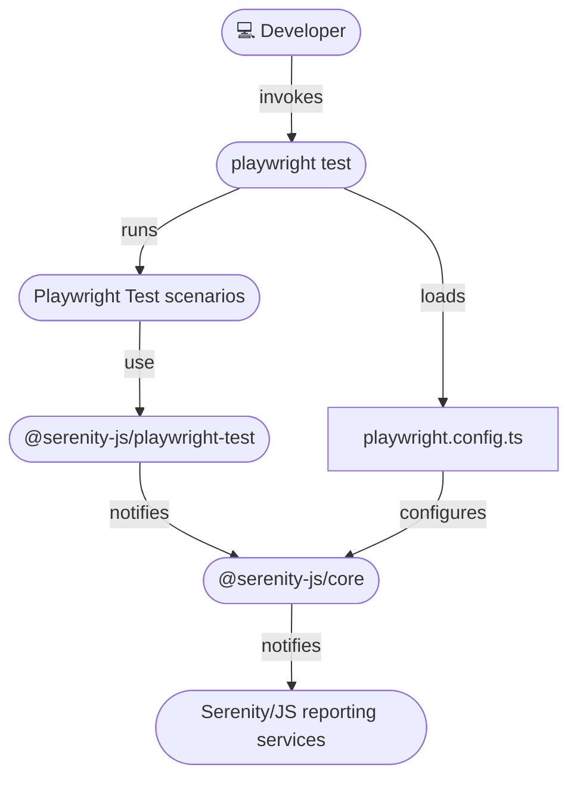

# Integration architecture

Serenity/JS integrates with Playwright Test through the [`@serenity-js/playwright-test`](/api/playwright-test) module,
which acts as a [test runner adapter](/handbook/architecture/#serenityjs-test-runner-adapters) and:
- Captures test execution events from Playwright Test
- Translates them into [Serenity/JS domain events](/handbook/reporting/domain-events)
- Makes them available to [Serenity/JS reporting services](/handbook/reporting/)

This modular architecture enables Serenity/JS to enhance both classic Playwright Test scenarios and those following the Screenplay Pattern with advanced reporting capabilities.

To enable this integration, you need to:
1. Configure [Serenity/JS test runner adapter and reporting services](/handbook/test-runners/playwright-test/configuration/#integrating-serenityjs-reporting) in your `playwright.config.ts` file
2. Optionally, use the [Serenity/JS test fixtures](/handbook/test-runners/playwright-test/writing-tests/#using-the-screenplay-pattern-apis) to enable Screenplay Pattern APIs in your Playwright Test scenarios

<figure>

<figcaption>Serenity/JS + Playwright Test integration architecture</figcaption>
</figure>

## Next steps

Well done, your Playwright Test codebase is now integrated with Serenity/JS! 🎉🎉🎉

To take things further, check out:
- [Your first web scenario (Serenity/JS + Playwright Test tutorial)](/handbook/tutorials/your-first-web-scenario)
- [The Screenplay Pattern](/handbook/design/screenplay-pattern/)
- [Serenity/JS Web Testing Patterns](/handbook/web-testing/)
- [Serenity/JS Playwright project templates](/getting-started/project-templates/#playwright)
- [Serenity/JS Web API docs](/api/web/)
- [Serenity/JS Assertions API docs](/api/assertions/)
- [Serenity/JS examples on GitHub](https://github.com/serenity-js/serenity-js/tree/main/examples/)
- 📚 Our book, ["BDD in Action, Second Edition"](https://www.manning.com/books/bdd-in-action-second-edition)

Remember, new features, tutorials, and demos are coming soon!
Follow [Serenity/JS on LinkedIn](https://www.linkedin.com/company/serenity-js),
subscribe to [Serenity/JS channel on YouTube](https://www.youtube.com/@serenity-js) and join the [Serenity/JS Community Chat](https://matrix.to/#/#serenity-js:gitter.im) to stay up to date!

Don't forget to ⭐️ [Serenity/JS on GitHub](https://github.com/serenity-js/serenity-js) to help others discover the framework!

