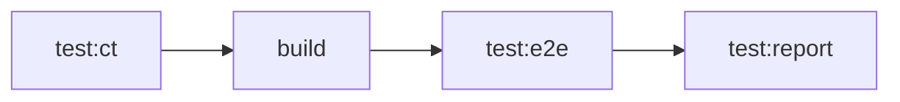

# Reporting

Serenity/JS provides comprehensive reporting capabilities and integrates with both the [Serenity BDD reporter](/handbook/reporting/serenity-bdd-reporter/) and the native Playwright Test reporting tools.
The framework supports:
- **Playwright Test HTML Reports** - Enhanced with Screenplay Pattern activity details and automatic screenshots.
- **Playwright Test UI Mode** - Real-time test execution with Screenplay Pattern integration.
- **Playwright Trace Viewer** - Detailed test execution traces, including Screenplay Pattern activities.
- **Serenity BDD Reports** - Rich, business-focused living documentation of your system.

Serenity/JS supports both classic Playwright Test scenarios and those that follow the [Screenplay Pattern](/handbook/design/screenplay-pattern/),
allowing you to migrate to Screenplay gradually if you wish, or mix and match the two implementations within the same codebase.

:::tip Reference Implementation
Explore the [Serenity/JS + Playwright Test project template](https://github.com/serenity-js/serenity-js-playwright-test-template) to see these reports in action:
- [Serenity BDD report](https://serenity-js.github.io/serenity-js-playwright-test-template/serenity/)
- [Playwright Test report](https://serenity-js.github.io/serenity-js-playwright-test-template/playwright/)
:::

## Playwright HTML reports

Serenity/JS **automatically enhances** the built-in [Playwright HTML reports](https://playwright.dev/docs/test-reporters#html-reporter)
with information gathered from your [Screenplay Pattern](/handbook/design/screenplay-pattern) activities.

To enable integration with the Playwright HTML reporter, you need to:
1. Use the [Screenplay Pattern APIs](/handbook/test-runners/playwright-test/writing-tests/#using-the-screenplay-pattern-apis) in your Playwright Test scenarios.
2. Configure the [Playwright HTML reporter](https://playwright.dev/docs/test-reporters#html-reporter) in your `playwright.config.ts` file.

```ts title="playwright.config.ts"
import { defineConfig, devices } from '@playwright/test'
import type { SerenityFixtures, SerenityWorkerFixtures } from '@serenity-js/playwright-test'

export default defineConfig<SerenityFixtures, SerenityWorkerFixtures>({
    reporter: [
        // Enable Serenity/JS reporting services
        [ '@serenity-js/playwright-test', {
            crew: [
                '@serenity-js/console-reporter',
                [ '@serenity-js/serenity-bdd', {
                  specDirectory: './spec'
                } ],
                [ '@serenity-js/core:ArtifactArchiver', {
                  outputDirectory: './target/site/serenity'
                } ],
            ]
        }],

        // Enable Playwright Test HTML reporter
        [ 'html', { open: 'never' } ],
    ],

    // Other Playwright Test configuration options
})
```

<Figure
    caption='Native Playwright Test HTML report, augmented with information from Serenity/JS Screenplay Pattern activities and automated screenshots captured by the Serenity/JS Photographer'
    externalLink={'https://serenity-js.github.io/serenity-js-playwright-test-template/playwright/'}
    img={require('@site/static/images/test-runners/playwright-test/serenity-js-playwright-test-report.png')}
/>

## Playwright Test UI Mode

Serenity/JS integrates with [Playwright Test UI Mode](https://playwright.dev/docs/test-ui-mode), displaying Screenplay Pattern activities in the test runner interface.

To use Playwright Test UI Mode, run the following command in your Playwright Test project:
```sh
npx playwright test --ui
```

<Figure
    caption='Using Serenity/JS Screenplay Pattern with Playwright Test UI Mode'
    externalLink={'https://serenity-js.github.io/serenity-js-playwright-test-template/playwright/'}
    img={require('@site/static/images/test-runners/playwright-test/serenity-js-playwright-ui-mode.png')}
/>

## Using Playwright Test Trace Viewer

Your Screenplay Pattern activities automatically appear in the [Playwright Test Trace Viewer](https://playwright.dev/docs/trace-viewer-intro).

To use this feature, you need to:
1. Use the [Screenplay Pattern APIs](/handbook/test-runners/playwright-test/writing-tests/#using-the-screenplay-pattern-apis) in your Playwright Test scenarios.
2. Enable tracing in your `playwright.config.ts` file.

```ts title="playwright.config.ts"
import { defineConfig, devices } from '@playwright/test'
import type { SerenityFixtures, SerenityWorkerFixtures } from '@serenity-js/playwright-test'

export default defineConfig<SerenityFixtures, SerenityWorkerFixtures>({
  use: {
    trace: 'on-first-retry',     // or 'on', 'retain-on-failure'
  },
})
```

<Figure
    caption='Using Serenity/JS Screenplay Pattern with Playwright Test Trace Viewer'
    externalLink={'https://serenity-js.github.io/serenity-js-playwright-test-template/playwright/'}
    img={require('@site/static/images/test-runners/playwright-test/serenity-js-playwright-test-trace-viewer.png')}
/>

## Serenity BDD Reports

[Serenity reports and living documentation](/handbook/reporting/serenity-bdd-reporter) are a powerful feature enabled by Serenity BDD.
They aim not only to **report test results**, but also to document **how features are tested**, and **what your application does**.

Serenity BDD reports are generated by the [Serenity BDD CLI](https://github.com/serenity-bdd/serenity-core/tree/main/serenity-cli),
a Java program that ships with the [`@serenity-js/serenity-bdd`](/api/serenity-bdd/) module.
These reports are based on the `json` reports produced by the [Serenity BDD Reporter](/handbook/reporting/serenity-bdd-reporter/),
as well as screenshots captured by the [Photographer](/handbook/reporting/photographer/).

<Figure
    caption='Example Serenity BDD report'
    externalLink={'https://serenity-js.github.io/serenity-js-playwright-test-template/serenity/'}
    img={require('@site/static/images/reporting/serenity-bdd-reporter.png')}
/>

To generate Serenity BDD HTML reports and living documentation, your test suite must:
1. Use [`SerenityBDDReporter`](/api/serenity-bdd/class/SerenityBDDReporter/) and [`ArtifactArchiver`](/api/core/class/ArtifactArchiver/) as per the [configuration instructions](/handbook/test-runners/playwright-test/configuration/#integrating-serenityjs-reporting).
2. Invoke the `serenity-bdd run` command when the test run has finished to generate the Serenity BDD report.

All [Serenity/JS Project Templates](/getting-started/project-templates/) follow the same recommended pattern to generate Serenity BDD reports.
This approach relies on:
- NPM scripts to invoke the command-line tools, such as Playwright Test or the Serenity BDD CLI.
- [`npm-failsafe`](https://www.npmjs.com/package/npm-failsafe) to execute a sequence of NPM scripts.
- [`rimraf`](https://www.npmjs.com/package/rimraf) to remove any test reports left over from the previous run.

You can install these additional recommended modules as follows:

```sh npm2yarn
npm install --save-dev npm-failsafe rimraf
```

Next, add the following convenience scripts to your `package.json` file:
- `clean` - removes any test reports left over from the previous test run.
- `test` - uses `npm-failsafe` to execute multiple NPM scripts and generate test reports.
- `test:execute` - an example alias for `playwright test`. You can extend it to include any necessary command-line arguments.
- `test:report` - an alias for `serenity-bdd run`. You can configure it with alternative `json` report locations (`--source`) and HTML report destinations (`--destination`). Run `npx serenity-bdd run --help` to see the available options.

```json title="package.json"
{
  "scripts": {
    "clean": "rimraf target",
    "test": "failsafe clean test:execute test:report",
    "test:execute": "playwright test",
    "test:report": "serenity-bdd run --source ./target/site/serenity --destination ./target/site/serenity",
  }
}
```

To learn more about the `SerenityBDDReporter`, see:
- [`SerenityBDDReporter`](/api/serenity-bdd/class/SerenityBDDReporter/) API documentation and configuration examples.
- [Serenity/JS + Playwright Test project template](https://github.com/serenity-js/serenity-js-playwright-test-template) on GitHub
- [Serenity/JS examples](https://github.com/serenity-js/serenity-js/tree/main/examples) on GitHub

### Chaining NPM scripts

A common advanced usage pattern for systems with multiple test suites is to execute each test suite separately on CI across multiple [pipeline stages](/handbook/integration/),
while running them sequentially in a local environment. In both cases, a single Serenity BDD report is generated at the end.
This pattern is particularly useful for systems with multiple [Playwright Test projects](https://playwright.dev/docs/test-projects) or those that use both the [Playwright Component Test runner](/getting-started/project-templates/#web-component-testing) and
the [Playwright Test runner](/getting-started/project-templates/#playwright).

<figure>

<figcaption>Example CI pipeline running tests and build steps across multiple pipeline stages</figcaption>
</figure>

To implement this pattern, define an NPM script for each project and the report generation step, then use `npm-failsafe` to chain the NPM scripts for local execution.


```json title="package.json"
{
  "scripts": {
    "build": "esbuild src/app.tsx ...",
    "test": "failsafe test:clean test:ct build test:e2e test:report",
    "test:clean": "rimraf target",
    "test:ct": "playwright test-ct --config playwright-ct.config.ts",
    "test:e2e": "playwright test --config playwright.config.ts",
    "test:report": "serenity-bdd run --source ./target/site/serenity --destination ./target/site/serenity",
  }
}
```

:::tip Parameterized NPM scripts
`npm-failsafe` enables additional advanced usage and configuration patterns, such as passing runtime
parameters to your NPM scripts. See the [`npm-failsafe` documentation](https://github.com/jan-molak/npm-failsafe?tab=readme-ov-file#configuration) for examples.
:::

## What you learnt

- Serenity/JS automatically enhances Playwright HTML reports, UI Mode, and Trace Viewer with Screenplay Pattern details.
- Serenity BDD reports provide business-focused living documentation generated from JSON artifacts.
- Use `npm-failsafe` to chain test execution and report generation scripts reliably.

## Next step

Learn about the [integration architecture](/handbook/test-runners/playwright-test/integration-architecture/) to understand how Serenity/JS works with Playwright Test under the hood.
