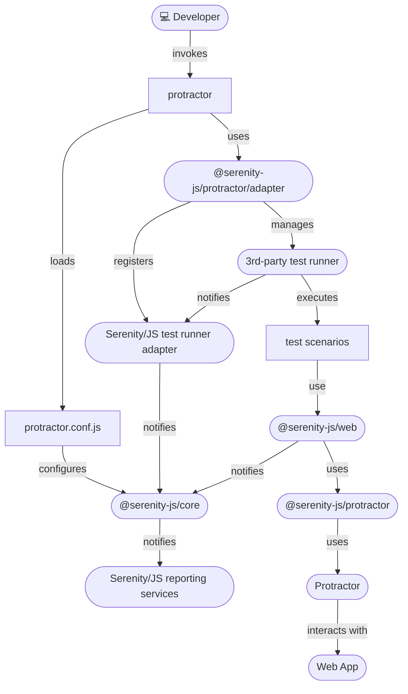

# Protractor

[Protractor](https://www.protractortest.org/) is an end-to-end test framework for Angular and AngularJS applications, based on Selenium 3.
Protractor runs tests against your application running in a real browser, interacting with it as a user would.

[Serenity/JS](https://serenity-js.org) revolutionises automated testing by enabling your team to write **expressive**, **maintainable tests** that align
with **your unique domain**. Seamlessly integrating with [Protractor](https://www.protractortest.org/) and test runners like
[**Mocha**](https://serenity-js.org/handbook/test-runners/mocha/),
[**Cucumber**](https://serenity-js.org/handbook/test-runners/cucumber/),
and [**Jasmine**](https://serenity-js.org/handbook/test-runners/jasmine/),
Serenity/JS also offers **advanced reporting** that provides clear insights into test results,
helping both technical teams and business stakeholders understand the quality of the system under test.

Plus, it accommodates both classic Protractor tests and Serenity/JS [Screenplay Pattern scenarios](/handbook/design/screenplay-pattern/),
allowing you to migrate to Screenplay gradually,
and then simply switch to using Serenity/JS with a more modern web integration tool
like [Playwright](/handbook/test-runners/playwright-test/) or
[WebdriverIO](/handbook/test-runners/webdriverio/).

:::warning Protractor is deprecated
Protractor is now [officially deprecated](https://blog.angular.io/the-state-of-end-to-end-testing-with-angular-d175f751cb9c)
and has not received any updates since [April 2020](https://github.com/angular/protractor/commits/master).
You **should not** rely on Protractor for any new test automation projects, and instead use Serenity/JS with more modern
and developer-friendly integration tools like [WebdriverIO](/handbook/test-runners/webdriverio)
or [Playwright Test](/handbook/test-runners/playwright-test).

#### Should I use Serenity/JS with my existing Protractor project?

**Yes**. The most common reason why you **should** introduce Serenity/JS
to an **existing** Protractor project is that it can help you to **reliably migrate** your codebase
to a more modern integration tool like [WebdriverIO](/api/webdriverio)
or [Playwright](/api/playwright).

Using Serenity/JS [Screenplay Pattern APIs](/handbook/design/screenplay-pattern)
will also help you **future-proof your codebase** and make it **agnostic** of the underlying integration tools.
:::

**Benefits of integrating Protractor with Serenity/JS:**
- [Enhanced Reporting](/handbook/reporting/) - Use Serenity/JS as a drop-in replacement of any built-in Protractor framework to produce in-depth test execution reports and living documentation of your project.
- [Screenplay Pattern APIs](/handbook/design/screenplay-pattern/) - Leverage the Screenplay Pattern for portable, maintainable tests that streamline collaboration.
- [Integration Libraries](/api/core/) - [Test RESTful APIs](/api/rest), [manage local Node.js servers](/api/local-server/), and [verify complex workflows](/api/assertions/) effortlessly with ready-to-use libraries.

**In this guide, you will learn how to:**
- **Integrate Serenity/JS** with your Protractor test suite.
- **Enable Serenity BDD reports**.
- Start using the **Screenplay Pattern**.
- Replace Protractor with **WebdriverIO** while keeping your tests working!


## Quick start 🚀

To start testing immediately, consider using:
- [**Serenity/JS Project Templates for Protractor**](/handbook/project-templates/#protractor) - Pre-configured with essential dependencies.
- [**Serenity/JS GitPods**](/handbook/project-templates/#serenityjs-gitpods) - Ready-to-use cloud-based development environments.
- [**Serenity/JS reference implementations**](https://github.com/serenity-js/serenity-js/tree/main/examples) on GitHub.

To see Serenity/JS reporting in action, explore the live reports generated by the Serenity/JS + Protractor Project Templates:
| Framework | Project Template | Live Report |
| --- | --- | --- |
| Serenity/JS + Cucumber + Protractor | [Project Template](https://github.com/serenity-js/serenity-js-cucumber-protractor-template) | [Live Report](https://serenity-js.github.io/serenity-js-cucumber-protractor-template/) |
| Serenity/JS + Mocha + Protractor | [Project Template](https://github.com/serenity-js/serenity-js-mocha-protractor-template) | [Live Report](https://serenity-js.github.io/serenity-js-mocha-protractor-template/) |
| Serenity/JS + Jasmine + Protractor | [Project Template](https://github.com/serenity-js/serenity-js-jasmine-protractor-template) | [Live Report](https://serenity-js.github.io/serenity-js-jasmine-protractor-template/) |

## Installation

To use Serenity/JS with Protractor, follow the [Serenity/JS installation guide](/handbook/installation/)
to set up your development environment and core runtime dependencies.
Then, create a new Protractor project or add Serenity/JS integration and reporting modules to an existing project.

### Installing Serenity/JS

To add Serenity/JS to a Protractor project, install the following modules:

```sh npm2yarn
npm install --save-dev @serenity-js/core @serenity-js/console-reporter @serenity-js/protractor @serenity-js/rest @serenity-js/web @serenity-js/serenity-bdd
```

This command installs:
- [`@serenity-js/core`](/api/core)
- [`@serenity-js/console-reporter`](/api/console-reporter)
- [`@serenity-js/protractor`](/api/protractor)
- [`@serenity-js/rest`](/api/rest)
- [`@serenity-js/web`](/api/web)
- [`@serenity-js/serenity-bdd`](/api/serenity-bdd)

Protractor offers a test runner that uses Jasmine, Mocha, or Cucumber to run your test scenarios.
Since the task of running the scenarios is delegated to another tool,
you'll need to follow the installation instructions to add a Serenity/JS test runner adapter for the runner you've decided to use.

See Serenity/JS test runner adapter installation instructions for:
- [Cucumber](/handbook/test-runners/cucumber#installing-serenityjs-test-runner-adapter)
- [Jasmine](/handbook/test-runners/jasmine#installing-serenityjs-test-runner-adapter)
- [Mocha](/handbook/test-runners/mocha#installing-serenityjs-test-runner-adapter)


## Configuration

Protractor uses the [`protractor.conf.js` file](https://github.com/angular/protractor/blob/master/lib/config.ts) to configure test scenarios and reporters.

This section provides a step-by-step guide to the complete configuration setup.

### Integrating Serenity/JS reporting

Serenity/JS offers automatic screenshot capture for test scenarios using the [Screenplay Pattern](/handbook/design/screenplay-pattern/).
This is handled by the [Photographer service](/handbook/reporting/photographer/), which takes screenshots based on interactions and assertion failures performed by the Serenity/JS actors.

To integrate [Serenity/JS reporting](/handbook/reporting/) and enable automatic screenshot capture, modify the `protractor.conf.js` file as follows:

```js title="protractor.conf.js" tab={"label":"Cucumber"}
exports.config = {
    // Disable Selenium promise manager
    SELENIUM_PROMISE_MANAGER: false,

    framework:      'custom',
    frameworkPath:  require.resolve('@serenity-js/protractor/adapter'),

    specs: [
        './features/**/*.feature'
    ],

    serenity: {
        runner: 'cucumber',
        crew: [
            // Optional, print test execution results to standard output
            '@serenity-js/console-reporter',

            // Optional, produce Serenity BDD reports
            // and living documentation (HTML)
            [ '@serenity-js/serenity-bdd', {
                specDirectory: './features'
            } ],

            [ '@serenity-js/core:ArtifactArchiver', {
                outputDirectory: 'target/site/serenity'
            } ],

            // Optional, automatically capture screenshots
            // upon interaction failure
            [ '@serenity-js/web:Photographer', {
                strategy: 'TakePhotosOfFailures'
            } ],
        ]
    },

    cucumberOpts: {
        require: [
            'features/step_definitions/**/*.steps.ts',      // If you're using TypeScript
            'features/support/*.ts',
            // 'features/step_definitions/**/*.steps.js',   // If you're using JavaScript
            // 'features/support/*.js'
        ],
        requireModule:   [
            // Optional, if you're using TypeScript
            'ts-node/register'
        ],
        tags:    ['not @wip'],
        strict:  false,
    }
};
```

```js title="protractor.conf.js" tab={"label":"Mocha"}
exports.config = {
    // Disable Selenium promise manager
    SELENIUM_PROMISE_MANAGER: false,

    framework:      'custom',
    frameworkPath:  require.resolve('@serenity-js/protractor/adapter'),

    specs: [
        './spec/*.spec.ts',     // If you're using TypeScript
        // './spec/*.spec.js',  // If you're using JavaScript
    ],

    serenity: {
        runner: 'mocha',
        crew: [
            // Optional, print test execution results to standard output
            '@serenity-js/console-reporter',

            // Optional, produce Serenity BDD reports
            // and living documentation (HTML)
            [ '@serenity-js/serenity-bdd', {
                specDirectory: './spec'
            } ],

            [ '@serenity-js/core:ArtifactArchiver', {
                outputDirectory: 'target/site/serenity'
            } ],

            // Optional, automatically capture screenshots
            // upon interaction failure
            [ '@serenity-js/web:Photographer', {
                strategy: 'TakePhotosOfFailures'
            } ],
        ]
    },

    mochaOpts: {
        require: [
            // Optional, if you're using TypeScript
            'ts-node/register',
        ],
        timeout: 10000,
        // retries: 2       // auto-retry failed tests up to n times
    },
};
```

```js title="protractor.conf.js" tab={"label":"Jasmine"}
exports.config = {
    // Disable Selenium promise manager
    SELENIUM_PROMISE_MANAGER: false,

    framework:      'custom',
    frameworkPath:  require.resolve('@serenity-js/protractor/adapter'),

    specs: [
        './spec/*.spec.ts',     // If you're using TypeScript
        // './spec/*.spec.js',  // If you're using JavaScript
    ],

    serenity: {
        runner: 'jasmine',
        crew: [
            // Optional, print test execution results to standard output
            '@serenity-js/console-reporter',

            // Optional, produce Serenity BDD reports
            // and living documentation (HTML)
            [ '@serenity-js/serenity-bdd', {
                specDirectory: './spec'
            } ],

            [ '@serenity-js/core:ArtifactArchiver', {
                outputDirectory: 'target/site/serenity'
            } ],

            // Optional, automatically capture screenshots
            // upon interaction failure
            [ '@serenity-js/web:Photographer', {
                strategy: 'TakePhotosOfFailures'
            } ],
        ]
    },

    jasmineNodeOpts: {
        requires: [
            // Optional, if you're using TypeScript
            'ts-node/register'
        ],
    },
};
```

This configuration enables the [`@serenity-js/protractor`](/api/protractor/) test runner adapter, which in turn configures the ["stage crew"](/handbook/architecture/#serenityjs-reporting-services) of Serenity/JS reporting services:
- [Console reporter](/handbook/reporting/console-reporter/) - Displays test results in the terminal.
- [Serenity BDD reporter](/handbook/reporting/serenity-bdd-reporter/) - Produces `json` reports to be ingested by the Serenity BDD CLI and produce the living documentation.
- [Photographer](/handbook/reporting/photographer/) - Automatically captures screenshots of the browser upon interactions or assertion failures when configured with `TakePhotosOfInteractions` or `TakePhotosOfFailures`, respectively.
- [Artifact Archiver](/handbook/reporting/artifact-archiver/) - Stores the `json` reports and screenshots captured by the Photographer to disk.

Note that the above configuration assumes the following directory structure of your project:
- `./spec` - stores your test scenarios and is the top-most directory of your [requirements hierarchy](/handbook/reporting/serenity-bdd-reporter/#the-requirements-hierarchy).
- `./target/site/serenity` - stores any test report artifacts, like the `.json` files and screenshots.

If you'd like to use different locations for your tests or the test reports, adjust the `specDirectory` and `outputDirectory` settings accordingly.

Learn more about the configuration options for your test runner:
| Test Runner | Configuration Options | Complete `protractor.conf.js` |
| --- | --- | --- |
| Cucumber | [Serenity/JS Cucumber configuration options](/api/cucumber-adapter/interface/CucumberConfig/) | [Cucumber Protractor Template config](https://github.com/serenity-js/serenity-js-cucumber-protractor-template/blob/main/protractor.conf.js) |
| Jasmine | [Serenity/JS Jasmine configuration options](/api/jasmine-adapter/interface/JasmineConfig/) | [Jasmine Protractor Template config](https://github.com/serenity-js/serenity-js-jasmine-protractor-template/blob/main/protractor.conf.js) |
| Mocha | [Serenity/JS Mocha configuration options](/api/mocha-adapter/interface/MochaConfig/) | [Mocha Protractor Template config](https://github.com/serenity-js/serenity-js-mocha-protractor-template/blob/main/protractor.conf.js) |

## Writing tests

Serenity/JS is designed to integrate seamlessly with your existing Protractor codebase, even if you are not using the [Screenplay Pattern](/handbook/design/screenplay-pattern/) yet.
Additionally, the framework enables you to **mix Screenplay and non-Screenplay scenarios** within the same codebase, helping your team gradually adopt the pattern where appropriate.

In this section, you will learn how to write test scenarios using Protractor and Serenity/JS APIs and how to leverage actors to structure your test interactions.

### Using the Screenplay Pattern APIs

The [Screenplay Pattern](/handbook/design/screenplay-pattern/) is an innovative, user-centred approach to writing high-quality automated acceptance tests.
It promotes effective use of layers of abstraction, helps your test scenarios reflect the business vernacular of your domain,
and encourages good testing and software engineering practices within your team.

To use the Screenplay Pattern APIs, import the relevant [interactions](/api/core/class/Interaction/) and [questions](/api/core/class/Question/) from the appropriate modules,
and instruct your actors to perform them using the [`actor.attemptsTo`](/api/core/class/Actor/#attemptsTo) method.

The most commonly used Screenplay Pattern APIs come from the following modules:
- [`@serenity-js/web`](/api/web) - Provides web interactions portable across different web automation libraries, such as Playwright or [WebdriverIO](/handbook/test-runners/webdriverio/), as well as the [Page Element Query Language](/handbook/web-testing/page-element-query-language/) APIs.
- [`@serenity-js/assertions`](/api/assertions) - Provides universal assertions that work across different test runners and automation libraries.
- [`@serenity-js/rest`](/api/rest) - Provides RESTful API interactions for sending requests and inspecting responses.
- [`@serenity-js/protractor`](/api/protractor) - Provides Protractor-specific interactions.
- [`@serenity-js/core`](/api/core) - Provides interface-agnostic interactions, such as [waiting and synchronisation](/handbook/design/waiting-and-synchronisation/), [control flow](/handbook/design/control-flow/), or [logging](/handbook/design/logging/).


### Using actors in test scenarios

When you configure [Serenity/JS Protractor](/api/protractor)
as the [Protractor `framework`](/handbook/test-runners/protractor#configuring-serenityjs),
Serenity/JS automatically creates and makes available a default [cast](/api/core/class/Cast) of [actors](/api/core/class/Actor/),
where every actor has the abilities to:
- [`BrowseTheWebWithProtractor`](/api/protractor/class/BrowseTheWebWithProtractor/) - Allows interaction with the browser using the global `protractor.browser` object.
- [`TakeNotes.usingAnEmptyNotepad()`](/api/core/class/TakeNotes/) - Facilitates storing and retrieving information during the test run.
- [`CallAnApi`](/api/rest/class/CallAnApi/) - Enables interaction with RESTful APIs using an Axios HTTP client configured
  with configured with `baseUrl`.

To use an actor in your Protractor test scenario, refer to it using the
[`actorCalled`](/api/core/function/actorCalled) function, which returns an instance of the actor with the given name,
or use the [`actorInTheSpotlight`](/api/core/function/actorInTheSpotlight) function to refer to the last accessed actor.
All the default actors already have access to the Protractor-managed browser instance.

```ts title="specs/example.spec.ts"
import 'jasmine'
import { actorCalled } from '@serenity-js/core'
import { Navigate, Page } from '@serenity-js/web'
import { Ensure, equals } from '@serenity-js/assertions'

describe('My awesome website', () => {
    it('can have test scenarios that follow the Screenplay Pattern', async () => {
        await actorCalled('Alice').attemptsTo(
            Navigate.to(`https://www.protractortest.org/`),
            Ensure.that(
                Page.current().title(),
                equals(`Protractor - end-to-end testing for AngularJS`)
            ),
        )
    })

    it('can have non-Screenplay scenarios too', async () => {
        await browser.get(`https://www.protractortest.org`)
        await expect(browser.getTitle())
            .toBe('Protractor - end-to-end testing for AngularJS')
    })
})
```

:::tip Overriding abilities
An actor can only have **one instance of each ability** type at a time.
Therefore, providing a new instance of the same type via the [`actor.whoCan`](/api/core/class/Actor/#whoCan) method overrides any existing ability of that type
:::

Since Protractor uses Jasmine, Mocha, or Cucumber to run your test scenarios, please refer to their
dedicated guides to learn more about using Serenity/JS actors with:
- [Cucumber](/handbook/test-runners/cucumber#referring-to-actors-in-test-scenarios)
- [Jasmine](/handbook/test-runners/jasmine#referring-to-actors-in-test-scenarios)
- [Mocha](/handbook/test-runners/mocha#referring-to-actors-in-test-scenarios)

### Replacing the default actors

You can replace the default [cast of actors](/api/core/class/Cast)
by providing a custom implementation via [`serenity.actors`](/api/protractor-adapter/interface/Config#serenity)
configuration option in your `protractor.conf.js`.

For example, to implement a cast where every actor can [`BrowseTheWebWithProtractor`](/api/protractor/class/BrowseTheWebWithProtractor),
[`TakeNotes`](/api/core/class/TakeNotes) and [`CallAnApi`](/api/rest/class/CallAnApi), you could create a `MyActors` class like this:

```javascript title="test/MyActors.js"
const { TakeNotes } = require('@serenity-js/core')
const { CallAnApi } = require('@serenity-js/rest')
const { BrowseTheWebWithProtractor } = require('@serenity-js/protractor')

exports.Actors = class Actors {
    constructor(apiUrl) {
        this.apiUrl = apiUrl
    }

    prepare(actor) {
        return actor.whoCan(
            BrowseTheWebWithProtractor.using(require('protractor').browser),
            TakeNotes.usingAnEmptyNotepad(),
            CallAnApi.at(this.apiUrl),
        );
    }
}
```

:::info No browser in the configuration file
Protractor doesn't allow you to use the `browser` global variable in `protractor.conf.js`.
That's why you need to create a custom implementation of [`Cast`](/api/core/class/Cast)
and only refer to `browser` in [`Cast.prepare`](/api/core/class/Cast#prepare) method.
:::

:::info No TypeScript in the configuration file
Protractor doesn't allow you to use TypeScript in `protractor.conf.js`.
That's why `MyActors` needs to be implemented in plain-old JavaScript.
:::


Next, modify your Protractor configuration file to provide your custom `MyActors` implementation:

```javascript title="protractor.conf.js"
// highlight-next-line
const { MyActors } = require('./test/MyActors');

exports.config = {

    framework:      'custom',
    frameworkPath:  require.resolve('@serenity-js/protractor/adapter'),

    serenity: {
        // highlight-next-line
        actors: new MyActors(),
        crew: [
            '@serenity-js/console-reporter',
            '@serenity-js/serenity-bdd',
            [ '@serenity-js/core:ArtifactArchiver', { outputDirectory: 'target/site/serenity' } ],
            [ '@serenity-js/web:Photographer', { strategy: 'TakePhotosOfFailures' } ],
        ]
    },

    // other Protractor config
}
```

## Reporting

Serenity/JS provides comprehensive reporting capabilities and integrates with the [Serenity BDD reporter](/handbook/reporting/serenity-bdd-reporter/).

:::tip Reference Implementation
Explore the [Serenity/JS + Protractor project templates](/handbook/project-templates/#protractor) to see the reporting capabilities in action.
:::

### Serenity BDD Reports

[Serenity reports and living documentation](/handbook/reporting/serenity-bdd-reporter) are a powerful feature enabled by Serenity BDD.
They aim not only to **report test results**, but also to document **how features are tested**, and **what your application does**.

Serenity BDD reports are generated by the [Serenity BDD CLI](https://github.com/serenity-bdd/serenity-core/tree/main/serenity-cli),
a Java program that ships with the [`@serenity-js/serenity-bdd`](/api/serenity-bdd/) module.
These reports are based on the `json` reports produced by the [Serenity BDD Reporter](/handbook/reporting/serenity-bdd-reporter/),
as well as screenshots captured by the [Photographer](/handbook/reporting/photographer/).

<Figure
    caption='Example Serenity BDD report'
    img={require('@site/static/images/reporting/serenity-bdd-reporter.png')}
/>

To generate Serenity BDD HTML reports and living documentation, your test suite must:
1. Use [`SerenityBDDReporter`](/api/serenity-bdd/class/SerenityBDDReporter/) and [`ArtifactArchiver`](/api/core/class/ArtifactArchiver/) as per the [configuration instructions](#integrating-serenityjs-reporting).
2. Invoke the `serenity-bdd run` command when the test run has finished to generate the Serenity BDD report.

All [Serenity/JS Project Templates](/handbook/project-templates/) follow the same recommended pattern to generate Serenity BDD reports.
This approach relies on:
- NPM scripts to invoke the command-line tools, such as Playwright Test or the Serenity BDD CLI.
- [`npm-failsafe`](https://www.npmjs.com/package/npm-failsafe) to execute a sequence of NPM scripts.
- [`rimraf`](https://www.npmjs.com/package/rimraf) to remove any test reports left over from the previous run.

You can install these additional recommended modules as follows:

```sh npm2yarn
npm install --save-dev npm-failsafe rimraf
```

Next, add the following convenience scripts to your `package.json` file:
- `clean` - removes any test reports left over from the previous test run.
- `test` - uses `npm-failsafe` to execute multiple NPM scripts and generate test reports.
- `test:execute` - an example alias for `protractor`. You can extend it to include any necessary command-line arguments.
- `test:report` - an alias for `serenity-bdd run`. You can configure it with alternative `json` report locations (`--source`) and HTML report destinations (`--destination`). Run `npx serenity-bdd run --help` to see the available options.

```json title="package.json"
{
  "scripts": {
    "clean": "rimraf target",
    "test": "failsafe clean test:execute test:report",
    "test:execute": "protractor ./protractor.conf.js",
    "test:report": "serenity-bdd run --source ./target/site/serenity --destination ./target/site/serenity",
  }
}
```

To learn more about the `SerenityBDDReporter`, see:
- [`SerenityBDDReporter`](/api/serenity-bdd/class/SerenityBDDReporter/) API documentation and configuration examples.
- [Serenity/JS Protractor project templates](/handbook/project-templates/#protractor)
- [Serenity/JS examples](https://github.com/serenity-js/serenity-js/tree/main/examples) on GitHub

## Migrating from Protractor to Serenity/JS

Serenity/JS accommodates both classic Protractor tests and Serenity/JS [Screenplay Pattern scenarios](/handbook/design/screenplay-pattern/),
allowing you to migrate to Screenplay gradually while **keeping your existing test suites working** and providing value to your organisation
during the migration. With Serenity/JS, there's **no need for a big-bang rewrite**!

If you have an existing Protractor test suite and want to upgrade to a more modern web integration tool like Playwright or WebdriverIO, you'll need to:
- Upgrade your Node.js to the latest [Long-Term Support (LTS)](https://github.com/nodejs/Release) version, such as <strong><CurrentNodeVersion /></strong>
- Install [Serenity/JS dependencies](/handbook/test-runners/protractor/#installing-serenityjs) for Protractor,
as well as [Java Runtime Environment](/handbook/installation/#installing-the-jre) if you'd like to use
[Serenity BDD](/handbook/reporting/serenity-bdd-reporter/) reports
- Migrate your existing Protractor tests to use [Serenity/JS Screenplay Pattern web APIs](/api/web/), which you can do gradually while keeping the remaining scenarios working
- When all your test scenarios are using [Serenity/JS Screenplay Pattern web APIs](/api/web/) and there are no Protractor API calls left,
introduce [Playwright](/handbook/test-runners/playwright-test/) or [WebdriverIO](/handbook/test-runners/webdriverio/) to ensure
your migrated scenarios work with the new integration library
- Remove Protractor dependencies and enjoy your modernised test suite!

:::tip Migrate or rewrite?
Migrating existing Protractor test scenarios to follow the Serenity/JS Screenplay Pattern can be a big undertaking, depending on the size, complexity, and stability of your current test suite.
Not to mention that every team has a slightly different Protractor setup and uses the tool in different ways, which makes automating the migration process
challenging.

When migrating to Serenity/JS, start with the easy scenarios so that you can focus the first steps of your migration on making sure your
[continuous integration](/handbook/integration/) and [reporting infrastructure](/handbook/reporting/) work reliably.
This way you'll build a stable foundation upon which you can migrate the more complex tests.

Remember, if your current Protractor test suite is reasonably stable, still works and provides value, there's no need for a risky big bang rewrite
as you can migrate it one scenario at a time while keeping the existing tests working.
However, if your current Protractor test suite _doesn't work_ and you'd rather delete it than migrate it, you might prefer to start from scratch and use Serenity/JS with [Playwright](/handbook/test-runners/playwright-test/) or [WebdriverIO](/handbook/test-runners/webdriverio/) straight away.
The choice is yours and Serenity/JS will support you either way.
:::

### Locating elements

To identify web elements with Serenity/JS you use the [Page Element Query Language](/handbook/web-testing/page-element-query-language/).

In short:
- [`PageElement`](/api/web/class/PageElement/) represents a single HTML element,
- [`PageElements`](/api/web/class/PageElements/) represent a collection of HTML elements and lets you filter it based on your criteria.
- [`By`](/api/web/class/PageElements/) represents portable locators used to identify the elements,

For example, to identify an element `<h1 id="title">My article</h1>` in plain Protractor you'd say:
```typescript
element(by.css('h1.title'))
```
Serenity/JS has a similar construct and allows you to specify a description to be used when reporting interactions
with the element:
```typescript
import { By, PageElement } from '@serenity-js/web'

PageElement.located(By.css('h1.title'))
```
However, Serenity/JS also allows you to specify a human-readable description to be used when reporting interactions
with the element:

```typescript
import { By, PageElement } from '@serenity-js/web'

PageElement.located(By.css('h1.title'))
    .describedAs('article title')
```

The below table shows how you can translate common Protractor [element finder expressions](https://www.protractortest.org/#/locators#locators)
to Serenity/JS page element expressions:

| Protractor                                           | Serenity/JS                                                                                                                                                                              |
|------------------------------------------------------|------------------------------------------------------------------------------------------------------------------------------------------------------------------------------------------|
| `element(by.css('.selector'))`                       | `PageElement.located(By.css('...'))`                                                                                                                                                     |
| `element(by.id('...'))`                              | `PageElement.located(By.id('...'))`                                                                                                                                                      |
| `element(by.xpath('...'))`                           | `PageElement.located(By.xpath('...'))`                                                                                                                                                   |
| `element(by.model('...'))`                           | `PageElement.located(By.css('[ng-model="..."]'))`                                                                                                                                        |
| `element(by.repeater('...'))`                        | `PageElement.located(By.css('[ng-repeat="..."]'))`                                                                                                                                       |
| `element(by.cssContainingText('.selector', 'text'))` | `PageElement.located(By.cssContainingText('.selector', 'text'))`<br />or for greater flexibility:<br />`PageElements.located(By.css('.selector')).where(Text, includes('text')).first()` |
| `element(by.buttonText('Submit'))`                   | `PageElements.located(By.css('button')).where(Text, equals('Submit')).first()`                                                                                                           |
| `element.all`                                        | `PageElements.located(By.css('...'))`                                                                                                                                                    |

Note how with Serenity/JS you can easily express complex queries using intuitive syntax.
For example, you can locate the [last](/api/web/class/PageElements/#last) `<button />` which text meets some [expectation](/api/core/class/Expectation/):

```typescript
import { By, PageElements, Text } from '@serenity-js/web'
import { equals } from '@serenity-js/assertions'

PageElements.located(By.css('button'))
    .where(Text, equals('Submit'))
    .last()
```

You can create aliases for expressions you use frequently:

```typescript
import { By, PageElements, Text } from '@serenity-js/web'
import { equals } from '@serenity-js/assertions'

const approveButton = () =>
    PageElements.located(By.css('button'))
        .where(Text, equals('Approve'))
        .first()
```

And you can also [compose page elements](/handbook/web-testing/page-element-query-language/#composing-page-elements-using-meta-questions), making them reusable:

```typescript
import { actorCalled, Expectation } from '@serenity-js/core'
import { equals } from '@serenity-js/assertions'
import { By, Click, PageElement, PageElements } from '@serenity-js/web'

const clientNameField = () =>
    PageElement.located(By.css('[data-test-id="client-name"]'))
        .describedAs('client name field')

const invoiceRecordForClientWhereName = (expectation: Expectation<string>) =>
    PageElements.located(By.css('li.invoice'))
        .where(Text.of(clientNameField()), expectation)
        .first()

await actorCalled('Alice').attemptsTo(
    Click.on(
        approveButton().of(invoiceRecordForClientWhereName(equals('Acme')))
    )
)
```

Learn more:
- [Page Element Query Language](/handbook/web-testing/page-element-query-language/)

### Retrieving information

To retrieve information about the current web page, use [`Page.current()`](/api/web/class/Page/).

| Protractor                | Serenity/JS                 |
|---------------------------|-----------------------------|
| `browser.getCurrentUrl()` | `Page.current().url().href` |
| `browser.getTitle()`      | `Page.current().title()`    |

For example, to navigate to a page and then assert on its [title](/api/web/class/Page/#title) and [URL](/api/web/class/Page/#url) you can say:

```typescript
import { actorCalled } from '@serenity-js/core'
import { Ensure, endsWith, equals } from '@serenity-js/assertions'
import { Navigate, Page } from '@serenity-js/web'

await actorCalled('Amanda').attemptsTo(
    Navigate.to('https://serenity-js.org'),
    Ensure.that(
        Page.current().title(),
        endsWith('Serenity/JS')
    ),
    Ensure.that(
        Page.current().url().href,
        equals('https://serenity-js.org')
    ),
)
```

To retrieve information about a page element, use [Serenity/JS web questions](/api/web/):

| Protractor                                                                                                                             | Serenity/JS                                                                                           | Notes                                                                                                                   |
|----------------------------------------------------------------------------------------------------------------------------------------|-------------------------------------------------------------------------------------------------------|-------------------------------------------------------------------------------------------------------------------------|
| [`element(by.id('...')).getAttribute('class')`](https://www.protractortest.org/#/api?view=webdriver.WebElement.prototype.getAttribute) | [`CssClasses.of(pageElement)`](/api/web/class/CssClasses/)                                            | Serenity/JS returns an array of CSS classes to make assertions easier, instead of a single string like plain Protractor |
| [`element(by.id('...')).getAttribute('value')`](https://www.protractortest.org/#/api?view=webdriver.WebElement.prototype.getAttribute) | [`Value.of(pageElement)`](/api/web/class/Value/)                                                      | Serenity/JS has a dedicated question for retrieving the `value` attribute of `<input />` elements                       |
| [`element(by.id('...')).getText()`](https://www.protractortest.org/#/api?view=webdriver.WebElement.prototype.getText)                  | [`Text.of(pageElement)`](/api/web/class/Text/) and [`Text.ofAll(pageElements)`](/api/web/class/Text/) | Serenity/JS makes it easier to retrieve text content of all elements in a collection                                    |

For example, to navigate to a page and assert on the CSS classes of an element, you could say:

```typescript
import { actorCalled } from '@serenity-js/core'
import { By, CssClasses, Navigate, PageElement } from '@serenity-js/web'
import { Ensure, include } from '@serenity-js/assertions'

const startAutomatingButton = () =>
    PageElement.located(By.cssContainingText('.button', 'Start automating'))
        .describedAs('"Start automating" button')

await actorCalled('Amanda').attemptsTo(
    Navigate.to('https://serenity-js.org'),
    Ensure.that(
        CssClasses.of(startAutomatingButton()),
        include('button--primary')
    ),
)
```

### Performing interactions

To interact with a web page or a page element, instruct an [actor](/handbook/design/screenplay-pattern/#actors) to perform
a desired [interaction](/handbook/design/screenplay-pattern/#interactions).
Note that Serenity/JS also consistently models all [assertion](/handbook/design/assertions/), [synchronisation](/handbook/design/waiting-and-synchronisation/)
[logging](/handbook/design/logging/), [debugging](//handbook/design/debugging/), and [control flow](/handbook/design/control-flow/) statements as interactions too.

For example, to navigate to a page, click on a button and perform an assertion, you could say:

```typescript
import { actorCalled } from '@serenity-js/core'
import { By, Click, Navigate, Page, PageElement } from '@serenity-js/web'
import { Ensure, equals } from '@serenity-js/assertions'

const startAutomatingButton = () =>
    PageElement.located(By.cssContainingText('.button', 'Start automating'))
        .describedAs('"Start automating" button')

await actorCalled('Amanda').attemptsTo(
    Navigate.to('https://serenity-js.org'),
    Click.on(startAutomatingButton()),
    Ensure.that(
        Page.current().url().path,
        equals('/handbook/tutorials/your-first-web-scenario/')
    )
)
```

Note that one of Serenity/JS super-powers is the ability to compose
interactions into [tasks](/handbook/design/screenplay-pattern/#tasks), like `startTutorial()` below,
which makes your code easy to share and reuse:

```typescript
import { actorCalled, Task } from '@serenity-js/core'
import { Click, Navigate, Page } from '@serenity-js/web'
import { Ensure, equals } from '@serenity-js/assertions'

// ...

const startTutorial = () =>
    Task.where(`#actor starts the Serenity/JS tutorial`,
        Click.on(startAutomatingButton()),
        Ensure.that(
            Page.current().url().path,
            equals('/handbook/tutorials/your-first-web-scenario/')
        )
    )

await actorCalled('Amanda').attemptsTo(
    Navigate.to('https://serenity-js.org'),
    startTutorial(),
)
```

Below table shows how you can replace Protractor-specific API calls with [Serenity/JS web interactions](/api/web/#Index):

| Protractor                        | Serenity/JS                                                     |
|-----------------------------------|-----------------------------------------------------------------|
| `element(locator).click()`        | [Click.on(pageElement)](/api/web/class/Click/)                  |
| `element(locator).clear()`        | [Clear.theValueOf(pageElement)](/api/web/class/Clear/)          |
| `element(locator).sendKeys(text)` | [Enter.theValue(text).into(pageElement)](/api/web/class/Enter/) |


### Waiting and synchronisation

To express a [synchronisation statement](/handbook/design/waiting-and-synchronisation/),
use [`Wait.until`](/api/core/class/Wait/)
or [`Ensure.eventually`](/api/assertions/class/Ensure/#eventually).

| Protractor                       | Serenity/JS                                                                   |
|----------------------------------|-------------------------------------------------------------------------------|
| `element(locator).isPresent()`   | [`Wait.until(pageElement, isPresent())`](/api/assertions/function/isPresent/) |
| `element(locator).isEnabled()`   | [`Wait.until(pageElement, isEnabled())`](/api/web/function/isEnabled/)        |
| `element(locator).isSelected()`  | [`Wait.until(pageElement, isSelected())`](/api/web/function/isSelected/)      |
| `element(locator).isDisplayed()` | [`Wait.until(pageElement, isVisible())`](/api/web/function/isVisible/)        |

### Replacing Protractor with WebdriverIO

In many ways, [WebdriverIO](https://webdriver.io/) is very similar to Protractor:
- it integrates with the same test runners, such as [Cucumber, Mocha, and Jasmine](https://webdriver.io/docs/frameworks/)
- it works well with [Serenity/JS](https://webdriver.io/docs/frameworks/#using-serenityjs)
- it works with local browsers and remote Selenium Grids
- it supports multi-tab and multi-window test scenarios
- it supports mobile testing
- its [configuration file](https://webdriver.io/docs/configuration) follows a similar structure

Once you've migrated your test scenarios to follow the Screenplay Pattern and there are no Protractor API calls left
in your code, follow WebdriverIO Protractor migration guide to:
- [migrate the configuration file](https://webdriver.io/docs/protractor-migration#first-the-config-file)
- [install the WebdriverIO dependencies](https://webdriver.io/docs/protractor-migration#install-webdriverio-dependencies)

Next, install Serenity/JS WebdriverIO module:

```sh npm2yarn
npm install @serenity-js/webdriverio --save-dev
```

Update the `script` section in your `package.json` to use `wdio` instead of `protractor`:

```diff title="package.json"
{
  "scripts": {
    "clean": "rimraf target",
    "test": "failsafe clean test:execute test:report",
-   "test:execute": "protractor ./protractor.conf.js",
+   "test:execute": "wdio ./wdio.conf.ts",
    "test:report": "serenity-bdd run"
  }
}
```

Once your test suite works, remove Protractor and its related Serenity/JS module:

```sh npm2yarn
npm uninstall protractor @serenity-js/protractor --save
```

Learn more:
- [Serenity/JS WebdriverIO Test Runner Adapter](/handbook/test-runners/webdriverio/)


## Integration architecture

To recap, Serenity/JS integrates with Protractor through the [`@serenity-js/protractor`](/api/protractor) module,
which acts as a [test runner adapter](/handbook/architecture/#serenityjs-test-runner-adapters) and:
- Captures test execution events from Playwright Test
- Translates them into [Serenity/JS domain events](/handbook/reporting/domain-events)
- Makes them available to [Serenity/JS reporting services](/handbook/reporting/)

This modular architecture enables Serenity/JS to enhance both classic Protractor scenarios and those following the Screenplay Pattern with advanced reporting capabilities.

To enable this integration, you need to:
1. Configure [Serenity/JS test runner adapter and reporting services](#integrating-serenityjs-reporting) in your `protractor.conf.js` file
2. Optionally, use the [Serenity/JS Screenplay Pattern APIs](#using-the-screenplay-pattern-apis) in your test scenarios

<figure>


<figcaption>Serenity/JS + Protractor integration architecture</figcaption>
</figure>

## Next steps

Well done, your Protractor test suite is now integrated with Serenity/JS! 🎉🎉🎉

To take things further, check out:
- [The Screenplay Pattern](/handbook/design/screenplay-pattern/)
- [Serenity/JS Web Testing Patterns](/handbook/web-testing/)
- [Serenity/JS Protractor project templates](/handbook/project-templates/#protractor)
- [Serenity/JS Web API docs](/api/web/)
- [Serenity/JS Assertions API docs](/api/assertions/)
- [Serenity/JS examples on GitHub](https://github.com/serenity-js/serenity-js/tree/main/examples/)
- 📚 Our book, ["BDD in Action, Second Edition"](https://www.manning.com/books/bdd-in-action-second-edition)

Remember, new features, tutorials, and demos are coming soon!
Follow [Serenity/JS on LinkedIn](https://www.linkedin.com/company/serenity-js),
subscribe to [Serenity/JS channel on YouTube](https://www.youtube.com/@serenity-js) and join the [Serenity/JS Community Chat](https://matrix.to/#/#serenity-js:gitter.im) to stay up to date!

Don't forget to ⭐️ [Serenity/JS on GitHub](https://github.com/serenity-js/serenity-js) to help others discover the framework!

[](https://www.linkedin.com/company/serenity-js)
[](https://www.youtube.com/@serenity-js)
[](https://matrix.to/#/#serenity-js:gitter.im)
[](https://github.com/serenity-js/serenity-js)
