```mdx-code-block
import SupportedNodeVersions from '@site/src/components/SupportedNodeVersions'
```

# WebdriverIO

[WebdriverIO](https://webdriver.io/) is a versatile framework for automating tests of modern web and mobile applications.
WebdriverIO leverages the power of the [WebDriver](https://www.w3.org/TR/webdriver/) and [WebDriver-BiDi](https://www.w3.org/TR/webdriver-bidi/) protocols, developed and supported
by all major browser vendors and thus guarantees a true cross-browser testing experience.

[Serenity/JS](https://serenity-js.org) revolutionises automated testing by enabling your team to write **expressive**, **maintainable tests** that align
with **your unique domain**. Seamlessly integrating with [WebdriverIO](https://webdriver.io) and test runners like
[**Mocha**](https://serenity-js.org/handbook/test-runners/mocha/),
[**Cucumber**](https://serenity-js.org/handbook/test-runners/cucumber/),
and [**Jasmine**](https://serenity-js.org/handbook/test-runners/jasmine/),
Serenity/JS also offers **advanced reporting** that provides clear insights into test results,
helping both technical teams and business stakeholders understand the quality of the system under test.

**Benefits of integrating Playwright Test with Serenity/JS:**
- [Enhanced Reporting](/handbook/reporting/) - Gain visually rich reports and living documentation with [Serenity BDD](/handbook/reporting/serenity-bdd-reporter/).
- [Reusable Code](/handbook/design/screenplay-pattern/) - Leverage the [Screenplay Pattern](/handbook/design/screenplay-pattern/) to write portable, maintainable tests that streamline collaboration.
- [Integration Libraries](/api/) - Interact seamlessly with [REST APIs](/api/rest/), [local Node.js servers](/api/local-server/), and verify [complex workflows](/api/assertions/) with ready-to-use integration libraries.

**In this guide, you will learn how to:**
- Set up a new Serenity/JS + WebdriverIO project
- Add Serenity/JS integration and reporting modules to new or existing WebdriverIO projects.
- Implement WebdriverIO Test scenarios using Serenity/JS Screenplay Pattern APIs and the [Serenity/JS WebdriverIO module](/api/webdriverio).


## Quick start 🚀

To start testing immediately, consider using:
- [**Serenity/JS Project Templates for WebdriverIO**](/handbook/project-templates/#webdriverio) - Pre-configured with essential dependencies.
- [**Serenity/JS GitPods**](/handbook/project-templates/#serenityjs-gitpods) - Ready-to-use cloud-based development environments.
- [**Serenity/JS reference implementations**](https://github.com/serenity-js/serenity-js/tree/main/examples) on GitHub.

To see Serenity/JS reporting in action, explore the live reports generated by the Serenity/JS + WebdriverIO Project Templates:
| Framework | Project Template | Live Report |
| --- | --- | --- |
| Serenity/JS + Cucumber + WebdriverIO | [Project Template](https://github.com/serenity-js/serenity-js-cucumber-webdriverio-template) | [Live Report](https://serenity-js.github.io/serenity-js-cucumber-webdriverio-template/) |
| Serenity/JS + Mocha + WebdriverIO | [Project Template](https://github.com/serenity-js/serenity-js-mocha-webdriverio-template) | [Live Report](https://serenity-js.github.io/serenity-js-mocha-webdriverio-template/) |
| Serenity/JS + Jasmine + WebdriverIO | [Project Template](https://github.com/serenity-js/serenity-js-jasmine-webdriverio-template) | [Live Report](https://serenity-js.github.io/serenity-js-jasmine-webdriverio-template/) |

## Installation

To use Serenity/JS with WebdriverIO Test, follow the [Serenity/JS installation guide](/handbook/installation/)
to set up your development environment and core runtime dependencies.
Then, create a new WebdriverIO project or add Serenity/JS integration and reporting modules to an existing project.

### Initialising a WebdriverIO project

To use the WebdriverIO CLI wizard to create a new project, run the following command in your computer terminal:

```sh npm2yarn
npm init wdio ./my-project
```

To create a Serenity/JS project, select the following options:

- Type of testing: **E2E Testing**
- Automation backend: **any** - Serenity/JS supports both local and remote WebdriverIO test runners; select **local** to keep it simple
- Environment: **web**
- Browser: **any** - Serenity/JS supports all browsers supported by WebdriverIO; selecting **Chrome** is a good starting point
- Framework: **Jasmine with Serenity/JS**, **Mocha with Serenity/JS**, or **Cucumber with Serenity/JS**
- Compiler: **any** - Serenity/JS supports both TypeScript and JavaScript; we recommend **TypeScript** for better tooling support
- Generate test files: **yes**, if you'd like Serenity/JS to give you a starting point for your test scenarios
- Test file location: **accept the defaults** unless you'd like to store your code in a different directory
- Test reporter: **any**, Serenity/JS configures the project to use [Serenity/JS reporting services](https://serenity-js.org/handbook/reporting/), and you can add native WebdriverIO reporters too if needed
- Plugins/add-ons/services: **none**; Serenity/JS doesn't require any additional plugins to work with WebdriverIO

:::tip TypeScript or JavaScript?
Using TypeScript improves code completion support in [JetBrains IDEs](/handbook/integration/jetbrains-idea) and
[Visual Studio Code](/handbook/integration/visual-studio-code), reducing common coding errors.
:::

For a step-by-step demonstration of creating a new project using the WebdriverIO CLI wizard, check out the below video:

<figure>
    <iframe width="100%" height="494" src="https://www.youtube.com/embed/8mMY6Of4nCw?si=iMT8jiH3xA9lWl0v"
            title="YouTube video player"
            frameborder="0"
            allow="accelerometer; autoplay; clipboard-write; encrypted-media; gyroscope; picture-in-picture; web-share; fullscreen"
            allowfullscreen></iframe>
    <figcaption>Generating a new Serenity/JS project using the WebdriverIO configuration wizard</figcaption>
</figure>

### Using Serenity/JS Project Templates

[Serenity/JS Project Templates](/handbook/project-templates/) combine the most popular configurations of Serenity/JS modules, integration, and test tools, and include a handful of test scenarios to help you get started.
All the official Serenity/JS Project Templates are available on GitHub, complete with **GitHub Actions** configuration, **VisualStudio Code** settings, and configured to publish test reports to **GitHub Pages**.

You can use them as a reference implementation or as a starting point for your project.

To create a new project from a Serenity/JS Project Template, click on the "Generate new project" link on the [Serenity/JS Project Templates](/handbook/project-templates/) page, or click on the "Use this template" button on the template's GitHub repository page.

Learn more:
- [Serenity/JS Project Templates for WebdriverIO](/handbook/project-templates/#webdriverio)
- [Creating a repository from a GitHub template](https://docs.github.com/en/repositories/creating-and-managing-repositories/creating-a-repository-from-a-template)

### Adding Serenity/JS to an existing project

To add Serenity/JS to an existing WebdriverIO project, you'll need to install the required Serenity/JS modules and [configure the WebdriverIO test runner](#configuration) to use Serenity/JS framework and reporting services.

#### Compatibility

Serenity/JS is compatible with:
- WebdriverIO 8 and 9
- Recent [maintenance and active LTS versions](https://nodejs.org/en/about/previous-releases) of Node.js <SupportedNodeVersions />
- Latest major versions of Jasmine and Mocha
- All major versions of Cucumber

If your existing project dependencies are older than the above, you'll need to update them first to ensure compatibility.
For more information on compatibility with external tools, consult the [Serenity/JS compatibility matrix](/releases/).

#### Installing Serenity/JS core and reporting modules

To add Serenity/JS to a WebdriverIO project, install the following modules:

```sh npm2yarn
npm install --save-dev @serenity-js/core @serenity-js/console-reporter @serenity-js/webdriverio @serenity-js/rest @serenity-js/web @serenity-js/serenity-bdd
```

This command installs:
- [`@serenity-js/core`](/api/core)
- [`@serenity-js/console-reporter`](/api/console-reporter)
- [`@serenity-js/rest`](/api/rest)
- [`@serenity-js/web`](/api/web)
- [`@serenity-js/serenity-bdd`](/api/serenity-bdd)
- [`@serenity-js/webdriverio`](/api/webdriverio) compatible with WebdriverIO 9 (replace with [`@serenity-js/webdriverio-8`](/api/webdriverio-8) if you're using WebdriverIO 8)

#### Installing Serenity/JS test runner adapter

WebdriverIO offers a [local runner](https://webdriver.io/docs/runner#local-runner) that
uses Jasmine, Mocha, or Cucumber test runners to run your test scenarios.
Depending on the test runner you use, you'll need the appropriate [Serenity/JS test runner adapter](/handbook/test-runners/).

##### Serenity/JS with Cucumber

To use Serenity/JS and WebdriverIO with Cucumber.js, install the [`@serenity-js/cucumber`](/api/cucumber) adapter module:

```sh npm2yarn
npm install --save-dev @serenity-js/cucumber
```

Please note that Serenity/JS WebdriverIO / Cucumber integration supports both [Serenity/JS reporting services](/handbook/reporting/) and native [Cucumber.js reporters](https://github.com/cucumber/cucumber-js/blob/main/docs/formatters.md).

##### Serenity/JS with Jasmine

To use Serenity/JS and WebdriverIO with Jasmine, install the [`@serenity-js/jasmine`](/api/jasmine) adapter module:

```sh npm2yarn
npm install --save-dev @serenity-js/jasmine
```

##### Serenity/JS with Mocha

To use Serenity/JS and WebdriverIO with Mocha, install the [`@serenity-js/mocha`](/api/mocha) adapter module:

```sh npm2yarn
npm install --save-dev @serenity-js/mocha
```

## Configuration

Serenity/JS uses the standard [WebdriverIO `wdio.conf.ts` configuration file](https://webdriver.io/docs/configurationfile), with an additional property called `serenity` for
specifying Serenity/JS configuration.

To integrate WebdriverIO with Serenity/JS, ensure that your `wdio.conf.ts` file:
- sets the [`framework`](https://webdriver.io/docs/frameworks/) option to `@serenity-js/webdriverio` (or `@serenity-js/webdriverio-8` for WebdriverIO 8),
- configures [Serenity/JS reporting services](/handbook/reporting/) under the `serenity.crew` option,
- optionally, sets the [`serenity.runner`](/api/webdriverio/interface/WithSerenityConfig/#Properties) option to `mocha`, `jasmine`, or `cucumber` to match your preferred test runner.

This section provides a step-by-step guide to the complete configuration setup.


### Integrating Serenity/JS reporting

Serenity/JS offers automatic screenshot capture for test scenarios using the [Screenplay Pattern](/handbook/design/screenplay-pattern/).
This is handled by the [Photographer service](/handbook/reporting/photographer/), which takes screenshots based on interactions and assertion failures performed by the Serenity/JS actors.

To integrate [Serenity/JS reporting](/handbook/reporting/) and enable automatic screenshot capture, modify the `wdio.conf.ts` file as follows:

```ts title="wdio.conf.ts" tab={"label":"Cucumber"}
import { WebdriverIOConfig } from '@serenity-js/webdriverio'

export const config: WebdriverIOConfig = {
    // Serenity/JS configuration
    framework: '@serenity-js/webdriverio',
    serenity: {
        runner: 'cucumber',
        crew: [
            // Optional, print test execution results to standard output
            '@serenity-js/console-reporter',

            // Optional, produce Serenity BDD reports
            // and living documentation (HTML)
            [ '@serenity-js/serenity-bdd', {
              specDirectory: './features'
            } ],

            [ '@serenity-js/core:ArtifactArchiver', {
              outputDirectory: './target/site/serenity'
            } ],
            // Optional, automatically capture screenshots
            // upon interaction failure
            [ '@serenity-js/web:Photographer', {
                strategy: 'TakePhotosOfFailures'
            } ],
        ],
    },

    specs: [
        './features/**/*.feature'
    ],

    cucumberOpts: {
        require: [
            './features/support/*.ts',
            './features/step-definitions/*.ts'
        ],
        // <string> (name) specify the profile to use
        profile: '',
        // <boolean> fail if there are any undefined or pending steps
        strict: false,
        // <string[] | string> (expression) only execute the features or scenarios with tags matching the expression
        tags: [],
        // <number> timeout for step definitions
        timeout: 60_000,
    },
};
```

```ts title="wdio.conf.ts" tab={"label":"Mocha"}
import { WebdriverIOConfig } from '@serenity-js/webdriverio'

export const config: WebdriverIOConfig = {
    // Serenity/JS configuration
    framework: '@serenity-js/webdriverio',
    serenity: {
        runner: 'mocha',
        crew: [
            // Optional, print test execution results to standard output
            '@serenity-js/console-reporter',

            // Optional, produce Serenity BDD reports
            // and living documentation (HTML)
            [ '@serenity-js/serenity-bdd', {
              specDirectory: './test/specs'
            } ],

            [ '@serenity-js/core:ArtifactArchiver', {
              outputDirectory: './target/site/serenity'
            } ],
            // Optional, automatically capture screenshots
            // upon interaction failure
            [ '@serenity-js/web:Photographer', {
                strategy: 'TakePhotosOfFailures'
            } ],
        ],
    },

    specs: [
        './test/specs/**/*.spec.ts'
    ],

    mochaOpts: {
        ui: 'bdd',
        timeout: 60000,
        reporterOptions: {
            specDirectory: 'test/specs'
        },
    },
};
```

```ts title="wdio.conf.ts" tab={"label":"Jasmine"}
import { WebdriverIOConfig } from '@serenity-js/webdriverio'

export const config: WebdriverIOConfig = {
    // Serenity/JS configuration
    framework: '@serenity-js/webdriverio',
    serenity: {
        runner: 'jasmine',
        crew: [
            // Optional, print test execution results to standard output
            '@serenity-js/console-reporter',

            // Optional, produce Serenity BDD reports
            // and living documentation (HTML)
            [ '@serenity-js/serenity-bdd', {
              specDirectory: './test/specs'
            } ],

            [ '@serenity-js/core:ArtifactArchiver', {
              outputDirectory: './target/site/serenity'
            } ],
            // Optional, automatically capture screenshots
            // upon interaction failure
            [ '@serenity-js/web:Photographer', {
                strategy: 'TakePhotosOfFailures'
            } ],
        ],
    },

    specs: [
        './test/specs/**/*.spec.ts'
    ],

    jasmineOpts: {
        defaultTimeoutInterval: 60000,
        specDir: 'test/specs',
    },
};
```

This configuration enables the [`@serenity-js/protractor`](/api/protractor/) test runner adapter, which in turn configures the ["stage crew"](/handbook/architecture/#serenityjs-reporting-services) of Serenity/JS reporting services:
- [Console reporter](/handbook/reporting/console-reporter/) - Displays test results in the terminal.
- [Serenity BDD reporter](/handbook/reporting/serenity-bdd-reporter/) - Produces `json` reports to be ingested by the Serenity BDD CLI and produce the living documentation.
- [Photographer](/handbook/reporting/photographer/) - Automatically captures screenshots of the browser upon interactions or assertion failures when configured with `TakePhotosOfInteractions` or `TakePhotosOfFailures`, respectively.
- [Artifact Archiver](/handbook/reporting/artifact-archiver/) - Stores the `json` reports and screenshots captured by the Photographer to disk.

Note that the above configuration assumes the following directory structure of your project:
- `./test/specs` or `./features` - stores your test scenarios and is the top-most directory of your [requirements hierarchy](/handbook/reporting/serenity-bdd-reporter/#the-requirements-hierarchy).
- `./target/site/serenity` - stores any test report artifacts, like the `.json` files and screenshots.

If you'd like to use different locations for your tests or the test reports, adjust the `specDirectory` and `outputDirectory` settings accordingly.

Learn more about the configuration options for your test runner:
| Test Runner | Configuration Options | Complete `wdio.conf.ts` |
| --- | --- | --- |
| Cucumber | [Serenity/JS Cucumber configuration options](/api/cucumber-adapter/interface/CucumberConfig/) | [Cucumber Protractor Template config](https://github.com/serenity-js/serenity-js-cucumber-webdriverio-template/blob/main/wdio.conf.ts) |
| Jasmine | [Serenity/JS Jasmine configuration options](/api/jasmine-adapter/interface/JasmineConfig/) | [Jasmine Protractor Template config](https://github.com/serenity-js/serenity-js-jasmine-webdriverio-template/blob/main/wdio.conf.ts) |
| Mocha | [Serenity/JS Mocha configuration options](/api/mocha-adapter/interface/MochaConfig/) | [Mocha Protractor Template config](https://github.com/serenity-js/serenity-js-mocha-webdriverio-template/blob/main/wdio.conf.ts) |

### Using WebdriverIO 9 configuration

To use the new [WebdriverIO 9 configuration types](https://webdriver.io/docs/multiremote/#extending-typescript-types), combine them with the [`WithSerenityConfig`](/api/webdriverio/interface/WithSerenityConfig/) interface
instead of using the default [`WebdriverIOConfig`](/api/webdriverio/#WebdriverIOConfig):

```ts title="wdio.conf.ts"
import { WithSerenityConfig } from '@serenity-js/webdriverio'

export const config: WebdriverIO.Config & WithSerenityConfig = {
    // ... Serenity/JS configuration
}
```

## Writing test scenarios

Serenity/JS is designed to integrate seamlessly with your existing WebdriverIO codebase, even if you are not using the [Screenplay Pattern](/handbook/design/screenplay-pattern/) yet.
Additionally, the framework enables you to **mix Screenplay and non-Screenplay scenarios** within the same codebase, helping your team gradually adopt the pattern where appropriate.

In this section, you will learn how to write test scenarios using WebdriverIO and Serenity/JS APIs and how to leverage actors to structure your test interactions.

### Using the Screenplay Pattern APIs

The [Screenplay Pattern](/handbook/design/screenplay-pattern/) is an innovative, user-centred approach to writing high-quality automated acceptance tests.
It promotes effective use of layers of abstraction, helps your test scenarios reflect the business vernacular of your domain,
and encourages good testing and software engineering practices within your team.

To use the Screenplay Pattern APIs, import the relevant [interactions](/api/core/class/Interaction/) and [questions](/api/core/class/Question/) from the appropriate modules,
and instruct your actors to perform them using the [`actor.attemptsTo`](/api/core/class/Actor/#attemptsTo) method.

The most commonly used Screenplay Pattern APIs come from the following modules:
- [`@serenity-js/web`](/api/web) - Provides web interactions portable across different web automation libraries, such as Playwright or [WebdriverIO](/handbook/test-runners/webdriverio/), as well as the [Page Element Query Language](/handbook/web-testing/page-element-query-language/) APIs.
- [`@serenity-js/assertions`](/api/assertions) - Provides universal assertions that work across different test runners and automation libraries.
- [`@serenity-js/rest`](/api/rest) - Provides RESTful API interactions for sending requests and inspecting responses.
- [`@serenity-js/webdriverio`](/api/webdriverio) - Provides WebdriverIO-specific interactions.
- [`@serenity-js/core`](/api/core) - Provides interface-agnostic interactions, such as [waiting and synchronisation](/handbook/design/waiting-and-synchronisation/), [control flow](/handbook/design/control-flow/), or [logging](/handbook/design/logging/).


### Using Serenity/JS actors

A test scenario following the Screenplay Pattern models workflows of one or multiple [actors](/api/core/class/Actor/) representing people and external systems interacting with the system under test.

When you [register `@serenity-js/webdriverio`](#integrating-serenityjs-reporting) as your WebdriverIO `framework`, Serenity/JS automatically configures
a default [cast](/api/core/class/Cast/) of actors where every actor,  where every actor has the abilities to:

To do so, Serenity/JS equips your actors with abilities to:
- [`BrowseTheWebWithWebdriverIO.using(browser)`](/api/webdriverio/class/BrowseTheWebWithWebdriverIO/) - Allows interaction with the browser using the global `browser` object.
- [`TakeNotes.usingAnEmptyNotepad()`](/api/core/class/TakeNotes/) - Facilitates storing and retrieving information during the test run.
- [`CallAnApi`](/api/rest/class/CallAnApi/) - Enables interaction with RESTful APIs using an Axios HTTP client configured
  with configured with `baseUrl`.

:::tip Overriding abilities
An actor can only have **one instance of each ability** type at a time.
Therefore, providing a new instance of the same type via the [`actor.whoCan`](/api/core/class/Actor/#whoCan) method overrides any existing ability of that type
:::

To use an actor in your test scenario, refer to it using the [`actorCalled`](/api/core/function/actorCalled/) or [`actorInTheSpotlight`](/api/core/function/actorInTheSpotlight/) functions
and they'll automatically use the configured cast of actors to create or retrieve the actor you need.

```typescript title="test/specs/example.spec.ts"
import { actorCalled } from '@serenity-js/core'
import { Navigate, Page } from '@serenity-js/web'
import { Ensure, includes } from '@serenity-js/assertions'

describe('Example', () => {

    it('can have test scenarios that follow the Screenplay Pattern', async () => {
        await actorCalled('Alice').attemptsTo(
            Navigate.to(`https://webdriver.io`),
            Ensure.that(
                Page.current().title(),
                includes(`Next-gen browser and mobile automation test framework for Node.js`)
            ),
        )
    })

    it('can have non-Screenplay scenarios too', async () => {
        await browser.url('https://webdriver.io')
        await expect(browser)
            .toHaveTitle('WebdriverIO · Next-gen browser and mobile automation test framework for Node.js | WebdriverIO')
    })
})
```

With Serenity/JS, you can also mix Screenplay and non-Screenplay scenarios in the same test suite and even in the same spec file.
This enables you to introduce test scenarios that follow the Screenplay Pattern even to an existing test suite
that doesn't use the Screenplay Pattern yet.

To learn more about the Screenplay Pattern and using Serenity/JS actors, check out:
- [The Screenplay Pattern](/handbook/design/screenplay-pattern/)
- [Serenity/JS Web Testing Patterns](/handbook/web-testing/)
- [Using Serenity/JS actors with Cucumber](/handbook/test-runners/cucumber#referring-to-actors-in-test-scenarios)
- [Using Serenity/JS actors with Jasmine](/handbook/test-runners/jasmine#referring-to-actors-in-test-scenarios)
- [Using Serenity/JS actors with Mocha](/handbook/test-runners/mocha#referring-to-actors-in-test-scenarios)
- 📚 Our book, ["BDD in Action, Second Edition"](https://www.manning.com/books/bdd-in-action-second-edition)

### Replacing the default actors

If you need to replace the default [cast of actors](/api/core/class/Cast), you can do so
by providing a custom implementation via [`serenity.actors`](/api/webdriverio/#WebdriverIOConfig)
configuration option in your `wdio.conf.ts`.

For example, you might want to introduce an actor called `Adam`, the test data admin, who can make HTTP requests to the admin API,
but doesn't need to use the browsers. Conversely, you might want your other actors to use the browser but not the admin API.

```typescript title="test/serenity/MyActors.ts"
import { Actor, Cast, TakeNotes } from '@serenity-js/core'
import { CallAnApi } from '@serenity-js/rest'
import { BrowseTheWebWithWebdriverIO } from '@serenity-js/webdriverio'

export class MyActors implements Cast {

    // Inject custom parameters via constructor
    constructor(private readonly adminApiUrl: string) {
    }

    prepare(actor: Actor): Actor {
        // You can assign abilities based on actor name, env variables, and so on
        switch (actor.name) {
            case 'Adam':
                return actor.whoCan(
                    CallAnApi.at(this.adminApiUrl)
                )

            default:
                return actor.whoCan(
                    BrowseTheWebWithWebdriverIO.using(global.browser as WebdriverIO.Browser),
                    TakeNotes.usingAnEmptyNotepad(),
                )
        }
    }
}
```

:::info No browser in the configuration file
WebdriverIO doesn't allow you to use the `browser` global variable in `wdio.conf.ts`.
That's why you need to create a custom implementation of [`Cast`](/api/core/class/Cast)
and only refer to `browser` in [`Cast.prepare`](/api/core/class/Cast#prepare) method.
:::

Next, modify your WebdriverIO configuration file to provide your custom `MyActors` implementation:

```typescript title="wdio.conf.ts"
import { WebdriverIOConfig } from '@serenity-js/webdriverio'
// highlight-next-line
import { MyActors } from './test/serenity/MyActors'

export const config: WebdriverIOConfig = {
    framework: '@serenity-js/webdriverio',
    serenity: {
        // highlight-next-line
        actors: new MyActors('https://admin-api.example.org'),
        crew: [
            '@serenity-js/console-reporter',
            '@serenity-js/serenity-bdd',
            [ '@serenity-js/core:ArtifactArchiver', { outputDirectory: 'target/site/serenity' } ],
        ],
    },
}
```


## Reporting

Serenity/JS provides comprehensive reporting capabilities and integrates with the [Serenity BDD reporter](/handbook/reporting/serenity-bdd-reporter/).

:::tip Reference Implementation
Explore the [Serenity/JS + WebdriverIO project templates](/handbook/project-templates/#webdriverio) to see the reporting capabilities in action.
:::

### Serenity BDD Reports

[Serenity reports and living documentation](/handbook/reporting/serenity-bdd-reporter) are a powerful feature enabled by Serenity BDD.
They aim not only to **report test results**, but also to document **how features are tested**, and **what your application does**.

Serenity BDD reports are generated by the [Serenity BDD CLI](https://github.com/serenity-bdd/serenity-core/tree/main/serenity-cli),
a Java program that ships with the [`@serenity-js/serenity-bdd`](/api/serenity-bdd/) module.
These reports are based on the `json` reports produced by the [Serenity BDD Reporter](/handbook/reporting/serenity-bdd-reporter/),
as well as screenshots captured by the [Photographer](/handbook/reporting/photographer/).

<Figure
    caption='Example Serenity BDD report'
    img={require('@site/static/images/reporting/serenity-bdd-reporter.png')}
/>

To generate Serenity BDD HTML reports and living documentation, your test suite must:
1. Use [`SerenityBDDReporter`](/api/serenity-bdd/class/SerenityBDDReporter/) and [`ArtifactArchiver`](/api/core/class/ArtifactArchiver/) as per the [configuration instructions](#integrating-serenityjs-reporting).
2. Invoke the `serenity-bdd run` command when the test run has finished to generate the Serenity BDD report.

All [Serenity/JS Project Templates](/handbook/project-templates/) follow the same recommended pattern to generate Serenity BDD reports.
This approach relies on:
- NPM scripts to invoke the command-line tools, such as Playwright Test or the Serenity BDD CLI.
- [`npm-failsafe`](https://www.npmjs.com/package/npm-failsafe) to execute a sequence of NPM scripts.
- [`rimraf`](https://www.npmjs.com/package/rimraf) to remove any test reports left over from the previous run.

You can install these additional recommended modules as follows:

```sh npm2yarn
npm install --save-dev npm-failsafe rimraf
```

Next, add the following convenience scripts to your `package.json` file:
- `clean` - removes any test reports left over from the previous test run.
- `test` - uses `npm-failsafe` to execute multiple NPM scripts and generate test reports.
- `test:execute` - an example alias for `protractor`. You can extend it to include any necessary command-line arguments.
- `test:report` - an alias for `serenity-bdd run`. You can configure it with alternative `json` report locations (`--source`) and HTML report destinations (`--destination`). Run `npx serenity-bdd run --help` to see the available options.

```json title="package.json"
{
  "scripts": {
    "clean": "rimraf target",
    "test": "failsafe clean test:execute test:report",
    "test:execute": "protractor ./protractor.conf.js",
    "test:report": "serenity-bdd run --source ./target/site/serenity --destination ./target/site/serenity",
  }
}
```

When your test run finishes, test results will be available in the `target/site/serenity` directory.
To view them, open the `index.html` file in your preferred web browser.

:::tip Using WebdriverIO CLI wizard
To avoid naming conflicts with any existing `test` script, projects created using the [WebdriverIO CLI wizard](#initialising-a-webdriverio-project) come pre-configured with a `serenity` script that runs your tests and generates the reports:

```sh
npm run serenity
```
:::

To learn more about the `SerenityBDDReporter`, see:
- [`SerenityBDDReporter`](/api/serenity-bdd/class/SerenityBDDReporter/) API documentation and configuration examples.
- [Serenity/JS WebdriverIO project templates](/handbook/project-templates/#webdriverio)
- [Serenity/JS examples](https://github.com/serenity-js/serenity-js/tree/main/examples) on GitHub

## Upgrading to WebdriverIO 9

[WebdriverIO 9](https://webdriver.io/blog/2024/08/15/webdriverio-v9-release) deprecated or removed several configuration options common in WebdriverIO 8 projects.

To upgrade your WebdriverIO 8-based Serenity/JS project:
- update the `@serenity-js/*`, `webdriverio` and any `@wdio/*` modules to the latest version,
- update your `tsconfig.json` to target `es2022`,
- replace the deprecated configuration properties with the new ones,
- install the updated modules.

### Updating dependencies

To update your dependencies, use a tool like [`npm-check-updates`](https://www.npmjs.com/package/npm-check-updates).
The command below will modify your `package.json` to update all `@serenity-js/*`, `webdriverio`, and `@wdio/*` modules to the latest version.
The command won't install the modules themselves (we'll do this last):

```sh
npx -y npm-check-updates '/@serenity-js|webdriverio|@wdio/' -u
```

Please also note that [WebdriverIO 9 no longer provides the `devtools` and `@wdio/devtools-service`](https://webdriver.io/blog/2024/08/15/webdriverio-v9-release#removal-of-devtools-and-wdiodevtools-service-packages) modules as they're no longer required.
If you had them in your `package.json`, you should remove them.

### Updating TypeScript configuration

Update `compilerOptions` configuration in your `tsconfig.json` to target `es2022`:

```diff title="tsconfig.json"
{
  "compilerOptions": {
-   "target": "es2021",
-   "lib": ["es2021", "dom"],
+   "target": "es2022",
+   "lib": ["es2022", "dom"],
    "module": "CommonJS",
    "moduleResolution": "node",
    "types": [
      "node",
      "@wdio/globals/types"
    ],
  }
}
```

### Updating WebdriverIO configuration

Modify your `wdio.conf.ts` to:
- remove the deprecated `automationProtocol` option,
- replace the [removed `autoCompileOpts`](https://github.com/webdriverio/webdriverio/pull/12752) with `tsConfigPath`.

```diff title="wdio.conf.ts"
import { WebdriverIOConfig } from '@serenity-js/webdriverio'

export const config: WebdriverIOConfig {

-  automationProtocol: 'devtools',

-  autoCompileOpts: { ... }
+  tsConfigPath: './tsconfig.json',
}
```
If you'd like to use one of the new [WebdriverIO 9 configuration types](https://webdriver.io/docs/multiremote/#extending-typescript-types), combine it with the [`WithSerenityConfig`](/api/webdriverio/interface/WithSerenityConfig/) interface:

```ts title="wdio.conf.ts"
import { WithSerenityConfig } from '@serenity-js/webdriverio'

export const config: WebdriverIO.Config & WithSerenityConfig = {
    // ...
}
```

### Installing updated modules

Finally, install the updated modules:

```npm2yarn
npm install
```

## Integration architecture

To recap, Serenity/JS integrates with WebdriverIO through the [`@serenity-js/webdriverio`](/api/webdriverio) module,
which acts as a [test runner adapter](/handbook/architecture/#serenityjs-test-runner-adapters) and:
- Captures test execution events from WebdriverIO and its test runners
- Translates them into [Serenity/JS domain events](/handbook/reporting/domain-events)
- Makes them available to [Serenity/JS reporting services](/handbook/reporting/)

This modular architecture enables Serenity/JS to enhance both classic WebdriverIO scenarios and those following the Screenplay Pattern with advanced reporting capabilities.

To enable this integration, you need to:
1. Configure [Serenity/JS test runner adapter and reporting services](#integrating-serenityjs-reporting) in your `wdio.conf.ts` file
2. Optionally, use the [Serenity/JS Screenplay Pattern APIs](#using-the-screenplay-pattern-apis) in your test scenarios

```mermaid
graph TB
    SUT(["Web App"])
    DEV(["💻 Developer"])
    WdioCli["wdio"]
    Wdio(["WebdriverIO"])
    ConfigFile["wdio.conf.ts"]
    SWdioAdapter(["@serenity-js/webdriverio/adapter"])
    SWeb(["@serenity-js/web"])
    SWdio(["@serenity-js/webdriverio"])
    SCore(["@serenity-js/core"])
    TR(["3rd-party test runner"])
    TRA(["Serenity/JS test runner adapter"])
    Specs["test scenarios"]
    R(["Serenity/JS reporting services"])

    DEV -- invokes --> WdioCli
    WdioCli -- loads --> ConfigFile
    WdioCli -- uses --> SWdioAdapter
    ConfigFile -- configures --> SCore
    SWdioAdapter -- registers --> TRA
    SWdioAdapter -- manages --> TR
    TR -- notifies --> TRA
    TR -- executes --> Specs
    Specs -- use --> SWeb
    SWeb -- notifies --> SCore

    SWeb -- uses --> SWdio

    SWdio -- uses --> Wdio

    Wdio -- interacts with --> SUT

    TRA -- notifies --> SCore
    SCore -- notifies --> R

    click SWdio "/api/webdriverio"
    click SWeb "/api/web"
    click SCore "/api/core"
    click R "/handbook/reporting"
```

<figure>


<figcaption>Serenity/JS + WebdriverIO integration architecture</figcaption>
</figure>

## Next steps

Well done, your WebdriverIO test suite is now integrated with Serenity/JS! 🎉🎉🎉

To take things further, check out:
- [Web testing with Serenity/JS](/handbook/web-testing/)
- [Serenity/JS examples on GitHub](https://github.com/serenity-js/serenity-js/tree/main/examples/)
- [Serenity/JS WebdriverIO project templates](https://github.com/serenity-js?q=webdriverio-template&type=all&language=&sort=)
- [Serenity/JS API docs](/api/web/)

Remember, new features, tutorials, and demos are coming soon!
Follow [Serenity/JS on LinkedIn](https://www.linkedin.com/company/serenity-js),
subscribe to [Serenity/JS channel on YouTube](https://www.youtube.com/@serenity-js) and join the [Serenity/JS Community Chat](https://matrix.to/#/#serenity-js:gitter.im) to stay up to date!

Don't forget to ⭐️ [Serenity/JS on GitHub](https://github.com/serenity-js/serenity-js) to help others discover the framework!

[](https://www.linkedin.com/company/serenity-js)
[](https://www.youtube.com/@serenity-js)
[](https://matrix.to/#/#serenity-js:gitter.im)
[](https://github.com/serenity-js/serenity-js)
