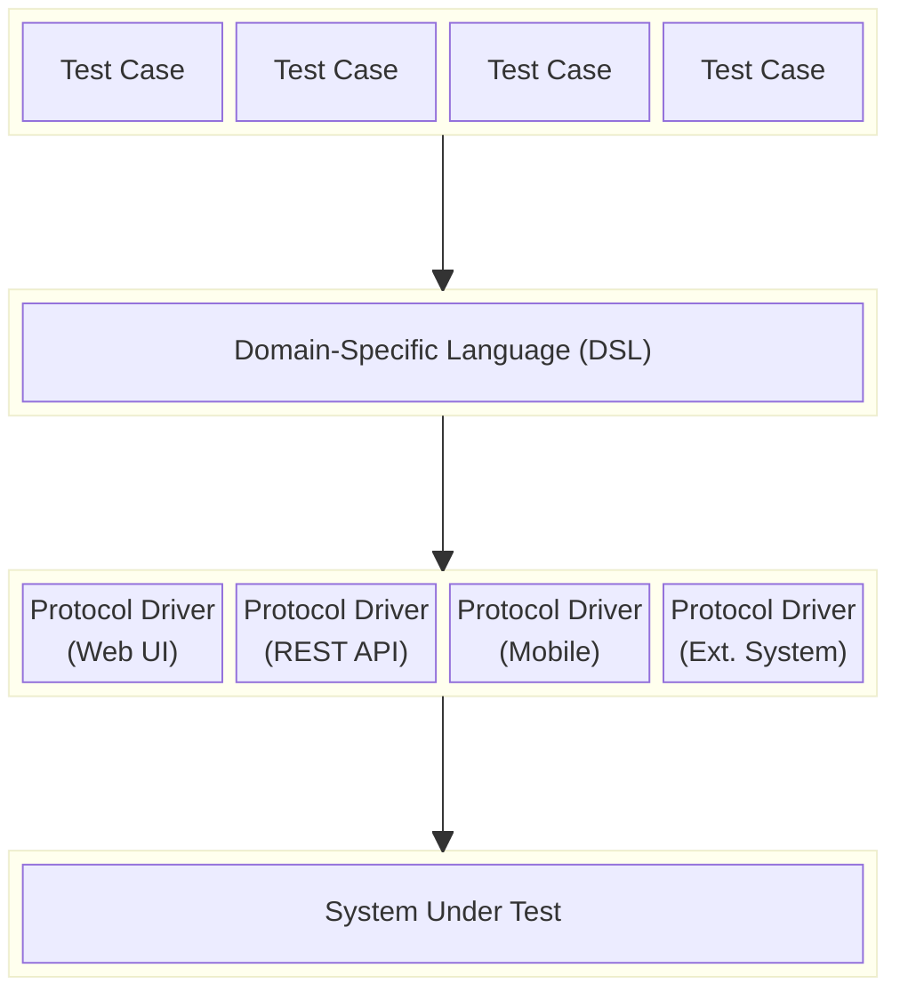

import Tabs from '@theme/Tabs';
import TabItem from '@theme/TabItem';

# What Does Serenity/JS Add?

Serenity/JS isn't a replacement for Playwright or WebdriverIO — it's an **abstraction layer on top** that adds structure, reporting, and reusability as your test suite grows.

This page shows the **same scenario** implemented three ways so you can see what each level of adoption gives you.

:::info Works with multiple tools
The examples below use [Playwright Test](/getting-started/playwright/), but Serenity/JS provides the same benefits with [WebdriverIO](/getting-started/webdriverio/). The Screenplay Pattern code (Level 3) is **identical** regardless of which tool drives the browser — that's the point of the abstraction.
:::

---

## Why abstraction matters

Dave Farley's [Four-Layer Separation of Concerns](https://www.youtube.com/watch?v=JDD5EEJgpHU) model explains why well-structured test suites survive change while brittle ones rot:



The key insight: **separate what you're testing from how you're testing it.**

- **Business rules change** → update the tests. DSL and drivers stay the same.
- **API endpoint changes** → update the API driver. Tests and UI driver don't move.
- **UI redesign** → update the UI driver. Tests and API driver don't move.
- **New feature** → add new tests and extend the DSL. Everything else stays untouched.

That's the difference between tests that rot and tests that last.

**How Serenity/JS maps to this model:**

| Layer | Serenity/JS concept | Example |
|---|---|---|
| Test Cases | Test scenarios (`it`, `describe`) | `it('should let a user checkout', ...)` |
| DSL | [Tasks](/api/core/class/Task/) | `Checkout.completeWith(...)` |
| Protocol Drivers | [Abilities](/api/core/class/Ability/) + [Interactions](/api/core/class/Interaction/) | `BrowseTheWebWithPlaywright`, `Click`, `Enter` |
| System Under Test | Your application | `https://www.saucedemo.com/` |

The Screenplay Pattern **is** this four-layer architecture, implemented as a TypeScript framework. Tasks are your DSL. Abilities and Interactions are your protocol drivers. When you swap Playwright for WebdriverIO, only the driver layer changes — your tests and DSL stay put.

→ Learn more: [Screenplay Pattern](/handbook/design/screenplay-pattern/) | [BDD in Action, Second Edition](https://www.manning.com/books/bdd-in-action-second-edition)

---

:::info The scenario
A user logs in to [SauceDemo](https://www.saucedemo.com/), adds a "Sauce Labs Backpack" to their cart, completes checkout, and verifies the order confirmation.
:::

## Level 1: Vanilla Playwright

Standard Playwright Test — no Serenity/JS. This is what most teams start with.

```typescript title="tests/checkout.spec.ts"
import { test, expect } from '@playwright/test';

test('should complete checkout successfully', async ({ page }) => {
    // Login
    await page.goto('https://www.saucedemo.com/');
    await page.locator('[data-test="username"]').fill('standard_user');
    await page.locator('[data-test="password"]').fill('secret_sauce');
    await page.locator('[data-test="login-button"]').click();

    // Add item to cart
    await page.locator('[data-test="add-to-cart-sauce-labs-backpack"]').click();

    // Go to cart and checkout
    await page.locator('[data-test="shopping-cart-link"]').click();
    await page.locator('[data-test="checkout"]').click();

    // Fill checkout info
    await page.locator('[data-test="firstName"]').fill('Alice');
    await page.locator('[data-test="lastName"]').fill('Smith');
    await page.locator('[data-test="postalCode"]').fill('90210');
    await page.locator('[data-test="continue"]').click();

    // Finish and verify
    await page.locator('[data-test="finish"]').click();
    await expect(page.locator('[data-test="complete-header"]'))
        .toHaveText('Thank you for your order!');
});
```

**What you get:** A working test. Quick to write for simple cases.

**What you don't get:** No reusable abstractions. No structured reporting beyond pass/fail. When you have 50 tests doing login + checkout variations, you'll be copy-pasting selectors everywhere.

---

## Level 2: Reporting-only mode

Change one import and add a reporter. Your test code stays the same, but you get **structured activity reports** showing what each test did step by step.

```typescript title="tests/checkout.spec.ts"
// highlight-next-line
import { test, expect } from '@serenity-js/playwright-test';  // ← only change

test('should complete checkout successfully', async ({ page }) => {
    // Login
    await page.goto('https://www.saucedemo.com/');
    await page.locator('[data-test="username"]').fill('standard_user');
    await page.locator('[data-test="password"]').fill('secret_sauce');
    await page.locator('[data-test="login-button"]').click();

    // Add item to cart
    await page.locator('[data-test="add-to-cart-sauce-labs-backpack"]').click();

    // Go to cart and checkout
    await page.locator('[data-test="shopping-cart-link"]').click();
    await page.locator('[data-test="checkout"]').click();

    // Fill checkout info
    await page.locator('[data-test="firstName"]').fill('Alice');
    await page.locator('[data-test="lastName"]').fill('Smith');
    await page.locator('[data-test="postalCode"]').fill('90210');
    await page.locator('[data-test="continue"]').click();

    // Finish and verify
    await page.locator('[data-test="finish"]').click();
    await expect(page.locator('[data-test="complete-header"]'))
        .toHaveText('Thank you for your order!');
});
```

```typescript title="playwright.config.ts"
import { defineConfig } from '@playwright/test';
import { SerenityFixtures, SerenityWorkerFixtures } from '@serenity-js/playwright-test';

export default defineConfig<SerenityFixtures, SerenityWorkerFixtures>({
    reporter: [
        [ 'line' ],
        [ '@serenity-js/playwright-test', {
            crew: [
                '@serenity-js/console-reporter',
                [ '@serenity-js/serenity-bdd', {
                    specDirectory: './tests'
                } ],
                [ '@serenity-js/core:ArtifactArchiver', {
                    outputDirectory: './reports/serenity'
                } ],
            ]
        }]
    ],
});
```

```json title="package.json (scripts)"
{
  "scripts": {
    "clean": "rimraf target",
    "test": "failsafe clean test:execute test:report",
    "test:execute": "npx playwright test",
    "test:report": "serenity-bdd run --features='./tests' --source='./reports/serenity' --destination='./reports/serenity'"
  }
}
```

**What you gain:**
- Detailed activity breakdown (every `fill`, `click`, `goto` logged with timing)
- Screenshots captured automatically on failure
- Serenity BDD living documentation (if configured)
- **Zero changes to your test code**

**When this makes sense:** You want better visibility into what your tests are doing without rewriting anything. A great first step.

→ [Set this up in 5 minutes](/getting-started/playwright/#step-1-install)

---

## Level 3: Full Screenplay Pattern

The Screenplay Pattern structures tests around **user goals** (Tasks) rather than page mechanics. Tests read like a description of what the user does, not how the browser is manipulated.

<Tabs>
<TabItem value="spec" label="swag-labs.spec.ts" default>

```typescript title="tests/swag-labs.spec.ts"
import { describe, it } from '@serenity-js/playwright-test';
import { Ensure, equals } from '@serenity-js/assertions';
import { Navigate } from '@serenity-js/web';

import { Authenticate } from '../screenplay/Authenticate';
import { Inventory } from '../screenplay/Inventory';
import { Checkout } from '../screenplay/Checkout';

describe('Swag Labs', () => {

    it('should let a standard user complete checkout', async ({ actor }) => {
        await actor.attemptsTo(
            Navigate.to('https://www.saucedemo.com/'),
            Authenticate.withCredentials('standard_user', 'secret_sauce'),
            Inventory.productCalled('Sauce Labs Backpack').addToCart(),
            Checkout.completeWith({
                firstName: 'Alice',
                lastName: 'Smith',
                postalCode: '90210',
            }),
            Ensure.that(Checkout.confirmationHeading(), equals('Thank you for your order!')),
        );
    });
});
```

</TabItem>
<TabItem value="authenticate" label="Authenticate.ts">

```typescript title="screenplay/Authenticate.ts"
import { Masked, Task } from '@serenity-js/core';
import { Click, Enter, PageElement, By } from '@serenity-js/web';

export class Authenticate {
    private static usernameField =
        PageElement.located(By.css('[data-test="username"]')).describedAs('username field');

    private static passwordField =
        PageElement.located(By.css('[data-test="password"]')).describedAs('password field');

    private static loginButton =
        PageElement.located(By.css('[data-test="login-button"]')).describedAs('login button');

    static withCredentials = (username: string, password: string) =>
        Task.where(`#actor logs in as ${ username }`,
            Enter.theValue(username).into(Authenticate.usernameField),
            Enter.theValue(Masked.valueOf(password)).into(Authenticate.passwordField),
            Click.on(Authenticate.loginButton),
        );
}
```

</TabItem>
<TabItem value="inventory" label="Inventory.ts">

```typescript title="screenplay/Inventory.ts"
import { Task } from '@serenity-js/core';
import { Click, Text, PageElement, By } from '@serenity-js/web';

export class ProductCard {
    constructor(private name: string) {}

    private card = PageElement.located(By.css(
        `[data-test="inventory-item"]:has([data-test="inventory-item-name"]:text("${ this.name }"))`
    )).describedAs(`product card for "${ this.name }"`);

    private inventoryItemPrice =
        PageElement.located(By.css('[data-test="inventory-item-price"]'))
            .of(this.card).describedAs(`price of "${ this.name }"`);

    private addToCartButton =
        PageElement.located(By.css('[data-test^="add-to-cart"]'))
            .of(this.card).describedAs(`"Add to cart" button for "${ this.name }"`);

    price = () =>
        Text.of(this.inventoryItemPrice);

    addToCart = () =>
        Task.where(`#actor adds "${ this.name }" to the cart`,
            Click.on(this.addToCartButton),
        );
}

export class Inventory {
    static productCalled = (name: string) => new ProductCard(name);
}
```

</TabItem>
<TabItem value="checkout" label="Checkout.ts">

```typescript title="screenplay/Checkout.ts"
import { Task } from '@serenity-js/core';
import { Click, Enter, Text, PageElement, By } from '@serenity-js/web';

import { Cart } from './Cart';

export class Cart {
    private static cartLink =
        PageElement.located(By.css('[data-test="shopping-cart-link"]')).describedAs('shopping cart link');

    private static checkoutButton =
        PageElement.located(By.css('[data-test="checkout"]')).describedAs('checkout button');

    static open = () =>
        Task.where('#actor opens the shopping cart',
            Click.on(Cart.cartLink),
        );

    static checkout = () =>
        Task.where('#actor proceeds to checkout',
            Cart.open(),
            Click.on(Cart.checkoutButton),
        );
}

export class Checkout {
    private static firstNameField =
        PageElement.located(By.css('[data-test="firstName"]')).describedAs('first name');

    private static lastNameField =
        PageElement.located(By.css('[data-test="lastName"]')).describedAs('last name');

    private static postalCodeField =
        PageElement.located(By.css('[data-test="postalCode"]')).describedAs('postal code');

    private static continueButton =
        PageElement.located(By.css('[data-test="continue"]')).describedAs('continue button');

    private static finishButton =
        PageElement.located(By.css('[data-test="finish"]')).describedAs('finish button');

    private static confirmationHeader =
        PageElement.located(By.css('[data-test="complete-header"]')).describedAs('confirmation heading');

    static completeWith = (info: { firstName: string; lastName: string; postalCode: string }) =>
        Task.where(`#actor completes checkout`,
            Cart.checkout(),
            Enter.theValue(info.firstName).into(Checkout.firstNameField),
            Enter.theValue(info.lastName).into(Checkout.lastNameField),
            Enter.theValue(info.postalCode).into(Checkout.postalCodeField),
            Click.on(Checkout.continueButton),
            Click.on(Checkout.finishButton),
        );

    static confirmationHeading = () =>
        Text.of(Checkout.confirmationHeader);
}
```

</TabItem>
</Tabs>

:::tip Tasks are portable
Notice the Task code imports from `@serenity-js/web` and `@serenity-js/core` — not from Playwright or WebdriverIO directly. Your Tasks are **portable**. Switch tools (or use both) without rewriting test logic. Only the [Ability](/api/core/class/Ability/) configuration changes.
:::

**What you gain:**
- **Readable tests** — the scenario reads like a user story
- **Reusable building blocks** — `Authenticate.withCredentials()` works in every test. Change the selector once, fix it everywhere.
- **Rich reports** — Task hierarchy in reports: "completes checkout" → "opens cart" → "clicks checkout button"
- **Masked credentials** — sensitive values appear as `[MASKED]` in reports
- **Multi-actor support** — buyer + seller, admin + user scenarios become trivial
- **Cross-interface testing** — same Tasks work for API tests
- **Tool independence** — swap Playwright for WebdriverIO without touching test logic

**When this makes sense:** Growing test suites, multiple contributors, multi-user workflows, or stakeholders who need to understand test coverage.

→ [Try the Screenplay Pattern](/getting-started/playwright/#step-5-optional-write-your-first-screenplay-test) | [Full Playwright tutorial](/getting-started/playwright/) | [WebdriverIO tutorial](/getting-started/webdriverio/)

---

## How to start

Most teams get the best ROI by starting with **reporting-only mode** (Level 2) — one import change, zero risk, immediate value. Once you see the activity breakdown in your reports, introduce the Screenplay Pattern gradually for new tests. You don't have to rewrite anything.

Over time, identify high-value legacy scenarios — the ones that break often or are hard to understand — and convert them to Screenplay for better reporting and easier maintenance. Periodically review lower-value scenarios: convert them gradually if they'd benefit from the structure, or delete them if your newer Screenplay tests already cover the same scope more effectively.

Remember, you're in control of how many or how few scenarios follow the improved structure — Serenity/JS supports both architectures side by side in the same project.

---

## Ready to try it?

- **[For Playwright users](/getting-started/playwright/)** — guide for teams using Playwright Test
- **[For WebdriverIO users](/getting-started/webdriverio/)** — guide for teams using WebdriverIO
- **[15-minute tutorial](/handbook/tutorials/your-first-web-scenario/)** — build your first Screenplay test
- **[Project Templates](/handbook/project-templates/)** — pre-configured starter projects
